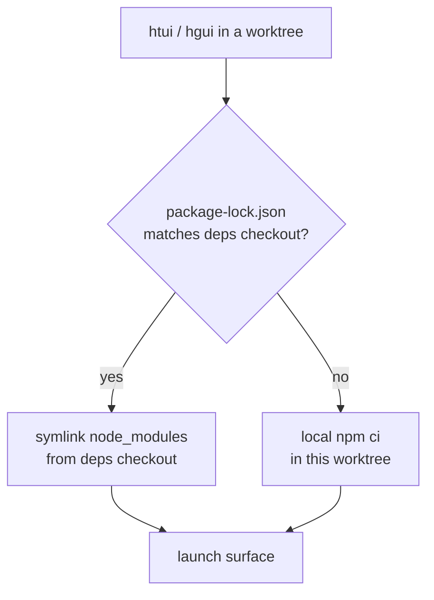

# worktree から TUI とデスクトップアプリを動かす {#tui-desktop-from-worktrees}

Python のコア部分は、どの [git worktree](/hermes/docs/user-guide/git-worktrees/) からでも問題なく動きます。`cd` して `hermes` と打つだけです。ところが TypeScript 側の 2 つの画面はそうはいきません。`ui-tui/` と `apps/desktop/` はどちらも中身の入った `node_modules` を必要とし、worktree ごとに `npm ci` をやり直すのは時間がかかるうえ、checkout しているブランチの数だけ数ギガバイトを重複して抱えることになります。

`htui` と `hgui` は、その穴を埋めるための 2 つのシェル関数です。どちらも **いま作業している worktree から** 画面を起動しつつ、`node_modules` は正となる 1 つの checkout から借りてきます。使い捨てのブランチにかかるコストが、インストールではなくシンボリックリンク 1 本で済むわけです。

これらは開発者向けの便利道具であって、製品として同梱されるコマンドではありません。`~/.zshrc` に置き、パスは自分の環境に合わせて直してください。

## 依存関係を共有する仕組み {#the-deps-sharing-model}

ひとつの checkout を **依存関係用の checkout** と決めます。実際に `npm install` を走らせるのはそこだけです。ほかの worktree はそこにリンクし、自分のロックファイルが食い違ったときにだけ、その worktree の中でインストールし直します（依存関係を上げたブランチが、古いパッケージのまま黙って動いてしまってはいけないからです）。



正となる checkout は、2 つの環境変数で指定します。

| 変数 | 意味 |
|----------|---------|
| `HERMES_MAIN_CHECKOUT` | 依存関係用の checkout。`node_modules` の実体が置かれ、バックエンドを動かす `.venv/bin/python` もここのものを使います。 |
| `HERMES_GUI_DEPS_CHECKOUT` | デスクトップ側の依存関係（`apps/desktop/node_modules`）が置かれた場所。既定では `HERMES_MAIN_CHECKOUT` と同じで、デスクトップの依存関係を別の場所に置いているときだけ上書きします。 |

どちらも Hermes 自身が読む変数ではなく、これらの関数の中だけで使うものです。Hermes が実際に読む変数は [環境変数](/hermes/docs/reference/environment-variables/) にまとめてあります。

## `htui` — worktree から TUI を動かす {#htui-tui-from-the-worktree}

Ink の TUI には、もともと開発用の経路があります。`hermes --tui --dev` は、ビルド済みのバンドルではなく TypeScript のソースを `tsx` 経由で実行します。`htui` はその一行ラッパーで、実行先をいま作業している worktree の `ui-tui/` に向けます。

```bash
htui() {
  local root
  root="$(_hermes_root)" || { echo "htui: not in a Hermes checkout" >&2; return 1; }
  ( cd "$root" && PYTHONPATH="$root" \
      "$HERMES_MAIN_CHECKOUT/.venv/bin/python" -m hermes_cli.main --tui --dev "$@" )
}
```

`--dev` はソースからコンパイルするため、ルートのロックファイルが一致していれば `HERMES_MAIN_CHECKOUT` から `ui-tui/node_modules` をリンクし、一致しなければその場でインストールします（[`_hermes_root` とリンク用の関数](#shared-helpers) を参照）。

:::warning `--dev` と `HERMES_TUI_DIR` は同時に使えません
`HERMES_TUI_DIR` は *ビルド済みの* バンドル（Nix やシステムのパッケージ）を Hermes に指し示すもので、ホットリロードできるソースがありません。シェルにこれが設定されていると、`hermes --tui --dev` はエラーで終了します。`htui` の前に `unset HERMES_TUI_DIR` を実行してください。
:::

## `hgui` — worktree からデスクトップアプリを動かす {#hgui-desktop-app-from-the-worktree}

デスクトップアプリはもっと重い作りです。リポジトリのルートと `apps/desktop/` の両方に `node_modules` が要り、ポート `5174` に固定された Vite の開発サーバーと、Python のバックエンドも必要になります。`hgui` は、そのすべてをいま作業している worktree に向けて配線します。

```bash
hgui() {
  local root deps desktop
  root="$(_hermes_root)" || { echo "hgui: not in a Hermes checkout" >&2; return 1; }
  deps="${HERMES_GUI_DEPS_CHECKOUT:-$HERMES_MAIN_CHECKOUT}"
  desktop="$root/apps/desktop"

  # Borrow deps when locks match; otherwise install locally in the worktree.
  if cmp -s "$root/package-lock.json" "$deps/package-lock.json"; then
    _hermes_link_deps "$desktop" "$deps/apps/desktop"
    _hermes_link_deps "$root" "$deps"
  else
    ( cd "$root" && npm ci ) || return 1
  fi

  # Vite is fixed at 5174 — evict a stale session from another hgui.
  lsof -t -i:5174 >/dev/null 2>&1 && killport 5174

  # Electron often survives Ctrl+C without reaping its ephemeral backends.
  trap '_hermes_gui_cleanup "$root"' INT TERM EXIT

  ( cd "$desktop"
    export PATH="$root/node_modules/.bin:$PATH"
    HERMES_DESKTOP_HERMES_ROOT="$root" \
    HERMES_DESKTOP_PYTHON="$HERMES_MAIN_CHECKOUT/.venv/bin/python" \
    HERMES_DESKTOP_IGNORE_EXISTING=1 \
    HERMES_DESKTOP_CWD="$root" \
    npm run dev )
}
```

ここで設定しているデスクトップ用の環境変数は、どれもバックエンドの解決に実際に効くものです。

| 変数 | `hgui` での役割 |
|----------|----------------|
| `HERMES_DESKTOP_HERMES_ROOT` | パッケージ版や PATH 上の `hermes` ではなく、**この worktree** からバックエンドを動かします。 |
| `HERMES_DESKTOP_PYTHON` | Python を探し直さず、依存関係用の checkout の venv を再利用します。 |
| `HERMES_DESKTOP_IGNORE_EXISTING` | `PATH` 上の `hermes` を無視して、worktree のものが隠されないようにします。 |
| `HERMES_DESKTOP_CWD` | デスクトップのチャットを、その worktree を起点にして開きます。 |

素の `npm run dev` では踏んでしまう落とし穴を、`hgui` は 2 つ処理しています。

- **ポート `5174` は固定です。** 2 つ目の `hgui` は 1 つ目の Vite サーバーとぶつかるので、先に古いほうを終了させます。
- **取り残された子プロセス。** Electron は `concurrently` を挟んでいると `Ctrl+C` を生き延びることが多く、一時的な `dashboard --port 0` のバックエンドや Vite のプロセスを回収しないまま残します。`EXIT` / `INT` / `TERM` の trap で後片付けを走らせ、Electron のシェル、`:5174` を掴んでいるプロセス、そこから起動された `--port 0` のダッシュボードを終了させます。

## 共通の関数 {#shared-helpers}

どちらの関数も、いる checkout を突き止めるやり方と、依存関係をリンクするやり方は同じです。

```bash
# The enclosing worktree, verified as a real Hermes checkout.
_hermes_root() {
  local root
  root="$(git rev-parse --show-toplevel 2>/dev/null)" || return 1
  [[ -f "$root/hermes_cli/main.py" && -d "$root/ui-tui" ]] && print -r "$root"
}

# Symlink node_modules from the deps checkout — never over an existing tree.
_hermes_link_deps() {
  local target="${1%/}" source="${2%/}"
  [[ -d "$source/node_modules" ]] || return 1
  [[ -e "$target/node_modules" ]] || ln -s "$source/node_modules" "$target/node_modules"
}

# Reap ephemeral backends Electron leaves behind on exit.
_hermes_gui_cleanup() {
  local root="$1"
  [[ -n "$root" ]] && pkill -TERM -f "${root}/apps/desktop/node_modules/electron" 2>/dev/null
  lsof -t -i:5174 >/dev/null 2>&1 && killport 5174
  pgrep -f 'hermes_cli\.main.*dashboard.*--port 0' 2>/dev/null | xargs -r kill -TERM 2>/dev/null
}
```

`killport` は自分で用意する小さな関数です（`lsof -ti:$1 | xargs kill`）。好みのやり方に置き換えてください。

:::info ロックファイルが一致したときだけリンクする理由
中身が食い違った `node_modules` へのシンボリックリンクは、何もインストールしないより悪い状態です。その worktree のロックファイルが宣言していないパッケージでビルドしてしまうからです。`package-lock.json` をバイト単位で比べるのは、安くて確実な見張りになります。ロックが同じなら借りても安全、違うならその場で `npm ci`、というわけです。Vite は `server.fs.allow` を適用する前にシンボリックリンクの実体パスを解決するので、`apps/desktop/vite.config.ts` では `node_modules` の実体の場所を許可リストに入れてあります。
:::

## あわせて読む {#see-also}

- [Git の worktree](/hermes/docs/user-guide/git-worktrees/) — これらの関数が土台にしている隔離の考え方
- [TUI](/hermes/docs/user-guide/tui/) — `hermes --tui --dev` と、`HERMES_TUI_DIR` を使うビルド済みの経路
- [デスクトップアプリ](/hermes/docs/user-guide/desktop/) — ソースからのビルドと、バックエンドを解決する順序
- [`apps/desktop/README.md`](https://github.com/NousResearch/hermes-agent/blob/main/apps/desktop/README.md) — 開発サーバー、サンドボックス用スクリプト、パッケージング
- [環境変数](/hermes/docs/reference/environment-variables/) — Hermes が読む `HERMES_*` 変数の一覧
