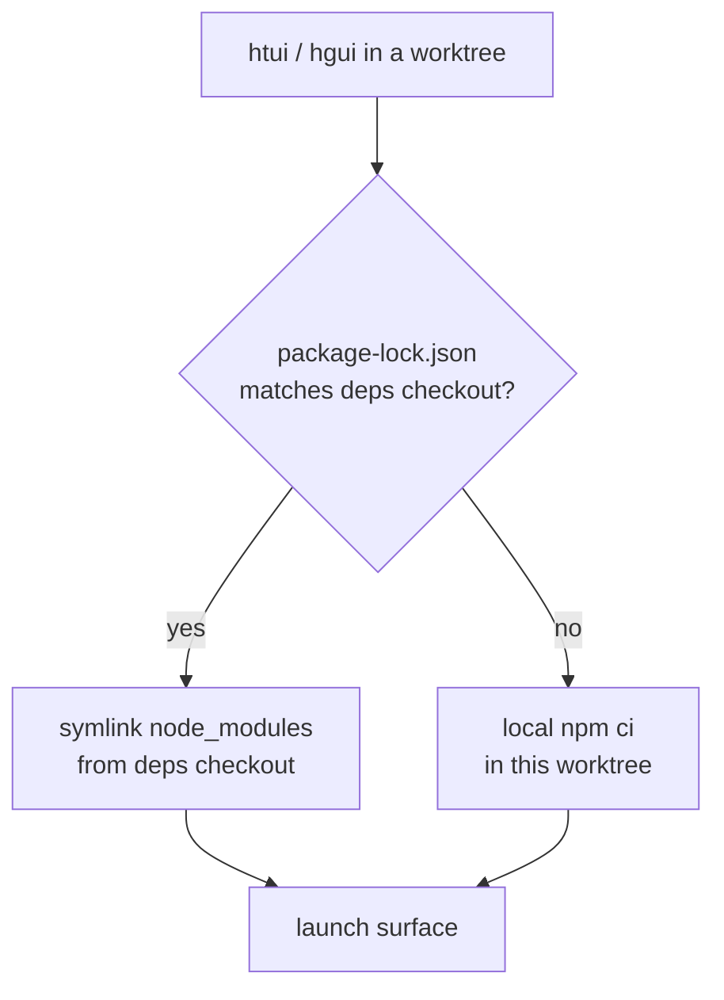

# worktree から TUI とデスクトップアプリを動かす {#tui-desktop-from-worktrees}

Python のコア部分は、どの [git worktree](/hermes/docs/user-guide/git-worktrees/) からでも問題なく動きます。`cd` して `hermes` と打つだけです。ところが TypeScript 側の 2 つの画面はそうはいきません。`ui-tui/` と `apps/desktop/` はどちらも中身の入った `node_modules` を必要とし、worktree ごとに `npm ci` をやり直すのは時間がかかるうえ、checkout しているブランチの数だけ数ギガバイトを重複して抱えることになります。

`htui` と `hgui` は、その穴を埋めるための 2 つのシェル関数です。どちらも **いま作業している worktree から** 画面を起動しつつ、`node_modules` は正となる 1 つの checkout から借りてきます。使い捨てのブランチにかかるコストが、インストールではなくシンボリックリンク 1 本で済むわけです。

これらは開発者向けの便利道具であって、製品として同梱されるコマンドではありません。`~/.zshrc` に置き、パスは自分の環境に合わせて直してください。

## 依存関係を共有する仕組み {#the-deps-sharing-model}

ひとつの checkout を **依存関係用の checkout** と決めます。実際に `npm install` を走らせるのはそこだけです。ほかの worktree はそこにリンクし、自分のロックファイルが食い違ったときにだけ、その worktree の中でインストールし直します（依存関係を上げたブランチが、古いパッケージのまま黙って動いてしまってはいけないからです）。



正となる checkout は、2 つの環境変数で指定します。

| 変数 | 意味 |
|----------|---------|
| `HERMES_MAIN_CHECKOUT` | 依存関係用の checkout。`node_modules` の実体が置かれ、バックエンドを動かす `.venv/bin/python` もここのものを使います。 |
| `HERMES_GUI_DEPS_CHECKOUT` | デスクトップ側の依存関係（`apps/desktop/node_modules`）が置かれた場所。既定では `HERMES_MAIN_CHECKOUT` と同じで、デスクトップの依存関係を別の場所に置いているときだけ上書きします。 |

どちらも Hermes 自身が読む変数ではなく、これらの関数の中だけで使うものです。Hermes が実際に読む変数は [環境変数](/hermes/docs/reference/environment-variables/) にまとめてあります。

## `htui` — worktree から TUI を動かす {#htui-tui-from-the-worktree}

Ink の TUI には、もともと開発用の経路があります。`hermes --tui --dev` は、ビルド済みのバンドルではなく TypeScript のソースを `tsx` 経由で実行します。`htui` はその一行ラッパーで、実行先をいま作業している worktree の `ui-tui/` に向けます。

```bash
htui() {
  local root
  root="$(_hermes_root)" || { echo "htui: not in a Hermes checkout" >&2; return 1; }
  ( cd "$root" && PYTHONPATH="$root" \
      "$HERMES_MAIN_CHECKOUT/.venv/bin/python" -m hermes_cli.main --tui --dev "$@" )
}
```

`--dev` はソースからコンパイルするため、ルートのロックファイルが一致していれば `HERMES_MAIN_CHECKOUT` から `ui-tui/node_modules` をリンクし、一致しなければその場でインストールします（[`_hermes_root` とリンク用の関数](#shared-helpers) を参照）。

:::warning `--dev` と `HERMES_TUI_DIR` は同時に使えません
`HERMES_TUI_DIR` は *ビルド済みの* バンドル（Nix やシステムのパッケージ）を Hermes に指し示すもので、ホットリロードできるソースがありません。シェルにこれが設定されていると、`hermes --tui --dev` はエラーで終了します。`htui` の前に `unset HERMES_TUI_DIR` を実行してください。
:::

## `hgui` — worktree からデスクトップアプリを動かす {#hgui-desktop-app-from-the-worktree}

デスクトップアプリには、リポジトリのルートと `apps/desktop/` の両方の依存関係、Vite のサーバー、Python のバックエンドが必要です。標準の `npm run dev` は Vite をポート `5174` に固定します。さらに Electron は、既定で CDP のポート `9222` を使い、ユーザーデータのディレクトリに対して多重起動を防ぐロックをかけます。Vite のポートを変えるだけでは、デスクトップを 2 つ動かせません。

次の **zsh** の例では、起動ごとにスロット（`HGUI_SLOT`、既定は `0`）をはっきり割り当てます。ターミナルごとに別のスロットを使ってください。下の[共通の関数](#shared-helpers)を使い、`lsof` が必要です。

```bash
hgui() (
  local root deps desktop slot="${HGUI_SLOT:-0}" vite_port cdp_port port
  [[ "$slot" == [0-9] ]] || { print -u2 'hgui: HGUI_SLOT must be 0-9'; return 1; }
  vite_port=$((5174 + slot))
  cdp_port=$((9222 + slot))
  for port in "$vite_port" "$cdp_port"; do
    if lsof -nP -t -iTCP:"$port" -sTCP:LISTEN >/dev/null 2>&1; then
      print -u2 "hgui: port $port is busy; choose another HGUI_SLOT"
      return 1
    fi
  done

  root="$(_hermes_root)" || { print -u2 'hgui: not in a Hermes checkout'; return 1; }
  deps="${HERMES_GUI_DEPS_CHECKOUT:-$HERMES_MAIN_CHECKOUT}"
  desktop="$root/apps/desktop"

  if cmp -s "$root/package-lock.json" "$deps/package-lock.json"; then
    _hermes_link_deps "$desktop" "$deps/apps/desktop" || return 1
    _hermes_link_deps "$root" "$deps" || return 1
  else
    ( cd "$root" && npm ci ) || return 1
  fi

  cd "$desktop" || return 1
  export PATH="$desktop/node_modules/.bin:$root/node_modules/.bin:$PATH"
  export HERMES_DESKTOP_HERMES_ROOT="$root"
  export HERMES_DESKTOP_PYTHON="$HERMES_MAIN_CHECKOUT/.venv/bin/python"
  export HERMES_DESKTOP_CWD="$root"
  export HERMES_DESKTOP_DEV_SERVER="http://127.0.0.1:$vite_port"
  export HERMES_DESKTOP_CDP_PORT="$cdp_port"
  export HERMES_DESKTOP_USER_DATA_DIR="${XDG_CACHE_HOME:-$HOME/.cache}/hermes-hgui/slot-$slot"
  # A userData override would otherwise also relocate the agent's home.
  export HERMES_HOME="${HERMES_HOME:-$HOME/.hermes}"
  export XCURSOR_SIZE=24

  # Mirror the dev scripts, replacing their fixed ports. No repo edits needed.
  concurrently -k -n "vite,electron" \
    "node scripts/assert-root-install.mjs && npm run clean:renderer && vite --host 127.0.0.1 --port $vite_port --strictPort" \
    "tsc --build tsconfig.electron.json && wait-on http://127.0.0.1:$vite_port && node scripts/bundle-electron-main.mjs --dev && electron ."
)
```

たとえば、`HERMES_MAIN_CHECKOUT` を設定して共通の関数を読み込んだあと、次のように使います。

```bash
# Terminal 1: main checkout
cd "$HERMES_MAIN_CHECKOUT"
HGUI_SLOT=0 hgui

# Terminal 2: an existing worktree
cd /path/to/hermes-worktree
HGUI_SLOT=1 hgui
```

スロット `0` はポート `5174`/`9222` を、スロット `1` は `5175`/`9223` を使います。スロットは呼び出す側が決めるもので、取り合いにならないよう自動で確保されるわけではありません。同時に起動するときは、必ず別々のスロットを使ってください。使用中のポートは断るだけで、先に使っている側を追い出すことはありません。同じ checkout から起動するとビルドの出力を共有してしまうので、別々にビルドしたいときは別々の checkout を使ってください。

| 変数 | `hgui` での役割 |
|----------|----------------|
| `HGUI_SLOT` | この関数だけが使うスロット番号で、`0`〜`9` です。Hermes の設定ではありません。 |
| `HERMES_DESKTOP_HERMES_ROOT` | パッケージ版や PATH 上の実行環境ではなく、この worktree からバックエンドを動かします。 |
| `HERMES_DESKTOP_PYTHON` | メインの checkout の Python 環境を再利用します。`.venv` ではなく `venv` を使っている環境では書き換えてください。 |
| `HERMES_DESKTOP_CWD` | デスクトップで新しく始める作業の起点を、その worktree にします。 |
| `HERMES_DESKTOP_DEV_SERVER` | Electron を、このインスタンス用の Vite サーバーに向けます。 |
| `HERMES_DESKTOP_CDP_PORT` | インスタンスごとに、画面描画側のデバッグ用ポートを分けます。 |
| `HERMES_DESKTOP_USER_DATA_DIR` | Electron の多重起動防止ロック、ブラウザーの保存領域、デスクトップの設定を分けます。 |
| `HERMES_HOME` | Electron のユーザーデータの場所を変えても、エージェントのホームが動かないように明示します。 |

どのスロットも、最初はまっさらなデスクトップの設定で始まり、次に起動したときはその設定を覚えています。この例では、動作中のアプリからブラウザーの保存領域、保存した画面の位置、バックエンドの持ち主の情報は引き継ぎません。

:::warning デスクトップを分けても、エージェントのデータは分かれません
既定の `HERMES_HOME` は共有されます。セッション、設定、認証情報、プロファイルは同じままです。同じ会話を両方のインスタンスから編集するのは避けてください。データを壊しかねないテストや、互換性のないデータベースの移行を試すときは、一時的な別の `HERMES_HOME` を渡し、その隔離環境を別に設定してください。
:::

アプリは普通に終了するか、起動したターミナルで Ctrl-C を押してください。`concurrently -k` が自分の子コマンドを管理し、バックエンドの停止は Electron が受け持ちます。全体に効く `killport` や `pkill electron`、`serve`/`dashboard --port 0` のプロセスをまとめて止める処理は足さないでください。別のインスタンスまで終了させてしまうことがあります。この関数の古い版から置き換える場合は、以前の `_hermes_gui_cleanup` の trap を取り除いてください。

## 共通の関数 {#shared-helpers}

どちらの関数も、いる checkout を突き止めるやり方と、依存関係をリンクするやり方は同じです。

```bash
# The enclosing worktree, verified as a real Hermes checkout.
_hermes_root() {
  local root
  root="$(git rev-parse --show-toplevel 2>/dev/null)" || return 1
  [[ -f "$root/hermes_cli/main.py" && -d "$root/ui-tui" ]] && print -r "$root"
}

# Symlink node_modules from the deps checkout — never over an existing tree.
_hermes_link_deps() {
  local target="${1%/}" source="${2%/}"
  [[ -d "$source/node_modules" ]] || return 1
  [[ -e "$target/node_modules" ]] || ln -s "$source/node_modules" "$target/node_modules"
}
```

:::info ロックファイルが一致したときだけリンクする理由
中身が食い違った `node_modules` へのシンボリックリンクは、何もインストールしないより悪い状態です。その worktree のロックファイルが宣言していないパッケージでビルドしてしまうからです。`package-lock.json` をバイト単位で比べるのは、安くて確実な見張りになります。ロックが同じなら借りても安全、違うならその場で `npm ci`、というわけです。Vite は `server.fs.allow` を適用する前にシンボリックリンクの実体パスを解決するので、`apps/desktop/vite.config.ts` では `node_modules` の実体の場所を許可リストに入れてあります。
:::

## あわせて読む {#see-also}

- [Git の worktree](/hermes/docs/user-guide/git-worktrees/) — これらの関数が土台にしている隔離の考え方
- [TUI](/hermes/docs/user-guide/tui/) — `hermes --tui --dev` と、`HERMES_TUI_DIR` を使うビルド済みの経路
- [デスクトップアプリ](/hermes/docs/user-guide/desktop/) — ソースからのビルドと、バックエンドを解決する順序
- [`apps/desktop/README.md`](https://github.com/NousResearch/hermes-agent/blob/main/apps/desktop/README.md) — 開発サーバー、サンドボックス用スクリプト、パッケージング
- [環境変数](/hermes/docs/reference/environment-variables/) — Hermes が読む `HERMES_*` 変数の一覧
