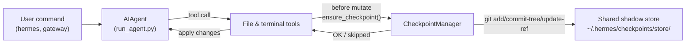

# チェックポイントと `/rollback` {#checkpoints-and-rollback}

Hermes Agent は、**破壊的な操作** の前にプロジェクトを自動でスナップショットし、コマンドひとつで元に戻せます。v2 からチェックポイントは **明示的に有効にする** 方式になりました。`/rollback` を使わない人がほとんどですし、シャドウの保管場所は時間とともに無視できない容量になるため、既定はオフです。

セッションごとに有効にするには `--checkpoints` を付けます。

```bash
hermes chat --checkpoints
```

全体で有効にするには `~/.hermes/config.yaml` に書きます。

```yaml
checkpoints:
  enabled: true
```

このしくみを支えているのが、内部の **チェックポイントマネージャ** です。`~/.hermes/checkpoints/store/` に、共有のシャドウ git リポジトリをひとつだけ持ちます。実際のプロジェクトの `.git` には決して触れません。エージェントが作業するすべてのプロジェクトが同じ保管場所を共有するので、git の内容にもとづくオブジェクト DB が、プロジェクトをまたいでもターンをまたいでも重複を取り除いてくれます。

## 何をきっかけにチェックポイントが作られるか {#what-triggers-a-checkpoint}

チェックポイントは、次の操作の前に自動で取られます。

- **ファイル系のツール** — `write_file` と `patch`
- **破壊的なターミナルコマンド** — `rm`、`rmdir`、`cp`、`install`、`mv`、`sed -i`、`truncate`、`dd`、`shred`、出力のリダイレクト（`>`）、`git reset` / `clean` / `checkout`

エージェントが作るのは **1 ターンあたり、ディレクトリごとに 1 つまで** です。長く続くセッションでもスナップショットだらけにはなりません。

## 早見表 {#quick-reference}

セッションの中で使うスラッシュコマンドです。

| コマンド | 説明 |
|---------|-------------|
| `/rollback` | 変更の統計を添えて、すべてのチェックポイントを一覧します |
| `/rollback <N>` | 手で直した内容を残したまま、チェックポイント N に戻します（直前の会話のターンも取り消します） |
| `/rollback <N> --all` | 完全に戻します。手で直した内容も上書きします |
| `/rollback diff <N>` | チェックポイント N と現在の状態の差分を先に見ます |
| `/rollback <N> <file>` | チェックポイント N から 1 つのファイルだけ戻します |

セッションの外から保管場所を調べたり管理したりする CLI です。

| コマンド | 説明 |
|---------|-------------|
| `hermes checkpoints` | 全体の容量、プロジェクト数、プロジェクトごとの内訳を表示します |
| `hermes checkpoints status` | 引数なしの `checkpoints` と同じです |
| `hermes checkpoints list` | `status` の別名です |
| `hermes checkpoints prune` | 掃除を強制します。取り残しや古いものを削除し、GC を実行し、容量の上限を適用します |
| `hermes checkpoints clear` | チェックポイントの置き場をまるごと消します（先に確認します） |
| `hermes checkpoints clear-legacy` | v1 からの移行で残った `legacy-*` の書庫だけを削除します |

## チェックポイントのしくみ {#how-checkpoints-work}

おおまかには次のとおりです。

- Hermes は、ツールが作業ツリーの **ファイルを変更しようとしている** ことを検知します。
- 会話のターンごとに 1 回（ディレクトリごと）、次のことをします。
  - そのファイルにとって妥当なプロジェクトのルートを決めます。
  - `~/.hermes/checkpoints/store/` にある **ひとつの共有シャドウ保管場所** を作るか、すでにあればそれを使います。
  - プロジェクトごとのインデックスにステージし、ツリーを作り、プロジェクトごとの ref（`refs/hermes/<project-hash>`）にコミットします。
- こうしてできたプロジェクトごとの ref が、`/rollback` で調べたり戻したりできるチェックポイントの履歴になります。



## 設定 {#configuration}

`~/.hermes/config.yaml` で設定します。

```yaml
checkpoints:
  enabled: false              # master switch (default: false — opt-in)
  max_snapshots: 20           # max checkpoints per project (enforced via ref rewrite + gc)
  max_total_size_mb: 500      # hard cap on total store size; oldest commits dropped
  max_file_size_mb: 10        # skip any single file larger than this

  # Auto-maintenance (on by default): sweep ~/.hermes/checkpoints/ at startup
  # and delete project entries whose last_touch is older than retention_days.
  # Runs at most once per min_interval_hours, tracked via a .last_prune
  # marker. This sweep never deletes "orphan" entries (working directory not
  # found) — a missing workdir at startup is ambiguous (deleted project vs.
  # an unmounted external volume / network share / VPN not yet up), so
  # orphan cleanup is only ever done via the explicit
  # `hermes checkpoints prune` command below, with a confirmation prompt.
  auto_prune: true
  retention_days: 7
  min_interval_hours: 24
```

すべて止めたい場合は次のようにします。

```yaml
checkpoints:
  enabled: false
  auto_prune: false
```

`enabled: false` のとき、チェックポイントマネージャは何もせず、git の操作を試みることもありません。`auto_prune: false` のときは、`hermes checkpoints prune` を手で実行するまで保管場所が大きくなり続けます。

## チェックポイントを一覧する {#listing-checkpoints}

CLI のセッションから次のように実行します。

```
/rollback
```

Hermes は、変更の統計を添えた一覧を返します。

```text
📸 Checkpoints for /path/to/project:

  1. 4270a8c  2026-03-16 04:36  before patch  (1 file, +1/-0)
  2. eaf4c1f  2026-03-16 04:35  before write_file
  3. b3f9d2e  2026-03-16 04:34  before terminal: sed -i s/old/new/ config.py  (1 file, +1/-1)

  /rollback <N>             restore to checkpoint N (keeps your hand-edits)
  /rollback <N> --all       full restore, overwriting your hand-edits too
  /rollback diff <N>        preview changes since checkpoint N
  /rollback <N> <file>      restore a single file from checkpoint N
```

## シェルから保管場所を調べる {#inspecting-the-store-from-the-shell}

```bash
hermes checkpoints
```

出力の例です。

```text
Checkpoint base: /home/you/.hermes/checkpoints
Total size:      142.3 MB
  store/         138.1 MB
  legacy-*       4.2 MB
Projects:        12

  WORKDIR                                                       COMMITS    LAST TOUCH  STATE
  /home/you/code/hermes-agent                                        20       2h ago  live
  /home/you/code/experiments/rl-runner                                8       1d ago  live
  /home/you/code/old-prototype                                        3       9d ago  orphan
  ...

Legacy archives (1):
  legacy-20260506-050616                           4.2 MB

Clear with: hermes checkpoints clear-legacy
```

24 時間の重複防止の目印を無視して、掃除を最後まで実行します。

```bash
hermes checkpoints prune --retention-days 3 --max-size-mb 200
```

## `/rollback diff` で変更を先に見る {#previewing-changes-with-rollback-diff}

戻すと決める前に、そのチェックポイントから何が変わったかを見ておけます。

```
/rollback diff 1
```

git の diff の統計の要約と、実際の差分が表示されます。

## `/rollback` で戻す {#restoring-with-rollback}

```
/rollback 1
```

裏側では、Hermes は次のことをしています。

1. 対象のコミットがシャドウの保管場所にあることを確認します。
2. あとで「取り消しを取り消せる」よう、現在の状態を **戻す直前のスナップショット** として保存します。
3. 作業ディレクトリの、追跡しているファイルを戻します。このとき **手で直した内容は残します**（後述）。
4. **直前の会話のターンを取り消し**、エージェントの文脈を、戻したあとのファイルの状態に合わせます。

### 手で直した内容は既定で残ります {#user-hand-edits-are-preserved-by-default}

`/rollback <N>` が戻すのは、Hermes 自身が変更したファイルだけです。`write_file` /
`patch` が成功するたびに、そのファイルの内容のハッシュが **エージェントの書き込み台帳**
に記録されます。戻すときには、現在の内容が Hermes の最後の書き込みと一致しないファイル
（そのあとで手を入れた、あるいは Hermes が一度も触っていない）は、上書きせずに
**飛ばして**、出力に並べます。

```
✅ Restored to checkpoint a1b2c3d4: before write_file
↷ Kept your hand-edits: src/config.py, notes.md
Use /rollback <N> --all to restore those too.
```

自分の編集も含めてすべてを元に戻す、従来どおりの完全な復元をしたい場合は `--all` を
付けます。

```
/rollback 1 --all
```

台帳が空のとき（この機能より前に作られた保管場所、あるいは Hermes がそのプロジェクトで
まだ何も書き込んでいない場合）、`/rollback` は自動的に完全な復元に切り替わります。

## 1 つのファイルだけ戻す {#single-file-restore}

ディレクトリの残りに影響を与えず、チェックポイントから 1 つのファイルだけ戻せます。

```
/rollback 1 src/broken_file.py
```

## 安全性と性能のためのガード {#safety-and-performance-guards}

- **git があるかどうか** — `PATH` に `git` が見つからない場合、チェックポイントは何も言わずに無効になります。
- **ディレクトリの範囲** — 範囲が広すぎるディレクトリ（ルートの `/`、ホームの `$HOME`）は飛ばします。
- **リポジトリの大きさ** — ファイルが 50,000 個を超えるディレクトリは飛ばします。
- **ファイル 1 つあたりの上限** — `max_file_size_mb`（既定は 10 MB）より大きいファイルはスナップショットから外します。データセットやモデルの重み、生成したメディアをうっかり抱え込むのを防ぎます。
- **保管場所全体の上限** — 保管場所が `max_total_size_mb`（既定は 500 MB）を超えると、プロジェクトごとにいちばん古いコミットを順番に落とし、上限を下回るまで続けます。
- **本当に消す掃除** — `max_snapshots` は、プロジェクトごとの ref を書き換え、そのあと `git gc --prune=now` を実行して適用します。これで参照のないオブジェクトが溜まりません。
- **変更がないときのスナップショット** — 前回のスナップショットから何も変わっていなければ、チェックポイントは飛ばされます。
- **エラーは致命的ではありません** — チェックポイントマネージャの中で起きたエラーはすべてデバッグレベルで記録され、ツールはそのまま動き続けます。

## チェックポイントの置き場所 {#where-checkpoints-live}

```text
~/.hermes/checkpoints/
  ├── store/                 # single shared bare git repo
  │   ├── HEAD, objects/     # git internals (shared across projects)
  │   ├── refs/hermes/<hash> # per-project branch tip
  │   ├── indexes/<hash>     # per-project git index
  │   ├── projects/<hash>.json  # workdir + created_at + last_touch
  │   └── info/exclude
  ├── .last_prune            # auto-prune idempotency marker
  └── legacy-<ts>/           # archived pre-v2 per-project shadow repos
```

`<hash>` は、作業ディレクトリの絶対パスから作られます。ふだんは手で触る必要はありません。`hermes checkpoints status` / `prune` / `clear` を使ってください。

### v1 からの移行 {#migration-from-v1}

v2 で作り直す前は、作業ディレクトリごとに完結したシャドウ git リポジトリが `~/.hermes/checkpoints/<hash>/` の直下に作られていました。この作りではプロジェクトをまたいでオブジェクトを共有できず、掃除のしくみも実際には何もしないと記録されていました。保管場所は際限なく大きくなっていったのです。

v2 で最初に実行したとき、v2 より前のシャドウリポジトリは `~/.hermes/checkpoints/legacy-<timestamp>/` に移され、新しい単一の保管場所がまっさらな状態で始まります。古い `/rollback` の履歴は、その書庫を `git` で手で調べれば今も見られます。もう必要ないと判断できたら、次を実行してください。

```bash
hermes checkpoints clear-legacy
```

これで容量を取り戻せます。古い書庫は `retention_days` を過ぎたあと `auto_prune` でも掃除されます。

## ベストプラクティス {#best-practices}

- **必要なときだけチェックポイントを有効にする** — `hermes chat --checkpoints`、またはプロファイルごとに `enabled: true` にします。
- **戻す前に `/rollback diff` を使う** — 何が変わるかを先に見て、正しいチェックポイントを選びます。
- **エージェントによる変更だけを取り消したいときは `git reset` ではなく `/rollback` を使う**。
- **チェックポイントをよく使うなら、ときどき `hermes checkpoints status` を見る** — どのプロジェクトが動いていて、保管場所にどれだけ容量を使っているかが分かります。
- **Git のワークツリーと組み合わせると、いっそう安全になります** — Hermes のセッションごとに専用のワークツリーとブランチを用意し、その上にチェックポイントを重ねます。

同じリポジトリで複数のエージェントを並行して動かす方法については、[Git ワークツリー](/hermes/docs/user-guide/git-worktrees/) の解説をご覧ください。
