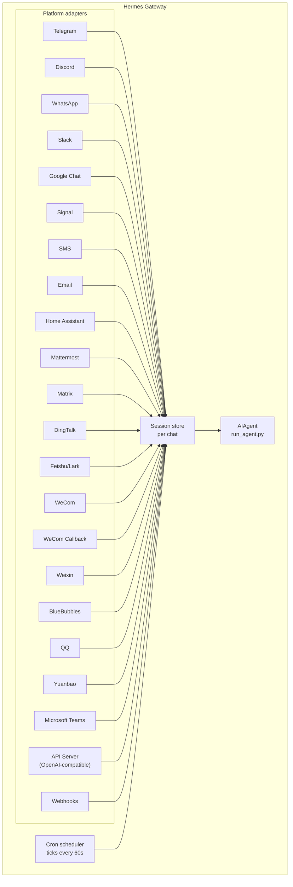

# メッセージングゲートウェイ {#messaging-gateway}

Telegram、Discord、Slack、WhatsApp、Signal、SMS、メール、Home Assistant、Mattermost、Matrix、DingTalk、Feishu/Lark、WeCom、Weixin、BlueBubbles（iMessage）、QQ、Yuanbao、Microsoft Teams、LINE、ntfy、ブラウザから Hermes と会話できます。ゲートウェイは 1 つのバックグラウンドプロセスで、設定済みのすべてのプラットフォームに接続し、セッションを管理し、cron ジョブを実行し、音声メッセージを届けます。

CLI のマイク入力モード、メッセージングでの音声返信、Discord のボイスチャンネルでの会話まで含めた音声機能の全体像は、[音声モード](/hermes/docs/user-guide/features/voice-mode/) と [Hermes で音声モードを使う](/hermes/docs/guides/use-voice-mode-with-hermes/) をご覧ください。

:::tip
ボットにはモデルプロバイダーとツールプロバイダー（TTS、Web）の両方が必要です。[Nous Portal](/hermes/docs/integrations/nous-portal/) のサブスクリプションはそれらをまとめて提供します。
:::

## プラットフォーム比較 {#platform-comparison}

| プラットフォーム | 音声 | 画像 | ファイル | スレッド | リアクション | 入力中表示 | ストリーミング |
|----------|:-----:|:------:|:-----:|:-------:|:---------:|:------:|:---------:|
| Telegram | ✅ | ✅ | ✅ | ✅ | — | ✅ | ✅ |
| Discord | ✅ | ✅ | ✅ | ✅ | ✅ | ✅ | ✅ |
| Slack | ✅ | ✅ | ✅ | ✅ | ✅ | ✅ | ✅ |
| Google Chat | — | ✅ | ✅ | ✅ | — | ✅ | — |
| WhatsApp | — | ✅ | ✅ | — | — | ✅ | ✅ |
| WhatsApp Cloud API | ✅ | ✅ | ✅ | — | — | ✅ | — |
| Signal | — | ✅ | ✅ | — | — | ✅ | — |
| SMS | — | — | — | — | — | — | — |
| メール | — | ✅ | ✅ | ✅ | — | — | — |
| Home Assistant | — | — | — | — | — | — | — |
| Mattermost | ✅ | ✅ | ✅ | ✅ | — | ✅ | ✅ |
| Matrix | ✅ | ✅ | ✅ | ✅ | ✅ | ✅ | ✅ |
| DingTalk | — | ✅ | ✅ | — | ✅ | — | ✅ |
| Feishu/Lark | ✅ | ✅ | ✅ | ✅ | ✅ | ✅ | ✅ |
| WeCom | ✅ | ✅ | ✅ | — | — | — | — |
| WeCom Callback | — | — | — | — | — | — | — |
| Weixin | ✅ | ✅ | ✅ | — | — | ✅ | — |
| BlueBubbles | — | ✅ | ✅ | — | ✅ | ✅ | — |
| Photon（iMessage） | ✅ | ✅ | ✅ | — | ✅ | ✅ | — |
| QQ | ✅ | ✅ | ✅ | — | — | ✅ | — |
| Yuanbao | ✅ | ✅ | ✅ | — | — | ✅ | ✅ |
| Microsoft Teams | — | ✅ | — | ✅ | — | ✅ | — |
| LINE | — | ✅ | ✅ | — | — | ✅ | — |
| ntfy | — | — | — | — | — | — | — |
| Raft | — | — | — | — | — | — | — |
| IRC | — | — | — | — | — | — | — |
| Buzz | — | ✅ | — | ✅ | — | — | — |
| SimpleX | ✅ | ✅ | ✅ | — | — | ✅ | — |

**音声** = TTS による音声返信、または音声メッセージの文字起こし。**画像** = 画像の送受信。**ファイル** = 添付ファイルの送受信。**スレッド** = スレッド形式の会話。**リアクション** = メッセージへの絵文字リアクション。**入力中表示** = 処理中に出る入力インジケーター。**ストリーミング** = メッセージを編集しながら少しずつ更新する表示。

:::note Hermes Relay
[Hermes Relay](/hermes/docs/user-guide/messaging/relay/)（実験的機能）はチャットプラットフォームそのものではなく、Discord、Telegram、Slack、WhatsApp などの前面に立つコネクター機構です。プラットフォームの認証情報はコネクター側が持ちます。対応できる機能（メディア、ネイティブの承認・確認プロンプト、リアクション、スレッド、入力中表示、ストリーミング）は上の表のように固定ではなく、接続時のハンドシェイクでコネクターごとに決まります。
:::

## 構成 {#architecture}



各プラットフォームのアダプターがメッセージを受け取り、チャットごとのセッションストアを通して振り分け、処理のために AIAgent へ渡します。ゲートウェイは cron スケジューラーも動かしており、60 秒ごとに時刻を確認して実行時期の来たジョブを走らせます。

## 意図的な沈黙トークン {#intentional-silence-tokens}

グループチャット、フック、自動化フローのために、Hermes は明示的な沈黙トークンに対応しています。エージェントの最終応答がサポート対象のトークンそのものだった場合、ゲートウェイは送信を抑止し、チャットには何も送りません。

サポートされるトークン:

- `[SILENT]`
- `SILENT`
- `NO_REPLY`
- `NO REPLY`

空白と大文字小文字は正規化されますが、最終応答の全体がトークンでなければなりません。「Use `[SILENT]` when nothing changed」のような文は通常どおり送信されます。

沈黙はあくまで送信するかどうかの判断です。Hermes はアシスタントの沈黙ターンをセッションの記録に残すため、会話は通常どおり交互に進みます。

```text
user: side-channel chatter
assistant: [SILENT]   # stored, not delivered
user: next message
```

失敗したターンはこれまでどおりエラーとして表面化します。文面が沈黙トークンに似ているというだけで、Hermes が失敗を隠すことはありません。

## かんたんセットアップ {#quick-setup}

メッセージングプラットフォームを設定する一番簡単な方法は、対話式のウィザードです。

```bash
hermes gateway setup        # Interactive setup for all messaging platforms
```

このコマンドは矢印キーで選びながら各プラットフォームの設定を進め、すでに設定済みのものを表示し、終わったらゲートウェイの起動・再起動もその場で提案します。

## ゲートウェイのコマンド {#gateway-commands}

```bash
hermes gateway              # Run in foreground
hermes gateway setup        # Configure messaging platforms interactively
hermes gateway install      # Install as a user service (Linux) / launchd service (macOS)
sudo hermes gateway install --system   # Linux only: install a boot-time system service
hermes gateway start        # Start the default service
hermes gateway stop         # Stop the default service
hermes gateway status       # Check default service status
hermes gateway status --system         # Linux only: inspect the system service explicitly
```

### Linux のイベントループ監視（任意） {#optional-linux-event-loop-watchdog}

systemd で管理されたゲートウェイは、Python の asyncio イベントループに
実行時間が回らなくなったときにプロセスを復旧させる仕組みを有効にできます。
プロセス全体が固まり、プラットフォーム固有の生存確認まで止まる状況に対応します。

```yaml title="~/.hermes/config.yaml"
gateway:
  systemd_watchdog_seconds: 120
```

この設定を変えたら、サービスのユニットファイルを作り直してください。

```bash
hermes gateway install --force
```

正の値を入れると、生成されるユニットは `Type=notify`、
`NotifyAccess=main`、および対応する `WatchdogSec` を使うようになります。Hermes は
イベントループが滞りなく進んでいる間だけハートビートを送り、それが止まると systemd が
プロセスを再起動します。既定の `0` は従来どおり `Type=simple` のままです。
この設定は Linux／systemd 専用で、通常のプラットフォームの
ネットワーク切断をイベントループの障害とはみなしません。

## チャット内で使うコマンド {#chat-commands-inside-messaging}

| コマンド | 説明 |
|---------|-------------|
| `/new` or `/reset` | 会話を新しく始める |
| `/model [provider:model]` | モデルを表示・変更する（`provider:model` の書き方に対応） |
| `/personality [name]` | パーソナリティを設定する（`none` で解除） |
| `/retry` | 直前のメッセージをやり直す |
| `/undo` | 直前のやり取りを取り消す |
| `/status` | セッション情報を表示する |
| `/whoami` | この範囲でのスラッシュコマンドの権限を表示する（admin / user / unrestricted） |
| `/stop` | 実行中のエージェントを止める |
| `/approve` | 保留中の危険なコマンドを承認する |
| `/deny` | 保留中の危険なコマンドを却下する |
| `/sethome` | このチャットをホームチャンネルに設定する |
| `/compress` | 会話のコンテキストを手動で圧縮する |
| `/title [name]` | セッションのタイトルを設定・表示する |
| `/resume [name]` | 名前を付けたセッションを再開する |
| `/sessions [all] [search <query>]` | 過去のセッションを一覧する。`search <query>` はタイトルや ID で絞り込む |
| `/usage` | このセッションのトークン使用量を表示する（`/usage reset [--force]` は貯めておいた Codex の上限リセットを使う） |
| `/insights [days]` | 使用状況の分析を表示する |
| `/reasoning [level\|show\|hide]` | 推論の深さを変える、または推論表示を切り替える |
| `/voice [on\|off\|tts\|join\|leave\|status]` | メッセージングの音声返信と Discord のボイスチャンネルの挙動を操作する |
| `/rollback [number]` | ファイルシステムのチェックポイントを一覧・復元する |
| `/bg <prompt>` | 別のバックグラウンドセッションでプロンプトを実行する |
| `/btw <question>` | 今の会話を止めずに、その内容について脇道の質問をする |
| `/reload-mcp` | 設定から MCP サーバーを読み直す |
| `/update` | Hermes Agent を最新版に更新する |
| `/help` | 使えるコマンドを表示する |
| `/<skill-name>` | 導入済みのスキルを呼び出す |

## セッションの管理 {#session-management}

### セッションの保持 {#session-persistence}

セッションはリセットするまでメッセージをまたいで保持されます。エージェントは会話の流れを覚えています。

### 過去のセッションを探す（`/sessions`） {#finding-past-sessions-sessions}

`/sessions` は今のチャットにひもづく過去のセッションを一覧し、`/sessions <name>` でそのひとつを再開します（`/resume` の短縮形です）。一覧が長くなったら、`/sessions search <query>`（別名 `find`）でタイトルやセッション ID を絞り込めます。並び順は直近に使ったものからです。`/sessions all` による他の場所のセッションの一覧は管理者だけが使えます。通常のユーザーには自分のチャット由来のセッションしか見えません。

### `/model` の変更が残る仕組み {#persistent-model-overrides}

ゲートウェイのチャットで `/model` を切り替えると、そのセッションに適用され、**ゲートウェイを再起動しても残ります**。モデルとプロバイダーの選択はセッションストアに保存され、再起動後の初回利用時に復元されます（認証情報は読み込み時に取り直され、ディスクには書かれません）。`/new`（または `/reset`）で解除され、`/model <name> --global` を使うと `config.yaml` 側にも書き込まれます。`/model <name> --once` はそのターン限りの適用です。

### 送信の確実さ {#delivery-reliability}

エージェントの最終応答は、プラットフォームへの送信の前後で永続的な
**送信台帳**（`state.db`）に記録されます。応答を作ってからプラットフォームが
受信を確認するまでの間にゲートウェイが落ちたり再起動したりしても、
次回の起動時に保存済みの応答を送り直すので、応答が失われることも、
ターンを丸ごとやり直すこともありません。

意味づけは正直に「少なくとも 1 回」です。

- 送信が**まだ始まっていなかった**応答は、そのまま送り直されます。
- ゲートウェイが落ちた時点で**送信中だった**応答（プラットフォームが受け取ったか
  どうかわからないもの）は、「♻️ Recovered reply — … may be a duplicate」という
  目に見える前置きを付けて送り直されます。あいまいなものにはあいまいだと
  ラベルを付けます。黙って送り直すことはしません。
- 再送には上限があります。3 回まで、24 時間以内のものだけで、それを過ぎた行は
  破棄されます。送信済みの行は 7 日後に整理されます。

無効にするには `config.yaml` で `gateway.delivery_ledger: false` を設定します
（送信中の応答がクラッシュで失われる、以前の挙動に戻ります）。

### リセットの方針 {#reset-policies}

**既定ではセッションが自動リセットされることはありません**。自分で `/reset` するか、
コンテキスト圧縮が働くまで文脈は残ります。自動的にリセットしたい場合は、
`~/.hermes/config.yaml` の `session_reset` セクションで有効にします。

```yaml
session_reset:
  mode: idle        # "idle", "daily", "both", or "none" (default)
  idle_minutes: 1440  # for idle/both: minutes of inactivity before reset
  at_hour: 4          # for daily/both: hour of day (0-23, local time)
```

| モード | 説明 |
|------|-------------|
| `none` | 自動リセットしない（既定） |
| `daily` | 毎日決まった時刻にリセットする |
| `idle` | 操作がない状態が N 分続いたらリセットする |
| `both` | どちらか先に条件を満たしたほう |

`terminal(background=true)` で起動した実行中のバックグラウンドプロセスがあると、
出力を失わないように、通常はそのセッションのリセットが止まります。とはいえ、
たとえばプレビュー用サーバーのような放置されたプロセスがセッションを永久に
開いたままにしないよう、`bg_process_max_age_hours`（既定 **24**）より古い
バックグラウンドプロセスはリセットを妨げなくなります。プロセスが強制終了される
わけでは**なく**、リセット判定で無視されるだけです。この打ち切りをなくすには `0` を
設定します（実行中のプロセスがあれば必ずリセットを止める、以前の挙動になります）。
何日もかかる正当なジョブを走らせていて、その稼働で会話を開いたままにしたいときは
値を大きくしてください。

プラットフォームごとの個別設定は `~/.hermes/gateway.json` で行います。

```json
{
  "reset_by_platform": {
    "telegram": { "mode": "idle", "idle_minutes": 240 },
    "discord": { "mode": "idle", "idle_minutes": 60 }
  }
}
```

## チャンネルごとのモデルとシステムプロンプトの上書き {#per-channel-model-system-prompt-overrides}

**1 つのゲートウェイ**で、チャンネルごとに違うモデルと人格を動かせます。たとえば `#daily` では安くて速いモデル、`#dev` では専門的なプロンプトを与えた最上位モデル、といった具合です。`~/.hermes/gateway-config.yaml` のプラットフォームの下に `channel_overrides` を設定します。

```yaml
platforms:
  discord:
    enabled: true
    channel_overrides:
      "123456789012345678":        # channel/thread id
        model: anthropic/claude-sonnet-4.6
        provider: anthropic
        system_prompt: "You are the #dev channel code-review specialist."
      "987654321098765432":
        model: openai/gpt-5-mini
```

詳細:

- 3 つのキーはいずれも任意です。`model` だけ、`system_prompt` だけ、あるいは組み合わせでも構いません。設定しなかった項目は全体の既定値が使われます。
- 参照される順番は、まず該当のチャンネル／スレッド ID、次に**親**のチャンネル／フォーラム ID です。そのため Discord のスレッドは親チャンネルの設定を自動的に引き継ぎます。
- モデルが決まる優先順位は、セッションでの `/model` による上書き → `channel_overrides` → 全体設定です。チャットで `/model` を実行したユーザーの指定は、チャンネルの既定より優先されます。
- `system_prompt` の上書きは、そのチャンネルに限りゲートウェイ全体のプロンプトを置き換えます（一時的なもので、ターンごとに差し込まれ、履歴には保存されません）。

## セキュリティ {#security}

**既定では、許可リストに載っておらず DM でのペアリングもしていないユーザーを、ゲートウェイはすべて拒否します。** ターミナルを扱えるボットにとって、これが安全な既定値です。

```bash
# Restrict to specific users (recommended):
TELEGRAM_ALLOWED_USERS=123456789,987654321
DISCORD_ALLOWED_USERS=123456789012345678
SIGNAL_ALLOWED_USERS=+155****4567,+155****6543
SMS_ALLOWED_USERS=+155****4567,+155****6543
EMAIL_ALLOWED_USERS=trusted@example.com,colleague@work.com
MATTERMOST_ALLOWED_USERS=3uo8dkh1p7g1mfk49ear5fzs5c
MATRIX_ALLOWED_USERS=@alice:matrix.org
DINGTALK_ALLOWED_USERS=user-id-1
FEISHU_ALLOWED_USERS=ou_xxxxxxxx,ou_yyyyyyyy
WECOM_ALLOWED_USERS=user-id-1,user-id-2
WECOM_CALLBACK_ALLOWED_USERS=user-id-1,user-id-2
TEAMS_ALLOWED_USERS=aad-object-id-1,aad-object-id-2

# Or allow
GATEWAY_ALLOWED_USERS=123456789,987654321

# Or explicitly allow all users (NOT recommended for bots with terminal access):
GATEWAY_ALLOW_ALL_USERS=true
```

### DM でのペアリング（許可リストの代わり） {#dm-pairing-alternative-to-allowlists}

ユーザー ID を手で設定する代わりに、知らないユーザーがボットに DM を送ると 1 回限りのペアリングコードが届きます。メールだけは例外で、メールのペアリングを明示的に有効にしない限り、知らない差出人は無視されます。

```bash
# The user sees: "Pairing code: XKGH5N7P"
# You approve them with:
hermes pairing approve telegram XKGH5N7P

# Other pairing commands:
hermes pairing list          # View pending + approved users
hermes pairing revoke telegram 123456789  # Remove access
```

ペアリングコードは 1 時間で失効し、回数制限があり、暗号論的な乱数で作られます。

### 管理者と通常のユーザー {#admins-vs-regular-users}

許可リストは「この人はそもそもボットに触れるのか」に答えるものです。**管理者とユーザーの区別**は、「入れたとして、何をしてよいのか」に答えます。

許可されたユーザーは、範囲（DM か、グループ／チャンネルか）ごとに次の 2 段階のどちらかに入ります。

- **管理者** — すべて使えます。登録済みのスラッシュコマンド（組み込みもプラグインも）をすべて実行でき、制限付きの機能もすべて使えます。
- **通常のユーザー** — 制限があります。エージェントとの会話は普通にできますが、明示的に許可したスラッシュコマンドしか実行できません。常に許可される最低ラインは `/help` と `/whoami` です。

段階の設定はプラットフォームごと、範囲ごとに行います。DM の管理者だからといってグループ／チャンネルの管理者になるわけではありません。範囲ごとに別々の管理者リストがあります。

**現時点でこの区別が制御するもの:** スラッシュコマンドです。判定は稼働中のコマンド登録簿を通るので、機能ごとの作り込みなしに組み込みコマンドもプラグインのコマンドも対象になります。普通の会話には影響しません。管理者でなくてもエージェントとは話せます。

**今後制御されうるもの:** 機能面（ツールの利用、モデルの切り替え、コストの高い操作）も、追加していく中で同じ管理者とユーザーの区別にぶら下げていきます。いま区別を設定しておけば、将来の制限が入ったときに誰が管理者かを考え直さずに済みます。

#### 設定 {#configuration}

```yaml
gateway:
  platforms:
    discord:
      extra:
        allow_from: ["111", "222", "333"]
        allow_admin_from: ["111"]                    # admins → all slash commands
        user_allowed_commands: [status, model]       # what non-admins may run
        # Optional: separate group/channel scope
        group_allow_admin_from: ["111"]
        group_user_allowed_commands: [status]
```

**以前の設定との互換性:** ある範囲に `allow_admin_from` を設定していない場合、その範囲では段階分けが無効になり、許可されたユーザー全員がすべてを使えます。既存の環境は何も変えずにそのまま動きます。区別したくなったときに有効にしてください。

#### 自分の権限を確認する {#inspecting-your-access}

どのプラットフォームからでも `/whoami` を使うと、現在の範囲、自分の段階（admin / user / unrestricted）、実行できるスラッシュコマンドがわかります。プラットフォームごとの例は [Telegram](/hermes/docs/user-guide/messaging/telegram/#slash-command-access-control) と [Discord](/hermes/docs/user-guide/messaging/discord/#slash-command-access-control) のページにあります。

## エージェントの軌道修正 {#redirecting-the-agent}

エージェントが作業している最中にメッセージを送ると、実行中のターンを修正できます。

- **モデルの生成は文脈を保ったまま再開する** — すでに表示された推論と、見えている途中までの文章は、通常のアシスタントの区切りとして残ります
- **終わった作業はそのまま使える** — それまでのツール呼び出しと結果はターン内に残ります
- **実行中のツールは安全に終わる** — 修正はツールを強制終了させるのではなく、次にツールの結果が返る区切りで反映されます
- **`/stop` は今までどおり強制停止** — 実行中のターンと前面の作業を打ち切りたいときに使います

### 待たせる・割り込む・誘導する（busy-input モード） {#queue-vs-interrupt-vs-steer-busy-input-mode}

既定では、作業中のエージェントにメッセージを送ると実行中のターンが修正されます。ほかに 2 つのモードがあります。

- `queue` — あとから送ったメッセージは待機し、いまの作業が終わってから次のターンとして実行されます。
- `steer` — あとから送ったメッセージは `/steer` を通じて実行中の処理に差し込まれ、次のツール呼び出しのあとでエージェントに届きます。割り込みも新しいターンも発生しません。エージェントがまだ動き出していない場合は `queue` と同じ挙動になります。

```yaml
display:
  busy_input_mode: steer   # or queue, or interrupt (default)
  busy_ack_enabled: true   # set to false to suppress the ⚡/⏳/⏩ chat reply entirely
```

どのプラットフォームでも、作業中のエージェントに初めてメッセージを送ったときは、この設定を説明する 1 行のヒントが受付メッセージに付きます（`"💡 First-time tip — …"`）。ヒントが出るのはインストールごとに 1 回だけで、`onboarding.seen.busy_input_prompt` のフラグで止まります。もう一度見たいときはそのキーを削除してください。

作業中の受付メッセージがうるさく感じたら、`display.busy_ack_enabled: false` を設定します。入力の扱いは変わらず、確認メッセージが出なくなるだけです。

## 確認の質問（複数選択） {#clarify-questions-multi-select}

エージェントが `clarify` ツールで質問してくると、ゲートウェイは選択肢を番号付きの形式で表示します（対応しているプラットフォームではネイティブのボタンになります）。確認の質問は**複数選択**にも対応していて、エージェントは一度に複数を選ばせることもできます。

- **メッセージングプラットフォーム** — 「Multiple selections allowed」と表示されます。番号をカンマか空白で区切って（例: `1, 3`）返すか、選択肢の文言そのもの、あるいは自由な文章で答えてください。
- **従来の CLI／TUI** — 複数選択はチェックボックスとして表示されます。**Space** で選択を切り替え、**Enter** で確定します。

単一選択の質問はこれまでどおりです。番号、ボタン、文言のいずれかで 1 つ選ぶか、「Other」から自分の答えを入力します。

## ツールの進捗通知 {#tool-progress-notifications}

ツールの動きをどこまで表示するかは `~/.hermes/config.yaml` で調整します。

```yaml
display:
  tool_progress: all    # off | new | all | verbose | log
  tool_progress_command: false  # set to true to enable /verbose in messaging
  # How progress is grouped on platforms that support message editing:
  #   accumulate (default) — edit one bubble in place as tools run
  #   separate             — send one message per tool (pre-v0.9 style; noisier)
  # Only applies where tool_progress is already enabled.
  tool_progress_grouping: accumulate   # accumulate | separate
```

### `log` モード — チャットではなく監査ファイルに残す {#log-mode-audit-file-instead-of-chat-messages}

`display.tool_progress: log` を設定すると、進捗の吹き出しはチャットに**まったく**送られません。代わりに、ツール呼び出しごとに 1 行が `~/.hermes/logs/tool_calls.log` に追記されます。これはローテーションする監査ファイル（5 MB × 3 世代）で、通常のログと同じ秘密情報の伏せ字処理を通るため、認証情報がディスクに残ることはありません。チャットを騒がせずにツール呼び出しの記録をすべて残したいときに使ってください。

### ステータス文言のカスタマイズ {#configurable-status-phrases}

時間のかかる処理でゲートウェイが出すステータス行（「まだ作業中です…」といったハートビート）は、文言のカタログから選ばれます。組み込みの既定は `gateway/assets/status_phrases.yaml` に入っており、`HERMES_HOME` の下にファイルを置けば自分の文言を追加できます（プロファイルごと持ち運べます）。

- `~/.hermes/status_phrases.yaml`、または `~/.hermes/status_phrases/` 内の任意の `*.yaml`（慣例的な置き場所で、自動的に読み込まれます）
- あるいは設定から相対パスを指定します。

```yaml
display:
  status_phrases:
    path: status_phrases/whatsapp.yaml  # relative to HERMES_HOME
    mode: append                        # append (default) or replace
```

文言ファイルは表示面（`status`、`generic`）ごとに文字列のリストを持ちます（1 つの面につき最大 80 個、それぞれ 160 文字まで）。設定をプロファイルごと持ち運べるように、絶対パスと `..` による脱出は無視されます。使われるのは設定した文言だけで、ツールの引数やコマンド、推論の文章がステータス文言に差し込まれることはありません。

### モデルに渡す文脈へのタイムスタンプ付与 {#message-timestamps-in-model-context}

既定では無効です。有効にすると、Hermes は**モデルの文脈の中で**各**ユーザー**メッセージの
先頭に読みやすい時刻（例: `[Tue 2026-04-28 13:40:53 CEST]`）を付け、いつ送られた
メッセージなのかをエージェントが把握できるようにします。「今朝たずねた件だけど…」の
ような時間に関する推論や、間隔が空いたことへの気づきに役立ちます。アシスタントの
メッセージやシステムプロンプトには付き**ません**。

```yaml
gateway:
  message_timestamps:
    enabled: false   # set true to show send-times to the model
```

保存される会話記録は常にきれいなままです。この切り替えに関係なく時刻はメッセージの
メタデータとして保存されるので、あとから有効にすれば過去のメッセージの送信時刻も
出てきますし、再生のたびに前置きが重なることもありません。

有効にすると、ボットは作業しながら次のようなステータスメッセージを送ります。

```text
💻 `ls -la`...
🔍 web_search...
📄 web_extract...
🐍 execute_code...
```

## バックグラウンドセッション {#background-sessions}

プロンプトを別のバックグラウンドセッションで実行すると、エージェントがそれを独立して進める間も、メインのチャットは反応し続けます。

```
/bg Check all servers in the cluster and report any that are down
```

Hermes はすぐに受付を返します。

```
🔄 Background task started: "Check all servers in the cluster..."
   Task ID: bg_143022_a1b2c3
```

### 仕組み {#how-it-works}

`/bg` のプロンプトごとに、非同期で動く**別のエージェント**が立ち上がります。

- **独立したセッション** — バックグラウンドのエージェントは独自の会話履歴を持つ独自のセッションで動きます。いま話しているチャットの文脈は知らず、渡したプロンプトだけを受け取ります。
- **設定は同じ** — 現在のゲートウェイ設定から、モデル、プロバイダー、ツールセット、推論の設定、プロバイダーの経路指定を引き継ぎます。
- **待たされない** — メインのチャットは完全に使えるままです。作業中でもメッセージを送り、別のコマンドを実行し、さらにバックグラウンドタスクを増やせます。
- **結果の受け取り** — タスクが終わると、コマンドを実行した**同じチャットまたはチャンネル**に「✅ Background task complete」を付けて結果が届きます。失敗した場合は「❌ Background task failed」とエラーが表示されます。

### バックグラウンドプロセスの通知 {#background-process-notifications}

バックグラウンドセッションで動くエージェントが `terminal(background=true)` を使って長時間動くプロセス（サーバー、ビルドなど）を起動すると、ゲートウェイはその状況をチャットに送れます。`~/.hermes/config.yaml` の `display.background_process_notifications` で制御します。

```yaml
display:
  background_process_notifications: concise    # concise | all | result | error | off
```

| モード | 届くもの |
|------|-----------------|
| `concise` | 完了時に 1 行のステータス。失敗した場合は出力の末尾を少し添える（既定） |
| `all` | 実行中の出力の更新**と**、最後の生の出力メッセージ |
| `result` | 最後の生の出力メッセージだけ（終了コードに関係なく） |
| `error` | 終了コードが 0 以外のときだけ、最後の生の出力メッセージ |
| `off` | プロセス監視のメッセージを一切送らない |

環境変数で設定することもできます。

```bash
HERMES_BACKGROUND_NOTIFICATIONS=result
```

### 使いどころ {#use-cases}

- **サーバーの監視** — 「/bg Check the health of all services and alert me if anything is down」
- **時間のかかるビルド** — 会話を続けながら「/bg Build and deploy the staging environment」
- **調べもの** — 「/bg Research competitor pricing and summarize in a table」
- **ファイルの整理** — 「/bg Organize the photos in ~/Downloads by date into folders」

:::tip
メッセージングプラットフォームでのバックグラウンドタスクは投げっぱなしで構いません。待ったり様子を見に行ったりする必要はなく、終われば同じチャットに結果が自動で届きます。
:::

## サービスの管理 {#service-management}

### Linux（systemd） {#linux-systemd}

```bash
hermes gateway install               # Install as user service
hermes gateway start                 # Start the service
hermes gateway stop                  # Stop the service
hermes gateway status                # Check status
journalctl --user -u hermes-gateway -f  # View logs

# Enable lingering (keeps running after logout)
sudo loginctl enable-linger $USER

# Or install a boot-time system service that still runs as your user
sudo hermes gateway install --system
sudo hermes gateway start --system
sudo hermes gateway status --system
journalctl -u hermes-gateway -f
```

ノート PC や開発機ではユーザーサービスを使ってください。ログイン状態に頼らず起動時に立ち上げたい VPS や画面のないホストではシステムサービスを使います。

:::danger `ExecStopPost` で強制終了する drop-in を自作しない
Hermes が入れるユニットは、`KillMode=mixed` と `KillSignal=SIGTERM` ですでにゲートウェイをきれいに停止します。さらに `Restart=always` と `RestartForceExitStatus` を使って、更新や `/restart` のあとに正しく起動し直すようになっています。`ExecStopPost=/bin/kill -9 $MAINPID` のような systemd の drop-in を追加**しないでください**。`ExecStopPost` はクリーンな再起動を含む*すべて*の停止で走るため、立ち上がったばかりのプロセスが安定する前に `SIGKILL` してしまい、`Restart=always` がすぐにまた起動します。結果として無限の再起動ループになります（Telegram の場合は再起動メッセージが大量に流れます）。そうした drop-in を入れてしまったら削除してください。`systemctl --user edit hermes-gateway`（システムサービスなら `sudo systemctl edit hermes-gateway`）で `ExecStopPost` の行を消し、`systemctl --user daemon-reload` を実行します。
:::

:::tip 画面のない VM では、ユーザーサービス + linger で root を求められずに済む
システムサービスは再起動のたびに root が必要になります。`hermes update` の最後に走る自動のゲートウェイ再起動も同様です。root 以外のユーザーで `hermes update` を実行すると、パスワードなしの `sudo systemctl` を試み、それが使えなければ再起動を飛ばして手動用の `sudo systemctl restart hermes-gateway` を表示します（パスワードの入力待ちで止まることはありません）。

ログインすることのない画面のない VM なら、linger を有効にした**ユーザー**サービスにすると、root をまったく使わずに同じ「起動時に立ち上がる」状態が得られます。

```bash
hermes gateway install          # user service
sudo loginctl enable-linger $USER   # one-time: start at boot, survive logout
```

こうしておけば、`hermes update` は特別な権限なしでゲートウェイを再起動できます。システムサービスのままにしたい場合は、更新を `sudo hermes update` で実行するか、systemctl についてサービス用アカウントにパスワードなしの sudo を許可します。たとえば `sudo visudo -f /etc/sudoers.d/hermes-gateway` で次のように書きます。

```
hermes ALL=(root) NOPASSWD: /usr/bin/systemctl --no-ask-password reset-failed hermes-gateway*, /usr/bin/systemctl --no-ask-password start hermes-gateway*, /usr/bin/systemctl --no-ask-password restart hermes-gateway*
```
:::

意図がある場合を除いて、ユーザー用とシステム用のゲートウェイのユニットを同時に入れたままにしないでください。両方があると起動・停止・状態確認の挙動があいまいになるため、Hermes は検出すると警告します。

:::info 複数のインストール
同じ端末で複数の Hermes を（別々の `HERMES_HOME` ディレクトリで）動かしている場合、それぞれに固有の systemd サービス名が付きます。既定の `~/.hermes` は `hermes-gateway` を使い、ほかのインストールは `hermes-gateway-<hash>` を使います。`hermes gateway` のコマンドは、いまの `HERMES_HOME` に対応するサービスを自動的に対象にします。
:::

### macOS（launchd） {#macos-launchd}

```bash
hermes gateway install               # Install as launchd agent
hermes gateway start                 # Start the service
hermes gateway stop                  # Stop the service
hermes gateway status                # Check status
tail -f ~/.hermes/logs/gateway.log   # View logs
```

生成される plist は `~/Library/LaunchAgents/ai.hermes.gateway.plist` に置かれます。次の 3 つの環境変数を含みます。

- **PATH** — インストール時のシェルの PATH 全体に、仮想環境の `bin/` と `node_modules/.bin` を先頭に足したもの。これにより、WhatsApp ブリッジのようなゲートウェイの子プロセスからも、自分で入れたツール（Node.js、ffmpeg など）が使えます。
- **VIRTUAL_ENV** — Python の仮想環境を指し、ツールがパッケージを正しく解決できるようにします。
- **HERMES_HOME** — ゲートウェイを自分の Hermes インストールに結び付けます。

:::tip インストール後に PATH が変わったとき
launchd の plist は静的です。ゲートウェイを用意したあとに新しいツール（nvm での新しい Node.js、Homebrew での ffmpeg など）を入れたら、`hermes gateway install` をもう一度実行して最新の PATH を取り込んでください。ゲートウェイは古い plist を検出して自動的に読み直します。
:::

:::info 複数のインストール
Linux の systemd サービスと同じく、`HERMES_HOME` ディレクトリごとに固有の launchd ラベルが付きます。既定の `~/.hermes` は `ai.hermes.gateway` を使い、ほかのインストールは `ai.hermes.gateway-<suffix>` を使います。
:::

## プラットフォームごとのツールセット {#platform-specific-toolsets}

プラットフォームごとに専用のツールセットがあります。

| プラットフォーム | ツールセット | 使える機能 |
|----------|---------|--------------|
| CLI | `hermes-cli` | すべて使える |
| Telegram | `hermes-telegram` | ターミナルを含むすべてのツール |
| Discord | `hermes-discord` | ターミナルを含むすべてのツール |
| WhatsApp | `hermes-whatsapp` | ターミナルを含むすべてのツール |
| WhatsApp Cloud API | `hermes-whatsapp` | ターミナルを含むすべてのツール（Baileys ブリッジとツールセットを共有） |
| Slack | `hermes-slack` | ターミナルを含むすべてのツール |
| Google Chat | `hermes-google_chat` | ターミナルを含むすべてのツール |
| Signal | `hermes-signal` | ターミナルを含むすべてのツール |
| SMS | `hermes-sms` | ターミナルを含むすべてのツール |
| メール | `hermes-email` | ターミナルを含むすべてのツール |
| Home Assistant | `hermes-homeassistant` | すべてのツール + HA の機器操作（ha_list_entities、ha_get_state、ha_call_service、ha_list_services） |
| Mattermost | `hermes-mattermost` | ターミナルを含むすべてのツール |
| Matrix | `hermes-matrix` | ターミナルを含むすべてのツール |
| DingTalk | `hermes-dingtalk` | ターミナルを含むすべてのツール |
| Feishu/Lark | `hermes-feishu` | ターミナルを含むすべてのツール |
| WeCom | `hermes-wecom` | ターミナルを含むすべてのツール |
| WeCom Callback | `hermes-wecom-callback` | ターミナルを含むすべてのツール |
| Weixin | `hermes-weixin` | ターミナルを含むすべてのツール |
| BlueBubbles | `hermes-bluebubbles` | ターミナルを含むすべてのツール |
| QQBot | `hermes-qqbot` | ターミナルを含むすべてのツール |
| Yuanbao | `hermes-yuanbao` | ターミナルを含むすべてのツール |
| Microsoft Teams | `hermes-teams` | ターミナルを含むすべてのツール |
| API Server | `hermes-api-server` | すべてのツール（`clarify` と `text_to_speech` は除く。プログラムからの利用には対話する相手がいないため） |
| Webhooks | `hermes-webhook` | ターミナルを含むすべてのツール |
| Raft | `hermes-raft` | 呼び出し専用のチャンネル。メッセージの入出力はエージェントが Raft CLI を使う |

## 複数プラットフォームのゲートウェイを運用する {#operating-a-multi-platform-gateway}

ゲートウェイは通常、複数のアダプター（Telegram + Discord + Slack など）を同時に動かします。以下では、すべてのプラットフォームにまたがる日々の運用を扱います。

### `/platform` コマンド {#platform-command}

ゲートウェイが動き出したら、接続中の CLI セッションやチャットから `/platform` スラッシュコマンドを使って、ゲートウェイ全体を再起動せずに個々のアダプターを確認・操作できます。

```
/platform list                  # show all adapters and their state
/platform pause <name>          # stop dispatching new messages to one adapter
/platform resume <name>         # re-enable a paused adapter
```

`/platform list` は、各アダプターが `running` なのか、（手動で）`paused` なのか、`paused-by-breaker` なのか（後述）を表示します。一時停止してもアダプターは読み込まれたままで、バックグラウンドの処理も生きています。届いたメッセージは捨てられますが、接続自体は開いたままなので再開はすぐです。

より広い状況をまとめて見る [`/platforms`](/hermes/docs/reference/slash-commands/#info) コマンドもあります。

### 自動サーキットブレーカー {#automatic-circuit-breaker}

各アダプターはサーキットブレーカーに包まれています。やり直しが利く失敗（ネットワークの瞬断、レート制限の応答、上流の 5xx 応答、WebSocket の切断）が続くとブレーカーが落ちます。アダプターは自動的に一時停止し、ほかに生きているプラットフォームが設定されていればそのホームチャンネルに運用者向けの通知が届き、構造化されたログが出力されます。

ブレーカーは自動では**復帰しません**。自分で `/platform resume <name>` を実行するまで落ちたままです。これは意図的な設計です。プラットフォームの障害が長引いているとき、ゲートウェイに再接続を繰り返させたくないからです。

### プラットフォームが一時停止したときに見る場所 {#where-to-look-when-a-platform-is-paused}

アダプターが一時停止したら、次を確認してください。

1. **ゲートウェイのログ**（`~/.hermes/logs/gateway.log`、または systemd／launchd のユニットログ）。プラットフォーム名と `circuit breaker`、`paused`、`disabled` を探します。ブレーカーが落ちたときの記録には、失敗回数と最後のエラーが入っています。
2. **`/platform list`** の出力。現在の状態と直近の理由がわかります。
3. **提供元の稼働状況ページ**（Telegram Bot API のステータス、Discord のステータスなど）。ブレーカーはプラットフォーム側が不調だから落ちたので、復旧するまで再開させないでください。

上流が復旧したら、`/platform resume <name>` でブレーカーが解除され、アダプターが再び動き出します。

### 再起動の通知 {#restart-notifications}

ゲートウェイが再起動したとき（または処理中のセッションを抱えたまま停止したとき）、各プラットフォームのホームチャンネルに「エージェントが戻りました」「エージェントが中断されました」というメッセージを 1 回だけ送れます。これは `gateway-config.yaml` の `gateway_restart_notification` フラグでプラットフォームごとに制御し、既定は `true` です。

```yaml
gateway:
  platforms:
    telegram:
      home_chat_id: "123456789"
      gateway_restart_notification: false   # opt out for this platform
    discord:
      home_chat_id: "987654321"
      # gateway_restart_notification omitted → defaults to true
```

通知が邪魔なプラットフォームや優先度の低いプラットフォームでは切り、主に使うチャットでは残す、という使い方ができます。通知は処理中のセッション数に関わらず、再起動 1 回につき 1 通です。

### 入力中の表示 {#typing-indicators}

エージェントがメッセージを処理している間、対応するプラットフォームではゲートウェイが入力中の状態を表示します。Telegram／Discord／Signal では「typing…」の吹き出し、Slack ではアシスタントの「is thinking…」表示です。これは `gateway-config.yaml` の `typing_indicator` フラグでプラットフォームごとに制御し、既定は `true` です。

```yaml
gateway:
  platforms:
    slack:
      typing_indicator: false   # don't show "is thinking…" on Slack
    telegram:
      # typing_indicator omitted → defaults to true
```

表示したくないプラットフォームでは `typing_indicator: false` を設定します。Slack の「is thinking…」をうるさく感じる人もいます（Slack の Assistant API を使う都合で、表示中は入力欄が一時的に使えなくなります）。無効にしても表示が消えるだけで、メッセージの送信やそのほかの動きは変わりません。このフラグは共通なので、同じキーがどのプラットフォームでも使えます。

### ゲートウェイの再起動をまたいだセッションの再開 {#session-resume-across-gateway-restarts}

ツール呼び出しや生成の途中でゲートウェイが停止すると、影響を受けたセッションに `restart_interrupted` の印が付きます。次の起動時、ゲートウェイはそれぞれについて自動再開を予約します。チャットには短い案内（「Send any message after restart and I'll try to resume where you left off.」）が届き、返信すると最後に確定したターンから会話が続きます。

この挙動は既定で有効で、ゲートウェイの起動時に次のように記録されます。

```
Scheduled auto-resume for N restart-interrupted session(s)
```

設定は不要です。案内が不要なら、そのプラットフォームで `gateway_restart_notification: false` を設定してください。

### スマートフォン向けの進捗の既定値 {#mobile-friendly-progress-defaults}

Telegram はたいていスマートフォンで読むものなので、既定値もその画面に合わせてあります。

- **`tool_progress`** の既定は **`off`** — ツールごとの足跡がチャットを埋めることはありません。
- **`busy_ack_detail`** の既定は **`off`** — 作業中の受付メッセージや長時間処理のハートビートは簡潔なままです（`iteration 21/60` のようなデバッグ用の詳細は出ません）。
- **`interim_assistant_messages`** は **有効のまま** — ターンの途中でアシスタントが実際に語る内容（これから何をするかをモデル自身が言うもの）は雑音ではなく情報です。
- **`long_running_notifications`** は **有効のまま** — 「⏳ Working — N min」という 1 つの吹き出しが数分おきに書き換わるので、30 分も `typing…` を眺めずに動いていることが確認できます。

有効のままの既定値を切ったり、プラットフォームごとに詳しい進捗表示に戻したりできます。

```yaml
display:
  platforms:
    telegram:
      # Re-enable the tool-progress stream
      tool_progress: new
      # Show "iteration N/M, running: tool" in heartbeats and busy acks
      busy_ack_detail: true
      # Or quiet them entirely
      interim_assistant_messages: false
      long_running_notifications: false
```

### 進捗の吹き出しの後片付け（任意） {#progress-bubble-cleanup-opt-in}

ツールの進捗メッセージ、「まだ作業中です…」のハートビート、ステータス通知の吹き出しは、最終的な応答が届いたあとに自動で削除することもできます。`display.platforms.<platform>.cleanup_progress` でプラットフォームごとに有効にします。

```yaml
display:
  platforms:
    telegram:
      cleanup_progress: true
    discord:
      cleanup_progress: true
```

既定は `false` です。この設定が効くのは、アダプターが `delete_message` に対応しているプラットフォームだけです（現時点では Telegram と Discord）。失敗した実行では後片付けを**行わない**ので、吹き出しが手がかりとして残ります。

## 次の一歩 {#next-steps}

- [Telegram の設定](/hermes/docs/user-guide/messaging/telegram/)
- [Discord の設定](/hermes/docs/user-guide/messaging/discord/)
- [Slack の設定](/hermes/docs/user-guide/messaging/slack/)
- [Google Chat の設定](/hermes/docs/user-guide/messaging/google_chat/)
- [WhatsApp の設定](/hermes/docs/user-guide/messaging/whatsapp/)
- [WhatsApp Business Cloud API の設定](/hermes/docs/user-guide/messaging/whatsapp-cloud/)
- [Signal の設定](/hermes/docs/user-guide/messaging/signal/)
- [SMS の設定（Twilio）](/hermes/docs/user-guide/messaging/sms/)
- [メールの設定](/hermes/docs/user-guide/messaging/email/)
- [Home Assistant との連携](/hermes/docs/user-guide/messaging/homeassistant/)
- [Mattermost の設定](/hermes/docs/user-guide/messaging/mattermost/)
- [Matrix の設定](/hermes/docs/user-guide/messaging/matrix/)
- [DingTalk の設定](/hermes/docs/user-guide/messaging/dingtalk/)
- [Feishu/Lark の設定](/hermes/docs/user-guide/messaging/feishu/)
- [WeCom の設定](/hermes/docs/user-guide/messaging/wecom/)
- [WeCom Callback の設定](/hermes/docs/user-guide/messaging/wecom-callback/)
- [Weixin の設定（WeChat）](/hermes/docs/user-guide/messaging/weixin/)
- [BlueBubbles の設定（iMessage）](/hermes/docs/user-guide/messaging/bluebubbles/)
- [Photon の設定（iMessage）](/hermes/docs/user-guide/messaging/photon/)
- [QQBot の設定](/hermes/docs/user-guide/messaging/qqbot/)
- [Yuanbao の設定](/hermes/docs/user-guide/messaging/yuanbao/)
- [Microsoft Teams の設定](/hermes/docs/user-guide/messaging/teams/)
- [Teams 会議のパイプライン](/hermes/docs/user-guide/messaging/teams-meetings/)
- [Microsoft Graph の Webhook リスナー](/hermes/docs/user-guide/messaging/msgraph-webhook/)
- [LINE の設定](/hermes/docs/user-guide/messaging/line/)
- [ntfy の設定](/hermes/docs/user-guide/messaging/ntfy/)
- [SimpleX Chat の設定](/hermes/docs/user-guide/messaging/simplex/)
- [Open WebUI + API サーバー](/hermes/docs/user-guide/messaging/open-webui/)
- [Raft の設定](/hermes/docs/user-guide/messaging/raft/)
- [IRC の設定](/hermes/docs/user-guide/messaging/irc/)
- [Buzz の設定](/hermes/docs/user-guide/messaging/buzz/)
- [A2A（エージェント間通信）の設定](/hermes/docs/user-guide/messaging/a2a/)
- [Webhook](/hermes/docs/user-guide/messaging/webhooks/)
