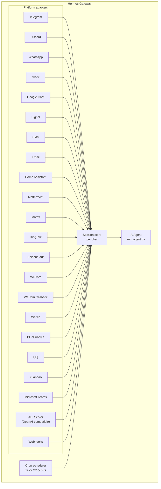

# メッセージングのゲートウェイ {#messaging-gateway}

Telegram、Discord、Slack、WhatsApp、Signal、SMS、メール、Home Assistant、Mattermost、Matrix、DingTalk、Feishu/Lark、WeCom、Weixin、BlueBubbles（iMessage）、QQ、Yuanbao、Microsoft Teams、LINE、ntfy、あるいはブラウザから Hermes と話せます。ゲートウェイは裏で動くひとつのプロセスで、設定したすべてのプラットフォームにつなぎ、セッションを扱い、定時の仕事を走らせ、音声メッセージを届けます。

CLI でのマイク入力、メッセージでの声による返信、Discord のボイスチャンネルでの会話まで含めた、音声まわりのすべては [音声モード](/hermes/docs/user-guide/features/voice-mode/) と [Hermes で音声モードを使う](/hermes/docs/guides/use-voice-mode-with-hermes/) を見てください。

:::tip
ボットには、モデルの提供元とツールの提供元（読み上げ、ウェブ）の両方が要ります。[Nous Portal](/hermes/docs/integrations/nous-portal/) の購読なら、そのすべてがひとまとめになっています。
:::

## プラットフォームの比較 {#platform-comparison}

| プラットフォーム | 音声 | 画像 | ファイル | スレッド | リアクション | 入力中 | 逐次送り |
|----------|:-----:|:------:|:-----:|:-------:|:---------:|:------:|:---------:|
| Telegram | ✅ | ✅ | ✅ | ✅ | — | ✅ | ✅ |
| Discord | ✅ | ✅ | ✅ | ✅ | ✅ | ✅ | ✅ |
| Slack | ✅ | ✅ | ✅ | ✅ | ✅ | ✅ | ✅ |
| Google Chat | — | ✅ | ✅ | ✅ | — | ✅ | — |
| WhatsApp | — | ✅ | ✅ | — | — | ✅ | ✅ |
| WhatsApp Cloud API | ✅ | ✅ | ✅ | — | — | ✅ | — |
| Signal | — | ✅ | ✅ | — | — | ✅ | — |
| SMS | — | — | — | — | — | — | — |
| メール | — | ✅ | ✅ | ✅ | — | — | — |
| Home Assistant | — | — | — | — | — | — | — |
| Mattermost | ✅ | ✅ | ✅ | ✅ | — | ✅ | ✅ |
| Matrix | ✅ | ✅ | ✅ | ✅ | ✅ | ✅ | ✅ |
| DingTalk | — | ✅ | ✅ | — | ✅ | — | ✅ |
| Feishu/Lark | ✅ | ✅ | ✅ | ✅ | ✅ | ✅ | ✅ |
| WeCom | ✅ | ✅ | ✅ | — | — | — | — |
| WeCom Callback | — | — | — | — | — | — | — |
| Weixin | ✅ | ✅ | ✅ | — | — | ✅ | — |
| BlueBubbles | — | ✅ | ✅ | — | ✅ | ✅ | — |
| Photon（iMessage） | ✅ | ✅ | ✅ | — | ✅ | ✅ | — |
| QQ | ✅ | ✅ | ✅ | — | — | ✅ | — |
| Yuanbao | ✅ | ✅ | ✅ | — | — | ✅ | ✅ |
| Microsoft Teams | — | ✅ | — | ✅ | — | ✅ | — |
| LINE | — | ✅ | ✅ | — | — | ✅ | — |
| ntfy | — | — | — | — | — | — | — |
| Raft | — | — | — | — | — | — | — |
| IRC | — | — | — | — | — | — | — |
| Buzz | — | ✅ | — | ✅ | — | — | — |
| SimpleX | ✅ | ✅ | ✅ | — | — | ✅ | — |

**音声** = 読み上げた音声での返信、または音声メッセージの文字起こし。**画像** = 画像の送受信。**ファイル** = 添付ファイルの送受信。**スレッド** = 枝分かれした会話。**リアクション** = メッセージへの絵文字の反応。**入力中** = 処理中に出る入力中のしるし。**逐次送り** = メッセージを書き換えながら少しずつ更新すること。

:::note Hermes Relay
[Hermes Relay](/hermes/docs/user-guide/messaging/relay/)（試験中）は、それ自体がチャットのプラットフォームではありません。Discord、Telegram、Slack、WhatsApp といったプラットフォームの前に立ち、その資格情報を持つ外部の中継役を通してつなぐ仕組みです。何ができるか（メディア、その場での承認や確認の問いかけ、リアクション、スレッド、入力中、逐次送り）は上の表で決まっているのではなく、中継役ごとに接続のときに取り決められます。
:::

## 仕組み {#architecture}



それぞれのプラットフォームのつなぎ役がメッセージを受け取り、チャットごとのセッションの置き場を通して、処理のために AIAgent へ渡します。ゲートウェイは定時の仕事の割り振りも回していて、60 秒ごとに時計を刻んで、その時刻が来た仕事を実行します。

## わざと黙るための合図 {#intentional-silence-tokens}

グループでの会話やフック、自動化の流れのために、Hermes ははっきりした「黙る合図」に対応しています。エージェントの最終的な返答がちょうど対応する合図ひとつだったときは、ゲートウェイが送信を止めて、チャットには何も送りません。

対応している合図は次のとおりです。

- `[SILENT]`
- `SILENT`
- `NO_REPLY`
- `NO REPLY`

空白と大文字小文字は揃えられますが、最終的な返答の全体がその合図でなければなりません。「何も変わらなかったときは `[SILENT]` を使ってください」といった文は、ふつうに届きます。

黙るかどうかは、届けるかどうかの判断だけです。Hermes はセッションの記録に、黙ったというアシスタントの番をそのまま残します。だから会話は、いつもどおり交互に続きます。

```text
user: side-channel chatter
assistant: [SILENT]   # stored, not delivered
user: next message
```

失敗した番は、これまでどおりエラーとして表に出ます。文面が黙る合図に似ているというだけで、Hermes が失敗を隠すことはありません。

## 手早く設定する {#quick-setup}

メッセージングのプラットフォームを設定するいちばん楽な方法は、対話形式の案内役です。

```bash
hermes gateway setup        # Interactive setup for all messaging platforms
```

矢印キーで選びながら、それぞれのプラットフォームの設定を順に案内してくれます。すでに設定済みのものも表示され、終わったらゲートウェイの起動や再起動も持ちかけてくれます。

## ゲートウェイのコマンド {#gateway-commands}

```bash
hermes gateway              # Run in foreground
hermes gateway setup        # Configure messaging platforms interactively
hermes gateway install      # Install as a user service (Linux) / launchd service (macOS)
sudo hermes gateway install --system   # Linux only: install a boot-time system service
hermes gateway start        # Start the default service
hermes gateway stop         # Stop the default service
hermes gateway status       # Check default service status
hermes gateway status --system         # Linux only: inspect the system service explicitly
```

### Linux で使える、任意のイベントループの見張り {#optional-linux-event-loop-watchdog}

systemd に管理されているゲートウェイは、Python の asyncio のイベントループに
実行の順番が回ってこなくなったときに、プロセスを立て直す仕組みを選べます。プラットフォームごとの
生存確認の処理までもが動かなくなる、プロセス全体の停止に効きます。

```yaml title="~/.hermes/config.yaml"
gateway:
  systemd_watchdog_seconds: 120
```

この設定を変えたら、サービスの定義を作り直してください。

```bash
hermes gateway install --force
```

正の値にすると、作られる定義が `Type=notify`、
`NotifyAccess=main`、そして対応する `WatchdogSec` を使うようになります。Hermes は自分の
イベントループが滞りなく進んでいるあいだだけ、生きているという合図を送ります。合図が止まると
systemd がプロセスを再起動します。既定の `0` は、これまでの `Type=simple` の
動きのままです。この設定は Linux と systemd のためのもので、ふつうの
プラットフォームの通信の切断をイベントループの異常として扱うことはありません。

## チャットのなかで使うコマンド {#chat-commands-inside-messaging}

| コマンド | 説明 |
|---------|-------------|
| `/new` または `/reset` | 新しい会話を始めます |
| `/model [provider:model]` | モデルを表示または変更します（`provider:model` の書き方に対応） |
| `/personality [name]` | 人格を設定します（`none` で解除） |
| `/retry` | 直前のメッセージをやり直します |
| `/undo` | 直前のやり取りを取り消します |
| `/status` | セッションの情報を表示します |
| `/whoami` | この範囲でのスラッシュコマンドの権限を表示します（admin / user / unrestricted） |
| `/stop` | 動いているエージェントを止めます |
| `/approve` | 保留中の危ないコマンドを承認します |
| `/deny` | 保留中の危ないコマンドを断ります |
| `/sethome` | このチャットを本拠のチャンネルにします |
| `/compress` | 会話の文脈を自分の手で圧縮します |
| `/title [name]` | セッションの題名を設定または表示します |
| `/resume [name]` | 名前を付けておいたセッションを再開します |
| `/sessions [all] [search <query>]` | これまでのセッションを並べます。`search <query>` で題名か ID を絞り込めます |
| `/usage` | このセッションのトークンの使用量を表示します（`/usage reset [--force]` で、貯めておいた Codex の上限の解除を使えます） |
| `/insights [days]` | 使い方の傾向と集計を表示します |
| `/reasoning [level\|show\|hide]` | 推論の深さを変えるか、推論の表示を切り替えます |
| `/voice [on\|off\|tts\|join\|leave\|status]` | メッセージでの音声の返信と、Discord のボイスチャンネルでの動きを操ります |
| `/rollback [number]` | ファイルの控えを並べるか、書き戻します |
| `/bg <prompt>` | 指示文を、裏で動く別のセッションで走らせます |
| `/btw <question>` | いまの会話を邪魔せずに、それについて横から質問します |
| `/reload-mcp` | 設定から MCP のサーバーを読み直します |
| `/update` | Hermes Agent を最新の版に更新します |
| `/help` | 使えるコマンドを表示します |
| `/<skill-name>` | 入っているスキルを呼び出します |

## セッションの扱い {#session-management}

### セッションが残ること {#session-persistence}

セッションは、やり直すまでメッセージをまたいで残ります。エージェントは会話の流れを覚えています。

### 前のセッションを探す（`/sessions`） {#finding-past-sessions-sessions}

`/sessions` は、いまのチャットでのこれまでのセッションを並べます。いま入っているものも `(current)` の印付きで出ます。`/sessions <name>` でそのひとつを再開できます（`/resume` の短い書き方です）。一覧が長くなったら、`/sessions search <query>`（別名 `find`）で題名かセッションの ID の一致で絞り込めます。並びは、最近使ったものからです。`/sessions all` による出どころをまたいだ一覧は管理者だけのもので、ふつうの利用者には一覧がチャットの範囲にとどまった旨の知らせが出て、自分のチャットの出どころのセッションしか見えません。

### 残る `/model` の上書き {#persistent-model-overrides}

ゲートウェイのチャットでの `/model` の切り替えは、そのセッションに効きます。そしていまは**ゲートウェイを再起動しても残ります**。モデルと提供元の選択はセッションの置き場に保存され、再起動後の初めての利用のときに戻されます（資格情報は読み込みのときに解決し直され、ディスクに書かれることはありません）。`/new`（または `/reset`）で上書きは消えます。`/model <name> --global` なら、代わりに `config.yaml` まで書き込みます。`/model <name> --once` は、その 1 回の往復だけに効きます。

### 確実に届けること {#delivery-reliability}

エージェントの最終的な返答は、プラットフォームへ送る前後で、消えない**送り届けの台帳**
（`state.db`）に記録されます。返答を作ってからプラットフォームが受け取りを確かめるまでの
あいだにゲートウェイが落ちたり再起動したりしても、次に立ち上がったときに、失ったり
やり直したりせずに保存した返答を送り直します。

意味づけは正直に「少なくとも 1 回」です。

- 送信が**まだ始まっていなかった**返答は、そのまま送り直されます。
- ゲートウェイが落ちたときに**送信の途中だった**返答（プラットフォームが受け取ったかも
  しれないし、受け取っていないかもしれないもの）は、目に見える
  「♻️ Recovered reply — … may be a duplicate」という前置きを付けて送り直されます。はっきり
  しないことには、はっきりしないと札を付けます。黙って送り直すことはしません。
- 送り直しには限りがあります。3 回まで、24 時間まで新しいものとして扱い、そのあとは
  諦めます。届いた記録は 7 日で片づけられます。

やめたいときは `config.yaml` で `gateway.delivery_ledger: false` にします（以前の
動きに戻り、落ちたときに送りかけの返答は失われます）。

### やり直しの決まり {#reset-policies}

**既定では、セッションが勝手にやり直されることはありません。** 自分で `/reset` するか、
文脈の圧縮が働くまで、会話の流れは残ります。自動でやり直したいなら、
`~/.hermes/config.yaml` の `session_reset` の節で有効にしてください。

```yaml
session_reset:
  mode: idle        # "idle", "daily", "both", or "none" (default)
  idle_minutes: 1440  # for idle/both: minutes of inactivity before reset
  at_hour: 4          # for daily/both: hour of day (0-23, local time)
```

| モード | 説明 |
|------|-------------|
| `none` | 自動ではやり直しません（既定） |
| `daily` | 毎日、決まった時刻にやり直します |
| `idle` | 何もしないまま N 分たったらやり直します |
| `both` | 先に当てはまったほうで |

裏で動いているプロセス（`terminal(background=true)` で始めたもの）は、ふつうは出力を
失わないように、自分のセッションがやり直されるのを止めます。ただし、忘れられたプロセス
（たとえばプレビュー用のサーバー）がセッションをいつまでも開いたままにしないよう、
`bg_process_max_age_hours`（既定 **24**）より古い裏のプロセスは、やり直しを止めなくなります。
プロセスが終了させられるわけでは**なく**、やり直しの見張りが無視するだけです。この打ち切りを
なくすには `0` にしてください（生きているプロセスがあれば必ずやり直しを止める、以前の動きに
戻ります）。何日もかかる正当な仕事を走らせていて、それが生きているあいだ会話を開いておきたい
なら、値を上げてください。

プラットフォームごとの上書きは `~/.hermes/gateway.json` に書きます。

```json
{
  "reset_by_platform": {
    "telegram": { "mode": "idle", "idle_minutes": 240 },
    "discord": { "mode": "idle", "idle_minutes": 60 }
  }
}
```

## チャンネルごとのモデルとシステムプロンプトの上書き {#per-channel-model-system-prompt-overrides}

**ひとつのゲートウェイ**から、チャンネルごとに違うモデルと人格を動かせます。たとえば `#daily` では安くて速いモデル、`#dev` では最前線のモデルに専門家向けのプロンプト、という具合です。`~/.hermes/gateway-config.yaml` のプラットフォームの下に `channel_overrides` を書きます。

```yaml
platforms:
  discord:
    enabled: true
    channel_overrides:
      "123456789012345678":        # channel/thread id
        model: anthropic/claude-sonnet-4.6
        provider: anthropic
        system_prompt: "You are the #dev channel code-review specialist."
      "987654321098765432":
        model: openai/gpt-5-mini
```

細かいところは次のとおりです。

- 3 つのキーはどれも任意です。`model` だけ、`system_prompt` だけ、あるいは組み合わせて設定できます。書かなかった項目は、全体の既定に落ちます。
- 探す順番は、まずチャンネルやスレッドの ID そのもの、次に**親**のチャンネルやフォーラムの ID です。だから Discord のスレッドは、親チャンネルの上書きを自動で受け継ぎます。
- モデルの決まる順番は、セッションの `/model` による上書き → `channel_overrides` → 全体の設定です。チャットで `/model` を打った利用者のほうが、チャンネルの既定より強いままです。
- `system_prompt` の上書きは、そのチャンネルでのゲートウェイ全体のプロンプトを置き換えます（その場限りのもので、往復ごとに差し込まれ、履歴には残りません）。

## 安全について {#security}

**既定では、許可の一覧に載っていない、あるいは DM で組み合わせをすませていない利用者を、ゲートウェイはすべて断ります。** ターミナルに手の届くボットとして、これが安全な既定です。

```bash
# Restrict to specific users (recommended):
TELEGRAM_ALLOWED_USERS=123456789,987654321
DISCORD_ALLOWED_USERS=123456789012345678
SIGNAL_ALLOWED_USERS=+155****4567,+155****6543
SMS_ALLOWED_USERS=+155****4567,+155****6543
EMAIL_ALLOWED_USERS=trusted@example.com,colleague@work.com
MATTERMOST_ALLOWED_USERS=3uo8dkh1p7g1mfk49ear5fzs5c
MATRIX_ALLOWED_USERS=@alice:matrix.org
DINGTALK_ALLOWED_USERS=user-id-1
FEISHU_ALLOWED_USERS=ou_xxxxxxxx,ou_yyyyyyyy
WECOM_ALLOWED_USERS=user-id-1,user-id-2
WECOM_CALLBACK_ALLOWED_USERS=user-id-1,user-id-2
TEAMS_ALLOWED_USERS=aad-object-id-1,aad-object-id-2

# Or allow
GATEWAY_ALLOWED_USERS=123456789,987654321

# Or explicitly allow all users (NOT recommended for bots with terminal access):
GATEWAY_ALLOW_ALL_USERS=true
```

### DM での組み合わせ（許可の一覧の代わりに） {#dm-pairing-alternative-to-allowlists}

利用者の ID を手で設定する代わりに、知らない利用者がボットに DM を送ると、一度きりの合わせ言葉が返ります。メールだけは例外で、知らない差出人は、メールでの組み合わせをはっきり有効にしていない限り無視されます。

```bash
# The user sees: "Pairing code: XKGH5N7P"
# You approve them with:
hermes pairing approve telegram XKGH5N7P

# Other pairing commands:
hermes pairing list          # View pending + approved users
hermes pairing revoke telegram 123456789  # Remove access
```

合わせ言葉は 1 時間で切れ、回数にも制限があり、暗号として使える乱数から作られます。

### 管理者とふつうの利用者 {#admins-vs-regular-users}

許可の一覧が答えるのは「この人はそもそもボットに届くのか」です。**管理者とふつうの利用者の分け方**が答えるのは「入れたとして、何をしてよいのか」です。

許可されたどの利用者も、範囲（DM か、グループやチャンネルか）ごとに 2 つのどちらかに入ります。

- **管理者** — 何でもできます。登録されているスラッシュコマンド（もとからあるものもプラグインのものも）をすべて実行でき、制限のかかった機能もすべて使えます。
- **ふつうの利用者** — できることが限られます。エージェントとふつうに話せますが、実行できるスラッシュコマンドは、こちらがはっきり許したものだけです。必ず使える最低限は `/help` と `/whoami` です。

この区分は、プラットフォームごと・範囲ごとに設定します。DM での管理者だからといって、グループやチャンネルでも管理者になるわけではありません。範囲ごとに、それぞれの管理者の一覧があります。

**いまこの区分が効くところ:** スラッシュコマンドです。区分は動いているコマンドの登録簿を通るので、もとからあるものにもプラグインが登録したものにも、機能ごとの作り込みなしに効きます。ふつうの会話には影響しません。管理者でなくてもエージェントとは話せます。

**これから効くかもしれないところ:** ほかの機能（ツールへのアクセス、モデルの切り替え、費用のかかる操作）も、増やしていくにつれてこの同じ管理者とふつうの利用者の区分にぶら下がります。いま区分を設定しておけば、そうした将来の制限も、誰が管理者かを組み直さずにそのまま収まります。

#### 設定 {#configuration}

```yaml
gateway:
  platforms:
    discord:
      extra:
        allow_from: ["111", "222", "333"]
        allow_admin_from: ["111"]                    # admins → all slash commands
        user_allowed_commands: [status, model]       # what non-admins may run
        # Optional: separate group/channel scope
        group_allow_admin_from: ["111"]
        group_user_allowed_commands: [status]
```

**以前との互換:** ある範囲で `allow_admin_from` を設定していなければ、その範囲では区分が無効になり、許可された利用者は全員が何でもできます。すでに入れてあるものは何も変えずに動き続けます。区別したくなったときに有効にしてください。

#### 自分の権限を確かめる {#inspecting-your-access}

どのプラットフォームからでも `/whoami` を使えば、いまの範囲、自分の区分（admin / user / unrestricted）、そして実行できるスラッシュコマンドが分かります。プラットフォームごとの例は [Telegram](/hermes/docs/user-guide/messaging/telegram/#slash-command-access-control) と [Discord](/hermes/docs/user-guide/messaging/discord/#slash-command-access-control) のページを見てください。

## エージェントの向きを変える {#redirecting-the-agent}

エージェントが働いている最中にメッセージを送れば、いまの番の内容を直せます。

- **モデルの生成は、流れを引き継いだうえでやり直します** — すでに見えている推論と、途中まで出ている文章は、ふつうのアシスタントの区切りとして残ります
- **終わった仕事はそのまま使えます** — それまでのツールの呼び出しと結果は、その番のなかに残ります
- **走っているツールは無事に終わります** — 直しは、ツールを打ち切るのではなく、次にツールの結果が出る切れ目で当てられます
- **`/stop` はきっぱり止めるためのものです** — いまの番と表で動いている仕事を取り消したいときに使ってください

### 待たせるか、割り込むか、脇から入れるか（busy-input のモード） {#queue-vs-interrupt-vs-steer-busy-input-mode}

既定では、忙しいエージェントにメッセージを送ると、いまの番の向きが変わります。ほかに 2 つのやり方があります。

- `queue` — あとから送ったメッセージは待ち、いまの仕事が終わってから次の番として走ります。
- `steer` — あとから送ったメッセージは `/steer` を通していまの実行に差し込まれ、次のツールの呼び出しのあとでエージェントに届きます。割り込みも新しい番も起きません。エージェントがまだ動き出していなければ、`queue` の動きに落ちます。

```yaml
display:
  busy_input_mode: steer   # or queue, or interrupt (default)
  busy_ack_enabled: true   # set to false to suppress the ⚡/⏳/⏩ chat reply entirely
```

どのプラットフォームでも、忙しいエージェントに初めてメッセージを送ったときは、Hermes がこの切り替えについての一行の案内を、忙しいことの返事に付け足します（`"💡 First-time tip — …"`）。この案内は入れたひとつの環境につき一度だけです。`onboarding.seen.busy_input_prompt` の下の目印が、それを覚えています。もう一度見たければ、その項目を消してください。

忙しいことの返事がうるさいと感じたら、`display.busy_ack_enabled: false` にしてください。入力の扱いは変わりません。確認のメッセージが隠れるだけです。

## 確認の問いかけ（複数選べるもの） {#clarify-questions-multi-select}

エージェントが `clarify` のツールで質問してくると、ゲートウェイは選択肢を番号付きの問いかけとして描きます（それに対応したプラットフォームなら、その場のボタンとして描きます）。確認の問いかけは**複数選べる**形にも対応していて、エージェントがいくつも選んでよいと示せます。

- **メッセージングのプラットフォーム** — 問いかけに「Multiple selections allowed」と出ます。番号をカンマか空白で区切って（たとえば `1, 3`）返すか、選択肢の文言そのもの、あるいは自分の言葉で答えてください。
- **昔ながらの CLI / TUI** — 複数選べるものはチェックボックスとして描かれます。**Space** で選択を切り替え、**Enter** で決定します。

ひとつだけ選ぶ問いかけは、これまでどおりです。番号かボタンか文言で選ぶか、「Other」から自分の答えを打ち込めます。

## ツールの進み具合の知らせ {#tool-progress-notifications}

ツールの動きをどこまで見せるかは `~/.hermes/config.yaml` で決めます。

```yaml
display:
  tool_progress: all    # off | new | all | verbose | log
  tool_progress_command: false  # set to true to enable /verbose in messaging
  # How progress is grouped on platforms that support message editing:
  #   accumulate (default) — edit one bubble in place as tools run
  #   separate             — send one message per tool (pre-v0.9 style; noisier)
  # Only applies where tool_progress is already enabled.
  tool_progress_grouping: accumulate   # accumulate | separate
```

### `log` のモード — チャットのメッセージではなく記録のファイルへ {#log-mode-audit-file-instead-of-chat-messages}

`display.tool_progress: log` にすると、進み具合の吹き出しはチャットに**まったく**出ません。代わりに、ツールの呼び出しごとに 1 行が `~/.hermes/logs/tool_calls.log` に書き足されます。これは入れ替わりながら残る記録のファイル（5 MB × 3 世代）で、ふつうの記録と同じ、秘密を伏せる仕組みを通ります。だから資格情報がディスクに残ることはありません。チャットを騒がせずに、ツールの呼び出しの跡をすべて残したいときにどうぞ。

### 状態を伝える言い回しを差し替える {#configurable-status-phrases}

長くかかっているときにゲートウェイが出す状態の行（「まだ働いています…」といった生存の合図）は、言い回しの一覧から選ばれます。もとからある既定は `gateway/assets/status_phrases.yaml` に入っていて、`HERMES_HOME` の下にプロファイルごと持ち運べるファイルを置けば、自分のものを足せます。

- `~/.hermes/status_phrases.yaml`、または `~/.hermes/status_phrases/` のなかの `*.yaml`（決まった置き場所で、自動で読まれます）
- あるいは設定から相対パスで指し示します。

```yaml
display:
  status_phrases:
    path: status_phrases/whatsapp.yaml  # relative to HERMES_HOME
    mode: append                        # append (default) or replace
```

言い回しのファイルは、出しどころ（`status`、`generic`）を文字列の一覧に対応づけます（出しどころごとに最大 80 個、1 つ 160 文字まで）。絶対パスと `..` による抜け出しは無視されるので、設定はプロファイルごと持ち運べるままです。使われるのは設定した言い回しだけです。ツールの生の引数、コマンド、推論の文章が、状態の言い回しに混ぜ込まれることはありません。

### モデルに渡す文脈のなかでの時刻 {#message-timestamps-in-model-context}

既定では無効です。有効にすると、Hermes は人が読める形の時刻
（たとえば `[Tue 2026-04-28 13:40:53 CEST]`）を、*モデルの文脈のなかで*
**利用者の**メッセージそれぞれの頭に付けます。だからエージェントは、いつ送られたものかを知れます。
時間についての推し量り（「今朝そう言いましたよね」、長い間が空いたことに気づく、など）に役立ちます。
アシスタントのメッセージやシステムプロンプトには付き**ません**。

```yaml
gateway:
  message_timestamps:
    enabled: false   # set true to show send-times to the model
```

保存される記録はいつもきれいなままです。時刻はこの切り替えに関わらずメッセージの付随情報として
保存されるので、あとから有効にすれば過去のメッセージの送信時刻も出ますし、
読み直しのたびに前置きが重なることもありません。

有効にすると、ボットは働きながら状態のメッセージを送ってきます。

```text
💻 `ls -la`...
🔍 web_search...
📄 web_extract...
🐍 execute_code...
```

## 裏で動くセッション {#background-sessions}

指示文を裏の別のセッションで走らせれば、メインのチャットの反応を保ったまま、エージェントに別で取り組ませられます。

```
/bg Check all servers in the cluster and report any that are down
```

Hermes はすぐに受け取りを返します。

```
🔄 Background task started: "Check all servers in the cluster..."
   Task ID: bg_143022_a1b2c3
```

### どう動くか {#how-it-works}

`/bg` の指示文ごとに、**別のエージェント**が生まれて、独立して走ります。

- **切り離されたセッション** — 裏のエージェントは、自分の会話の履歴を持つ自分のセッションを持ちます。いまのチャットの流れは一切知らず、渡された指示文だけを受け取ります。
- **同じ設定** — いまのゲートウェイの設定から、モデル、提供元、道具立て、推論の設定、提供元の振り分けを引き継ぎます。
- **待たされません** — メインのチャットは、変わらずやり取りできます。働いているあいだにメッセージを送っても、ほかのコマンドを打っても、裏の仕事をもっと増やしてもかまいません。
- **結果の届き方** — 仕事が終わると、コマンドを打ったのと**同じチャットやチャンネル**に「✅ Background task complete」の前置き付きで結果が返ります。失敗したときは「❌ Background task failed」がエラーとともに出ます。

### 裏のプロセスの知らせ {#background-process-notifications}

裏のセッションを走らせているエージェントが `terminal(background=true)` で長く動くプロセス（サーバー、ビルドなど）を始めたとき、ゲートウェイは状態の更新をチャットに送れます。これは `~/.hermes/config.yaml` の `display.background_process_notifications` で決めます。

```yaml
display:
  background_process_notifications: concise    # concise | all | result | error | off
```

| モード | 受け取るもの |
|------|-----------------|
| `concise` | 終わったときに一行の状態。失敗したときは出力の末尾が少し付きます（既定） |
| `all` | 動いている最中の出力の更新**と**、最後の生の出力のメッセージ |
| `result` | 最後の生の出力のメッセージだけ（終了コードに関わらず） |
| `error` | 終了コードが 0 でないときの、最後の生の出力のメッセージだけ |
| `off` | プロセスの見張りのメッセージは一切なし |

環境変数でも設定できます。

```bash
HERMES_BACKGROUND_NOTIFICATIONS=result
```

### こんなときに {#use-cases}

- **サーバーの見張り** — 「/bg すべてのサービスの健康状態を確かめて、落ちているものがあれば知らせて」
- **長いビルド** — 話を続けながら「/bg ステージング環境をビルドして配ってきて」
- **調べもの** — 「/bg 競合の価格を調べて表にまとめて」
- **ファイルの整理** — 「/bg ~/Downloads の写真を日付ごとのフォルダにまとめて」

:::tip
メッセージングのプラットフォームでの裏の仕事は、投げたら忘れてよいものです。待ったり様子を見に行ったりする必要はありません。終わったら、同じチャットに自動で結果が届きます。
:::

## サービスとしての扱い {#service-management}

### Linux（systemd） {#linux-systemd}

```bash
hermes gateway install               # Install as user service
hermes gateway start                 # Start the service
hermes gateway stop                  # Stop the service
hermes gateway status                # Check status
journalctl --user -u hermes-gateway -f  # View logs

# Enable lingering (keeps running after logout)
sudo loginctl enable-linger $USER

# Or install a boot-time system service that still runs as your user
sudo hermes gateway install --system
sudo hermes gateway start --system
sudo hermes gateway status --system
journalctl -u hermes-gateway -f
```

ノートパソコンや開発用の機械では、利用者のサービスを使ってください。VPS や画面のないホストで、systemd の居残り設定に頼らずに起動時から動いてほしいなら、システムのサービスを使ってください。

:::danger 自作の `ExecStopPost` で強制終了させる設定を足さないでください
Hermes が入れる定義は、`KillMode=mixed` と `KillSignal=SIGTERM` ですでにゲートウェイをきれいに終わらせますし、`Restart=always` と `RestartForceExitStatus` を使って、更新や `/restart` のときに正しく生まれ直すようにしてあります。`ExecStopPost=/bin/kill -9 $MAINPID` のような systemd の追加設定は足さ**ない**でください。`ExecStopPost` はきれいな再起動も含めて*すべての*停止で走るので、生まれたばかりのプロセスが落ち着く前に `SIGKILL` で殺してしまい、`Restart=always` がすぐにまた生み直します。結果として、終わらない再起動の輪ができます（Telegram では、再起動の知らせが洪水のように届きます）。そういう追加設定を足してしまったなら、消してください。`systemctl --user edit hermes-gateway`（システムのサービスなら `sudo systemctl edit hermes-gateway`）で `ExecStopPost` の行を消し、`systemctl --user daemon-reload` を実行します。
:::

:::tip 画面のない仮想機械では、利用者のサービスと居残り設定で root を求められずに済みます
システムのサービスは、再起動のたびに root が要ります。`hermes update` の最後に走る、ゲートウェイの自動の再起動も同じです。`hermes update` を root 以外で実行すると、パスワードの要らない `sudo systemctl` を試します。それが使えなければ再起動を飛ばして、手で打つための `sudo systemctl restart hermes-gateway` を表示します（対話的なパスワードの入力待ちで止まることはありません）。

ログインすることのない画面のない仮想機械なら、居残り設定を有効にした**利用者の**サービスで、root にまったく触れずに同じ「起動時から動く」動きが手に入ります。

```bash
hermes gateway install          # user service
sudo loginctl enable-linger $USER   # one-time: start at boot, survive logout
```

そうしておけば、`hermes update` は特別な権限なしにゲートウェイを再起動できます。システムのサービスのままでいきたいなら、更新を `sudo hermes update` で走らせるか、そのサービスの利用者に systemctl のパスワードなしの sudo を与えてください。たとえば `sudo visudo -f /etc/sudoers.d/hermes-gateway` でこう書きます。

```
hermes ALL=(root) NOPASSWD: /usr/bin/systemctl --no-ask-password reset-failed hermes-gateway*, /usr/bin/systemctl --no-ask-password start hermes-gateway*, /usr/bin/systemctl --no-ask-password restart hermes-gateway*
```
:::

よほどそうしたいのでなければ、利用者のものとシステムのものの両方のゲートウェイの定義を同時に入れておくのは避けてください。両方あると起動・停止・状態の確認がどちらのものか曖昧になるので、Hermes は気づいたら警告します。

:::info いくつも入れている場合
同じ機械に Hermes をいくつも入れている場合（`HERMES_HOME` のディレクトリを分けている場合）、それぞれが自分の systemd のサービス名を持ちます。既定の `~/.hermes` は `hermes-gateway` を使い、ほかは `hermes-gateway-<hash>` を使います。`hermes gateway` のコマンドは、いまの `HERMES_HOME` に合ったサービスを自動で選びます。
:::

### macOS（launchd） {#macos-launchd}

```bash
hermes gateway install               # Install as launchd agent
hermes gateway start                 # Start the service
hermes gateway stop                  # Stop the service
hermes gateway status                # Check status
tail -f ~/.hermes/logs/gateway.log   # View logs
```

作られる plist は `~/Library/LaunchAgents/ai.hermes.gateway.plist` にあります。3 つの環境変数が入っています。

- **PATH** — 入れたときのシェルの PATH をそのまま、venv の `bin/` と `node_modules/.bin` を先頭に足したものです。おかげで、自分で入れた道具（Node.js、ffmpeg など）が、WhatsApp の橋渡しのようなゲートウェイの子プロセスからも使えます。
- **VIRTUAL_ENV** — Python の仮想環境を指すので、道具がパッケージを正しく見つけられます。
- **HERMES_HOME** — ゲートウェイを、その Hermes に結びつけます。

:::tip 入れたあとで PATH が変わったら
launchd の plist は書いた時点で固まります。ゲートウェイを用意したあとで新しい道具を入れたら（nvm で新しい Node.js を入れた、Homebrew で ffmpeg を入れた、など）、もう一度 `hermes gateway install` を実行して、新しい PATH を取り込んでください。ゲートウェイは古い plist に気づいて、自動で読み直します。
:::

:::info いくつも入れている場合
Linux の systemd のサービスと同じで、`HERMES_HOME` のディレクトリごとに自分の launchd の名札を持ちます。既定の `~/.hermes` は `ai.hermes.gateway` を使い、ほかは `ai.hermes.gateway-<suffix>` を使います。
:::

## プラットフォームごとの道具立て {#platform-specific-toolsets}

プラットフォームごとに、それぞれの道具立てがあります。

| プラットフォーム | 道具立て | できること |
|----------|---------|--------------|
| CLI | `hermes-cli` | すべて使えます |
| Telegram | `hermes-telegram` | ターミナルを含めてすべて |
| Discord | `hermes-discord` | ターミナルを含めてすべて |
| WhatsApp | `hermes-whatsapp` | ターミナルを含めてすべて |
| WhatsApp Cloud API | `hermes-whatsapp` | ターミナルを含めてすべて（Baileys の橋渡しと道具立てを共有します） |
| Slack | `hermes-slack` | ターミナルを含めてすべて |
| Google Chat | `hermes-google_chat` | ターミナルを含めてすべて |
| Signal | `hermes-signal` | ターミナルを含めてすべて |
| SMS | `hermes-sms` | ターミナルを含めてすべて |
| メール | `hermes-email` | ターミナルを含めてすべて |
| Home Assistant | `hermes-homeassistant` | すべて + HA の機器の操作（ha_list_entities、ha_get_state、ha_call_service、ha_list_services） |
| Mattermost | `hermes-mattermost` | ターミナルを含めてすべて |
| Matrix | `hermes-matrix` | ターミナルを含めてすべて |
| DingTalk | `hermes-dingtalk` | ターミナルを含めてすべて |
| Feishu/Lark | `hermes-feishu` | ターミナルを含めてすべて |
| WeCom | `hermes-wecom` | ターミナルを含めてすべて |
| WeCom Callback | `hermes-wecom-callback` | ターミナルを含めてすべて |
| Weixin | `hermes-weixin` | ターミナルを含めてすべて |
| BlueBubbles | `hermes-bluebubbles` | ターミナルを含めてすべて |
| QQBot | `hermes-qqbot` | ターミナルを含めてすべて |
| Yuanbao | `hermes-yuanbao` | ターミナルを含めてすべて |
| Microsoft Teams | `hermes-teams` | ターミナルを含めてすべて |
| API Server | `hermes-api-server` | すべて（`clarify` と `text_to_speech` は外れます。プログラムからのアクセスには、その場にいる利用者がいないからです） |
| Webhooks | `hermes-webhook` | ターミナルを含めてすべて |
| Raft | `hermes-raft` | 起こすためだけの経路。メッセージのやり取りにはエージェントが Raft の CLI を使います |

## 複数のプラットフォームを束ねたゲートウェイを運用する {#operating-a-multi-platform-gateway}

ゲートウェイはたいてい、いくつものつなぎ役を同時に動かします（Telegram + Discord + Slack など）。ここから先は、すべてのプラットフォームにまたがる、動かし始めたあとの話です。

### `/platform` コマンド {#platform-command}

ゲートウェイが動き出したら、つながっている CLI のセッションやチャットから `/platform` のスラッシュコマンドを使って、ゲートウェイ全体を再起動せずに、つなぎ役をひとつずつ調べたり動かしたりできます。

```
/platform list                  # show all adapters and their state
/platform pause <name>          # stop dispatching new messages to one adapter
/platform resume <name>         # re-enable a paused adapter
```

`/platform list` は、それぞれのつなぎ役が `running` か、（手で）`paused` か、`paused-by-breaker`（下で説明します）かを表示します。止めているあいだも、つなぎ役は読み込まれたままで裏の処理も生きています。届いたメッセージは捨てられますが、接続そのものは開いたままなので、すぐに再開できます。

もっと広く状態をまとめて見る [`/platforms`](/hermes/docs/reference/slash-commands/#info) のコマンドもあります。

### 資格情報が `.env` に残っているプラットフォームを止める {#disabling-a-platform-whose-credentials-are-still-in-env}

`~/.hermes/config.yaml` の `platforms.<name>.enabled: false` が正です。
そのプラットフォームの資格情報が環境に残っていても（`TELEGRAM_BOT_TOKEN`、
`WEIXIN_TOKEN`、`HASS_TOKEN`、`EMAIL_*`、`TWILIO_ACCOUNT_SID` など）、送るだけの
道具が動き続けるようにプラットフォームの設定には組み込まれます。ただし、
つなぎ役を立ち上げることはもうありません。

```yaml title="~/.hermes/config.yaml"
platforms:
  weixin:
    enabled: false   # wins over WEIXIN_TOKEN in .env
```

以前の版では、資格情報があるというだけで 12 のプラットフォーム（Weixin、WhatsApp Cloud、
Home Assistant、メール、SMS、DingTalk、Feishu、WeCom、WeCom callback、BlueBubbles、
QQ Bot、Yuanbao）が、このキーに関わらず有効になっていました。それを当てにしていた
場合のために、ゲートウェイは起動時に、当てはまるプラットフォームごとに警告を 1 行出します。
黙って動かなくなることはありません。

```
Platform 'weixin' is explicitly disabled by platforms.weixin.enabled: false in config.yaml,
so the credentials found in the environment (WEIXIN_TOKEN, WEIXIN_ACCOUNT_ID) will NOT start
its adapter. Environment credentials no longer override an explicit disable. Remove the key
or set platforms.weixin.enabled: true to turn it back on.
```

`enabled` のキーをまったく書かなければ、これまでどおり環境変数だけで決まります。
資格情報があれば、つなぎ役が立ち上がります。

### 引き継いだプロキシを無視する（`gateway.trust_env`） {#ignoring-an-inherited-proxy-gatewaytrustenv}

既定では、どのつなぎ役もゲートウェイの環境にある `HTTP_PROXY` / `HTTPS_PROXY` /
`NO_PROXY`（と `SSL_CERT_FILE`）に従い、macOS ではシステムのプロキシも自動で
見つけます。Windows のタスクスケジューラやサービスの管理から立ち上げられたゲートウェイは、
対話的なシェルからは見えないプロキシ（まだ動いていない手元の Clash や V2Ray の
待ち受け）を引き継いでしまい、問い合わせのたびに
`Cannot connect to host 127.0.0.1:7890` を記録することがあります。引き継いだ
プロキシを、すべてのつなぎ役でまとめて無効にできます。

```yaml title="~/.hermes/config.yaml"
gateway:
  trust_env: false
```

プラットフォームごとにはっきり指定したプロキシの変数（`DISCORD_PROXY`、`TELEGRAM_PROXY`、
`MATRIX_PROXY` など）は、これまでどおり効きます。変えたらゲートウェイを再起動してください。

### 自動で切れる安全装置 {#automatic-circuit-breaker}

つなぎ役はそれぞれ、安全装置に包まれています。やり直せる失敗（通信の途切れ、回数制限の返事、上流の 5xx の応答、WebSocket の切断）が繰り返されると装置が落ちて、つなぎ役が自動で止まり、ほかに生きているプラットフォームがあればその本拠のチャンネルに運用者向けの知らせが送られ、決まった形の記録が残ります。

この装置は自動で**戻りません**。自分で `/platform resume <name>` を実行するまで、落ちたままです。これはわざとです。プラットフォームがずっと止まっているときに、ゲートウェイが再接続を繰り返して暴れるのは望ましくないからです。

### プラットフォームが止まったとき、どこを見るか {#where-to-look-when-a-platform-is-paused}

つなぎ役が止まったら、こう確かめます。

1. **ゲートウェイの記録**（`~/.hermes/logs/gateway.log` か、systemd / launchd の記録）。プラットフォーム名と `circuit breaker`、`paused`、`disabled` で探してください。装置が落ちたできごとには、失敗の回数と最後のエラーが入っています。
2. **`/platform list`** の出力 — いまの状態と、直前の理由が出ます。
3. **提供元の状態のページ**（Telegram のボット API の状態、Discord の状態など）。装置が落ちたのは、そのプラットフォームの調子が悪かったからです。戻るまで再開しないでください。

上流が元気になったら、`/platform resume <name>` で装置がもとに戻り、つなぎ役が動き出します。

### 再起動の知らせ {#restart-notifications}

ゲートウェイが再起動したとき（あるいは処理の途中のセッションを抱えたまま止まったとき）、それぞれのプラットフォームの本拠のチャンネルに「エージェントが戻りました」「エージェントが中断されました」という知らせを一度だけ送れます。これは `gateway-config.yaml` の `gateway_restart_notification` の旗でプラットフォームごとに決まり、既定は `true` です。

```yaml
gateway:
  platforms:
    telegram:
      home_chat_id: "123456789"
      gateway_restart_notification: false   # opt out for this platform
    discord:
      home_chat_id: "987654321"
      # gateway_restart_notification omitted → defaults to true
```

騒がしいところや優先度の低いところでは切り、主に使うチャットでは残す、という使い方ができます。この知らせは、途中のセッションがいくつあっても、再起動につき一度だけ送られます。

### 入力中のしるし {#typing-indicators}

エージェントがメッセージを処理しているあいだ、それに対応したプラットフォームでは、ゲートウェイが入力中の状態を表示します。Telegram / Discord / Signal なら「入力中…」の吹き出し、Slack ならアシスタントの「is thinking…」の状態です。これは `gateway-config.yaml` の `typing_indicator` の旗でプラットフォームごとに決まり、既定は `true` です。

```yaml
gateway:
  platforms:
    slack:
      typing_indicator: false   # don't show "is thinking…" on Slack
    telegram:
      # typing_indicator omitted → defaults to true
```

しるしが邪魔なプラットフォームでは `typing_indicator: false` にしてください。Slack の「is thinking…」の状態をうるさいと感じる人もいます（Slack の Assistant API を使うので、出ているあいだは入力欄も少しのあいだ使えなくなります）。切ってもしるしが消えるだけで、メッセージの届き方もそのほかも変わりません。この旗は共通なので、同じキーがどのプラットフォームでも使えます。

### ゲートウェイの再起動をまたいだセッションの再開 {#session-resume-across-gateway-restarts}

ツールの呼び出しや生成の途中でゲートウェイが止まると、そのセッションには `restart_interrupted` の印が付きます。次に立ち上がったとき、ゲートウェイはそれぞれについて自動での再開を予定します。利用者にはチャットに短い前置き（「再起動のあとで何かメッセージを送ってください。続きから再開してみます。」）が届き、返信するとセッションは最後に確定した番から続きます。

この動きは既定で有効で、ゲートウェイの起動時に記録されます。

```
Scheduled auto-resume for N restart-interrupted session(s)
```

設定は要りません。前置きが要らなければ、そのプラットフォームで `gateway_restart_notification: false` にしてください。

### 携帯で見やすい進み具合の既定 {#mobile-friendly-progress-defaults}

Telegram はたいてい携帯で見る受信箱なので、既定はその画面に合わせてあります。

- **`tool_progress`** の既定は **`off`** です。ツールごとの足跡がチャットを埋め尽くすことはありません。
- **`busy_ack_detail`** の既定は **`off`** です。忙しいことの返事や長くかかるときの合図は、そっけないままです（`iteration 21/60` のような細かい情報は出ません）。
- **`interim_assistant_messages`** は **有効**のままです。番の途中でアシスタントが本当に語ること（モデルがこれから何をするかを言葉にしているもの）は、雑音ではなく信号だからです。
- **`long_running_notifications`** は **有効**のままです。「⏳ Working — N min」というひとつの吹き出しがその場で数分おきに書き換わるので、30 分も `typing…` を眺める代わりに、生きているという合図が得られます。

有効のままにしてある既定を切ったり、逆に細かい進み具合を出すようにしたりは、プラットフォームごとにできます。

```yaml
display:
  platforms:
    telegram:
      # Re-enable the tool-progress stream
      tool_progress: new
      # Show "iteration N/M, running: tool" in heartbeats and busy acks
      busy_ack_detail: true
      # Or quiet them entirely
      interim_assistant_messages: false
      long_running_notifications: false
```

### 進み具合の吹き出しの片づけ（頼んだときだけ） {#progress-bubble-cleanup-opt-in}

ツールの進み具合のメッセージ、「まだ働いています…」の合図、状態を知らせる吹き出しは、最終的な返答が届いたあとに自動で消すこともできます。`display.platforms.<platform>.cleanup_progress` でプラットフォームごとに有効にします。

```yaml
display:
  platforms:
    telegram:
      cleanup_progress: true
    discord:
      cleanup_progress: true
```

既定は `false` です。この設定が効くのは、つなぎ役が `delete_message` を備えたプラットフォームだけです（いまのところ Telegram と Discord）。失敗した実行では片づけを**飛ばす**ので、吹き出しが足跡として残ります。

## 次に読むもの {#next-steps}

- [Telegram の設定](/hermes/docs/user-guide/messaging/telegram/)
- [Discord の設定](/hermes/docs/user-guide/messaging/discord/)
- [Slack の設定](/hermes/docs/user-guide/messaging/slack/)
- [Google Chat の設定](/hermes/docs/user-guide/messaging/google_chat/)
- [WhatsApp の設定](/hermes/docs/user-guide/messaging/whatsapp/)
- [WhatsApp Business Cloud API の設定](/hermes/docs/user-guide/messaging/whatsapp-cloud/)
- [Signal の設定](/hermes/docs/user-guide/messaging/signal/)
- [SMS の設定（Twilio）](/hermes/docs/user-guide/messaging/sms/)
- [メールの設定](/hermes/docs/user-guide/messaging/email/)
- [Home Assistant との連携](/hermes/docs/user-guide/messaging/homeassistant/)
- [Mattermost の設定](/hermes/docs/user-guide/messaging/mattermost/)
- [Matrix の設定](/hermes/docs/user-guide/messaging/matrix/)
- [DingTalk の設定](/hermes/docs/user-guide/messaging/dingtalk/)
- [Feishu/Lark の設定](/hermes/docs/user-guide/messaging/feishu/)
- [WeCom の設定](/hermes/docs/user-guide/messaging/wecom/)
- [WeCom Callback の設定](/hermes/docs/user-guide/messaging/wecom-callback/)
- [Weixin の設定（WeChat）](/hermes/docs/user-guide/messaging/weixin/)
- [BlueBubbles の設定（iMessage）](/hermes/docs/user-guide/messaging/bluebubbles/)
- [Photon の設定（iMessage）](/hermes/docs/user-guide/messaging/photon/)
- [QQBot の設定](/hermes/docs/user-guide/messaging/qqbot/)
- [Yuanbao の設定](/hermes/docs/user-guide/messaging/yuanbao/)
- [Microsoft Teams の設定](/hermes/docs/user-guide/messaging/teams/)
- [Teams の会議の受け渡し](/hermes/docs/user-guide/messaging/teams-meetings/)
- [Microsoft Graph の Webhook の受け口](/hermes/docs/user-guide/messaging/msgraph-webhook/)
- [LINE の設定](/hermes/docs/user-guide/messaging/line/)
- [ntfy の設定](/hermes/docs/user-guide/messaging/ntfy/)
- [SimpleX Chat の設定](/hermes/docs/user-guide/messaging/simplex/)
- [Open WebUI + API サーバー](/hermes/docs/user-guide/messaging/open-webui/)
- [Raft の設定](/hermes/docs/user-guide/messaging/raft/)
- [IRC の設定](/hermes/docs/user-guide/messaging/irc/)
- [Buzz の設定](/hermes/docs/user-guide/messaging/buzz/)
- [A2A（エージェント間）の設定](/hermes/docs/user-guide/messaging/a2a/)
- [Webhook](/hermes/docs/user-guide/messaging/webhooks/)
