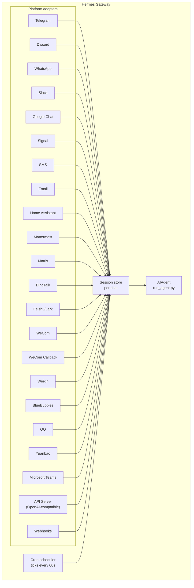

# メッセージングゲートウェイ {#messaging-gateway}

Telegram、Discord、Slack、WhatsApp、Signal、SMS、メール、Home Assistant、Mattermost、Matrix、DingTalk、Feishu/Lark、WeCom、Weixin、BlueBubbles（iMessage）、QQ、Yuanbao、Microsoft Teams、LINE、ntfy、そしてブラウザから Hermes と会話できます。ゲートウェイは 1 つのバックグラウンドプロセスで、設定したすべてのプラットフォームに接続し、セッションを管理し、cron ジョブを実行し、音声メッセージを届けます。

CLI のマイク入力モード、メッセージングでの音声返信、Discord のボイスチャンネルでの会話まで含めた音声機能の全体像は、[音声モード](/hermes/docs/user-guide/features/voice-mode/)と[Hermes で音声モードを使う](/hermes/docs/guides/use-voice-mode-with-hermes/)をご覧ください。

:::tip
ボットにはモデルのプロバイダーとツールのプロバイダー（TTS、Web）の両方が必要です。[Nous Portal](/hermes/docs/integrations/nous-portal/) のサブスクリプションなら、それらがまとめて付いてきます。
:::

## Desktop とダッシュボードでのメッセージング状態 {#messaging-status-in-desktop-and-the-dashboard}

メッセージングの状態は、選択中の端末の選択中のプロファイルに属します。`hermes gateway setup` で保存した
認証情報があれば、`config.yaml` に `platforms` の項目がなくても、認証情報ベースの
プラットフォームを有効にできます。ただし `platforms.<name>.enabled: false` を明示していれば
無効のままです。別のプロファイルがサーバープロセスの認証情報を引き継ぐことはありません。
必須の認証情報フィールドを持たないプラットフォームは、その一覧が空だからといって
有効になるわけではありません。

サーバー自身のプロファイルを明示的に指定した場合（既定プロファイルのサーバーに対する
`profile=default` など）は、指定なしで問い合わせたときと同じ状態が返ります。**Saved** は
認証情報が保存されていることを意味するだけで、メッセージングゲートウェイが動いているとか、
プラットフォームに接続できているという意味ではありません。有効なプラットフォームが
**Messaging gateway stopped** と表示されるのは正しい挙動です。

## プラットフォーム比較 {#platform-comparison}

| プラットフォーム | 音声 | 画像 | ファイル | スレッド | リアクション | 入力中表示 | 逐次表示 |
|----------|:-----:|:------:|:-----:|:-------:|:---------:|:------:|:---------:|
| Telegram | ✅ | ✅ | ✅ | ✅ | — | ✅ | ✅ |
| Discord | ✅ | ✅ | ✅ | ✅ | ✅ | ✅ | ✅ |
| Slack | ✅ | ✅ | ✅ | ✅ | ✅ | ✅ | ✅ |
| Google Chat | — | ✅ | ✅ | ✅ | — | ✅ | — |
| WhatsApp | — | ✅ | ✅ | — | — | ✅ | ✅ |
| WhatsApp Cloud API | ✅ | ✅ | ✅ | — | — | ✅ | — |
| Signal | — | ✅ | ✅ | — | — | ✅ | — |
| SMS | — | — | — | — | — | — | — |
| メール | — | ✅ | ✅ | ✅ | — | — | — |
| Home Assistant | — | — | — | — | — | — | — |
| Mattermost | ✅ | ✅ | ✅ | ✅ | — | ✅ | ✅ |
| Matrix | ✅ | ✅ | ✅ | ✅ | ✅ | ✅ | ✅ |
| DingTalk | — | ✅ | ✅ | — | ✅ | — | ✅ |
| Feishu/Lark | ✅ | ✅ | ✅ | ✅ | ✅ | ✅ | ✅ |
| WeCom | ✅ | ✅ | ✅ | — | — | — | — |
| WeCom Callback | — | — | — | — | — | — | — |
| Weixin | ✅ | ✅ | ✅ | — | — | ✅ | — |
| BlueBubbles | — | ✅ | ✅ | — | ✅ | ✅ | — |
| Photon (iMessage) | ✅ | ✅ | ✅ | — | ✅ | ✅ | — |
| QQ | ✅ | ✅ | ✅ | — | — | ✅ | — |
| Yuanbao | ✅ | ✅ | ✅ | — | — | ✅ | ✅ |
| Microsoft Teams | — | ✅ | — | ✅ | — | ✅ | — |
| LINE | — | ✅ | ✅ | — | — | ✅ | — |
| ntfy | — | — | — | — | — | — | — |
| Raft | — | — | — | — | — | — | — |
| IRC | — | — | — | — | — | — | — |
| Buzz | — | ✅ | — | ✅ | — | — | — |
| SimpleX | ✅ | ✅ | ✅ | — | — | ✅ | — |

**音声** = TTS による音声返信、または音声メッセージの文字起こし。**画像** = 画像の送受信。**ファイル** = 添付ファイルの送受信。**スレッド** = スレッド形式の会話。**リアクション** = メッセージへの絵文字リアクション。**入力中表示** = 処理中に出る入力中インジケーター。**逐次表示** = メッセージを編集しながら少しずつ更新していく表示。

:::note Hermes Relay
[Hermes Relay](/hermes/docs/user-guide/messaging/relay/)（実験的）は、それ自体がチャットのプラットフォームではありません。プラットフォームの認証情報を外部のコネクターに持たせたうえで、Discord・Telegram・Slack・WhatsApp などを前面で束ねるコネクターの仕組みです。対応できること（メディア、ネイティブの承認や確認のプロンプト、リアクション、スレッド、入力中表示、逐次表示）は上の表で固定されるのではなく、接続時のハンドシェイクでコネクターごとに取り決められます。
:::

## 構成 {#architecture}



各プラットフォームのアダプターがメッセージを受け取り、チャットごとのセッションストアを通して振り分け、処理のために AIAgent へ渡します。ゲートウェイは cron スケジューラーも動かしていて、60 秒ごとに時刻を確認して、実行時刻の来たジョブを走らせます。

## あえて黙るためのトークン {#intentional-silence-tokens}

グループチャット、フック、自動化の流れのために、Hermes は「黙る」ことを明示するトークンに対応しています。エージェントの最終応答が、対応しているトークンひとつだけだった場合、ゲートウェイは送信を抑制し、チャットには何も送りません。

対応しているトークン:

- `[SILENT]`
- `SILENT`
- `NO_REPLY`
- `NO REPLY`
- `[静默]` / `静默` と `[沉默]` / `沉默` — モデルがトークンをそのまま出さず、中国語に訳してしまったときの表記です

空白と大文字小文字は正規化されますが、最終応答の全体がそのトークンでなければなりません。「変化がないときは `[SILENT]` を使ってください」といった文は、ふつうに送信されます。

黙るかどうかは送信の判断だけに関わります。Hermes はアシスタントが黙ったターンもセッションの記録に残すので、会話の交互のリズムはそのまま保たれます。

```text
user: side-channel chatter
assistant: [SILENT]   # stored, not delivered
user: next message
```

失敗したターンはこれまでどおりエラーとして表に出ます。文面が黙るためのトークンに似ているというだけで、Hermes が失敗を隠すことはありません。

## すぐに設定する {#quick-setup}

メッセージングのプラットフォームを設定するいちばん簡単な方法は、対話形式のウィザードです。

```bash
hermes gateway setup        # Interactive setup for all messaging platforms
```

これを実行すると、矢印キーで選びながらプラットフォームごとの設定を進められます。すでに設定済みのプラットフォームも表示され、終わったところでゲートウェイの起動や再起動もその場で行えます。

## ゲートウェイのコマンド {#gateway-commands}

```bash
hermes gateway              # Run in foreground
hermes gateway setup        # Configure messaging platforms interactively
hermes gateway install      # Install as a user service (Linux) / launchd service (macOS)
sudo hermes gateway install --system   # Linux only: install a boot-time system service
hermes gateway start        # Start the default service
hermes gateway stop         # Stop the default service
hermes gateway status       # Check default service status
hermes gateway status --system         # Linux only: inspect the system service explicitly
```

### 必要なときにスタックを書き出す（`SIGUSR2`） {#stack-dump-on-demand-sigusr2}

Linux と macOS では、`kill -USR2 <gateway pid>` を送ると、すべてのスレッドのスタックが
`~/.hermes/logs/gateway_faulthandler.log` に追記され、ゲートウェイは動き続けます。
止まっている、あるいは様子がおかしいゲートウェイが何をしているのかを、再起動せずに確かめるときに使います。

### Linux 向けのイベントループ監視（任意） {#optional-linux-event-loop-watchdog}

systemd で管理しているゲートウェイでは、Python の asyncio の
イベントループに実行時間が回ってこなくなったときに、プロセスを復帰させる仕組みを有効にできます。
プロセス全体が固まって、プラットフォームごとの生存確認タスクまで動かなくなる状況に効きます。

```yaml title="~/.hermes/config.yaml"
gateway:
  systemd_watchdog_seconds: 120
```

この設定を変えたら、サービスのユニットを作り直してください。

```bash
hermes gateway install --force
```

正の値を入れると、生成されるユニットが `Type=notify`、
`NotifyAccess=main`、それに対応する `WatchdogSec` を使うようになります。Hermes は
イベントループが滞りなく進んでいるあいだだけハートビートを送り、それが止まると systemd が
プロセスを再起動します。既定値の `0` なら、これまでどおりの `Type=simple` の
挙動のままです。この設定は Linux と systemd 専用で、ふつうの
ネットワーク切断をイベントループの異常として扱うことはありません。

## チャットの中で使うコマンド {#chat-commands-inside-messaging}

| コマンド | 説明 |
|---------|-------------|
| `/new` or `/reset` | 会話を新しく始める |
| `/model [provider:model]` | モデルを表示・変更する（`provider:model` の書き方に対応） |
| `/personality [name]` | 人格を設定する（`none` で解除） |
| `/retry` | 直前のメッセージをやり直す |
| `/undo` | 直前のやり取りを取り消す |
| `/status` | セッションの情報を表示する |
| `/whoami` | この範囲での自分のスラッシュコマンド権限を表示する（admin / user / unrestricted） |
| `/stop` | 動作中のエージェントを止める |
| `/approve` | 保留中の危険なコマンドを承認する |
| `/deny` | 保留中の危険なコマンドを却下する |
| `/sethome` | このチャットをホームチャンネルにする |
| `/compress` | 会話のコンテキストを手動で圧縮する |
| `/title [name]` | セッションのタイトルを設定・表示する |
| `/resume [name]` | 名前を付けたセッションを再開する |
| `/sessions [all] [search <query>]` | 過去のセッションを一覧する。`search <query>` でタイトルや id を絞り込む |
| `/usage` | このセッションのトークン使用量を表示する（`/usage reset [--force]` で貯めておいた Codex の上限リセットを使う） |
| `/insights [days]` | 使用状況の分析を表示する |
| `/reasoning [level\|show\|hide]` | 推論の強さを変える、または推論の表示を切り替える |
| `/voice [on\|off\|tts\|join\|leave\|status]` | メッセージングの音声返信と Discord のボイスチャンネルの挙動を操作する |
| `/rollback [number]` | ファイルシステムのチェックポイントを一覧・復元する |
| `/bg <prompt>` | 別のバックグラウンドセッションでプロンプトを実行する |
| `/btw <question>` | いまの会話を中断せずに、脇道の質問をする |
| `/reload-mcp` | 設定から MCP サーバーを読み直す |
| `/update` | Hermes Agent を最新版に更新する |
| `/help` | 使えるコマンドを表示する |
| `/<skill-name>` | 導入済みのスキルを呼び出す |

## セッションの管理 {#session-management}

### セッションの保持 {#session-persistence}

セッションはリセットするまでメッセージをまたいで保たれます。エージェントは会話の流れを覚えています。

### 過去のセッションを探す（`/sessions`） {#finding-past-sessions-sessions}

`/sessions` は、いまのチャットにひもづく過去のセッションを一覧します。いま入っているセッションも `(current)` の印付きで並びます。`/sessions <name>` でその 1 つを再開できます（`/resume` の短縮形です）。一覧が長くなってきたら、`/sessions search <query>`（別名 `find`）でタイトルやセッション id の一致で絞り込めます。並び順は最近使ったものからです。`/sessions all` による別の出所をまたいだ一覧は管理者だけの機能で、一般の利用者には「一覧はこのチャットの範囲にとどめました」という案内が出て、自分のチャット由来のセッションしか見えません。

### `/model` の変更を保持する {#persistent-model-overrides}

ゲートウェイのチャットで `/model` を切り替えると、そのセッションに適用され、いまでは**ゲートウェイを再起動しても残ります**。モデルとプロバイダーの選択はセッションストアに保存され、再起動後の最初の利用時に復元されます（認証情報は読み込み時に改めて解決され、ディスクに書かれることはありません）。`/new`（または `/reset`）でこの上書きは消えます。`/model <name> --global` なら、その代わりに `config.yaml` へ書き込みます。`/model <name> --once` は 1 ターンだけ適用されます。

### 配送の確実さ {#delivery-reliability}

エージェントの最終応答は、プラットフォームへ送る前後で耐久性のある**配送台帳**
（`state.db`）に記録されます。応答を作ってからプラットフォームが受領を確認するまでの
あいだにゲートウェイが落ちたり再起動したりしても、次の起動時に保存した応答を
送り直すので、応答が失われることも、ターン全体をやり直すこともありません。

意味づけは正直に「少なくとも 1 回」です。

- 送信が**始まってすらいなかった**応答は、そのまま送り直されます。
- ゲートウェイが落ちた時点で**送信の途中だった**応答（プラットフォームが受け取ったかどうか
  分からないもの）は、目に見える形で
  「♻️ Recovered reply — … may be a duplicate」という前置きを付けて送り直されます。あいまいなものはあいまいだと示され、
  黙って送り直すことはありません。
- **流量制限**（Telegram のレート制限など）で拒否された最終送信は、記録した待ち時間が過ぎたあとに
  自動で再試行されます。再接続も再起動も要りません。
  待ち時間の途中で再起動した場合は、保存済みの返信をそのまま引き継ぐので、再試行の
  回数も消費しませんし、エージェントを再実行することもありません。再試行では元のボットのプロファイル、チャット、
  スレッドが保たれます。レート制限からの復帰には、前半のチャンクがすでに届いている可能性を
  知らせる前置きが付きます。台帳はメッセージの長さから部分的な配送を推し量ることはできません。
- 送り直しには上限があります。3 回まで、24 時間以内までで、そのあとは
  その行を諦めます。配送済みの行は 7 日後に削除されます。

無効にするには `config.yaml` で `gateway.delivery_ledger: false` を設定します（以前の
挙動に戻り、送信途中の応答はクラッシュ時に失われます）。

### セッションの連続性 {#session-continuity}

ゲートウェイの会話は、しばらく使わなくても、日付が変わってもリセットされません。会話をはっきり切り替えたいときは `/new`
か `/reset` を使ってください。コンテキストの圧縮は引き続き自動です。
以前の `session_reset` の設定、リセット方針の上書き、リセットのタイマーに関する環境変数は
無視されます。キャッシュされたエージェントはリソースを取り戻すために解放されることがありますが、耐久的な会話が
置き換わるわけではありません。再起動からの復帰に関する鮮度の制限がかかるのは自動での継続だけで、メッセージを送ったときに読み込まれる履歴には及びません。

## チャンネルごとのモデルとシステムプロンプトの上書き {#per-channel-model-system-prompt-overrides}

**1 つのゲートウェイ**で、チャンネルごとに違うモデルと人格を動かせます。たとえば `#daily` では安くて速いモデル、`#dev` では専門的なプロンプトを与えた最上位のモデル、といった具合です。`~/.hermes/config.yaml` のプラットフォームの下に `channel_overrides` を書きます。

```yaml
platforms:
  discord:
    enabled: true
    channel_overrides:
      "123456789012345678":        # channel/thread id
        model: anthropic/claude-sonnet-4.6
        provider: anthropic
        system_prompt: "You are the #dev channel code-review specialist."
      "987654321098765432":
        model: openai/gpt-5-mini
```

細かい点:

- 3 つのキーはいずれも任意です。`model` だけ、`system_prompt` だけ、あるいはその組み合わせでもかまいません。指定しなかったものは全体の既定値になります。
- 探す順番は、まずチャンネルやスレッドの id が完全一致するもの、次に**親**のチャンネルやフォーラムの id です。そのため Discord のスレッドは親チャンネルの上書きを自動的に受け継ぎます。
- モデルの決まり方の優先順位は、セッションでの `/model` の上書き → `channel_overrides` → 全体の設定、の順です。チャットで `/model` を実行した利用者の指定は、チャンネルの既定より優先されます。
- `system_prompt` の上書きは、そのチャンネルにおいて全体のゲートウェイ用プロンプトを置き換えます（一時的なもので、ターンごとに差し込まれ、履歴には残りません）。

## セキュリティ {#security}

**既定では、ゲートウェイは許可リストに載っておらず、DM でのペアリングもしていない利用者をすべて拒否します。** ターミナルを扱えるボットにとって、これが安全な既定値です。

```bash
# Restrict to specific users (recommended):
TELEGRAM_ALLOWED_USERS=123456789,987654321
DISCORD_ALLOWED_USERS=123456789012345678
SIGNAL_ALLOWED_USERS=+155****4567,+155****6543
SMS_ALLOWED_USERS=+155****4567,+155****6543
EMAIL_ALLOWED_USERS=trusted@example.com,colleague@work.com
MATTERMOST_ALLOWED_USERS=3uo8dkh1p7g1mfk49ear5fzs5c
MATRIX_ALLOWED_USERS=@alice:matrix.org
DINGTALK_ALLOWED_USERS=user-id-1
FEISHU_ALLOWED_USERS=ou_xxxxxxxx,ou_yyyyyyyy
WECOM_ALLOWED_USERS=user-id-1,user-id-2
WECOM_CALLBACK_ALLOWED_USERS=user-id-1,user-id-2
TEAMS_ALLOWED_USERS=aad-object-id-1,aad-object-id-2

# Or allow
GATEWAY_ALLOWED_USERS=123456789,987654321

# Or explicitly allow all users (NOT recommended for bots with terminal access):
GATEWAY_ALLOW_ALL_USERS=true
```

### DM でのペアリング（許可リストの代わり） {#dm-pairing-alternative-to-allowlists}

利用者 ID を手で設定する代わりに、知らない相手がボットに DM を送ると、その場かぎりのペアリングコードが渡されます。メールだけは例外で、知らない差出人はメールのペアリングを明示的に有効にしないかぎり無視されます。

```bash
# The user sees: "Pairing code: XKGH5N7P"
# You approve them with:
hermes pairing approve telegram XKGH5N7P

# Other pairing commands:
hermes pairing list          # View pending + approved users
hermes pairing revoke telegram 123456789  # Remove access
```

ペアリングコードは 1 時間で失効し、回数制限があり、暗号的な乱数から作られます。

### 管理者と一般の利用者 {#admins-vs-regular-users}

許可リストが答えるのは「この人はそもそもボットに届くのか」です。**管理者と利用者の区分**が答えるのは「入ってきたあと、何をしてよいのか」です。

許可された利用者は、範囲ごと（DM か、グループ・チャンネルか）に 2 つの層のどちらかに入ります。

- **管理者** — すべてを使えます。登録済みのスラッシュコマンド（組み込みもプラグインも）をすべて実行でき、制限付きの機能もすべて使えます。
- **一般の利用者** — 制限があります。エージェントとふつうに会話はできますが、実行できるスラッシュコマンドは明示的に許可したものだけです。常に許されている最低ラインは `/help` と `/whoami` です。

層はプラットフォームごと、範囲ごとに設定します。DM で管理者だからといってグループやチャンネルでも管理者になるわけではありません。範囲ごとに別の管理者一覧を持ちます。

**いま層で分けているもの:** スラッシュコマンドです。この区分は動作中のコマンド登録簿を通して働くため、組み込みのコマンドもプラグインが登録したコマンドも、機能ごとの配線なしでカバーされます。ふつうの会話には影響しません。管理者でない人もエージェントと話せます。

**将来的に層で分けるかもしれないもの:** 今後は、ツールの利用、モデルの切り替え、コストのかかる操作など、より多くの機能面が同じ管理者と利用者の区分にぶら下がっていきます。いま区分を設定しておけば、そうした将来の制限が、誰が管理者かを組み直さなくてもそのまま効くようになります。

#### 設定 {#configuration}

```yaml
gateway:
  platforms:
    discord:
      extra:
        allow_from: ["111", "222", "333"]
        allow_admin_from: ["111"]                    # admins → all slash commands
        user_allowed_commands: [status, model]       # what non-admins may run
        # Optional: separate group/channel scope
        group_allow_admin_from: ["111"]
        group_user_allowed_commands: [status]
```

**以前との互換性:** ある範囲について `allow_admin_from` を設定していない場合、その範囲では層の区分が無効になり、許可された利用者は全員がすべてを使えます。すでに動いている環境はそのまま動き続けます。区分が欲しくなったときに有効にしてください。

#### 自分の権限を確かめる {#inspecting-your-access}

どのプラットフォームでも `/whoami` を実行すると、いまの範囲、自分の層（admin / user / unrestricted）、そして実行できるスラッシュコマンドが分かります。プラットフォームごとの例は [Telegram](/hermes/docs/user-guide/messaging/telegram/#slash-command-access-control) と [Discord](/hermes/docs/user-guide/messaging/discord/#slash-command-access-control) のページをご覧ください。

## エージェントの向きを変える {#redirecting-the-agent}

エージェントが作業している最中にメッセージを送ると、進行中のターンを修正できます。

- **文脈を保ったままモデルの生成をやり直す** — すでに表示された推論と、目に見えている途中までのテキストは、ふつうのアシスタントの区切りとして残ります
- **終わった作業はそのまま使える** — それまでのツール呼び出しと結果はターンの中に残ります
- **動作中のツールは安全に終わる** — 修正はツールを強制終了させるのではなく、次のツール結果の区切りで反映されます
- **`/stop` は変わらず強制停止** — 進行中のターンと前面の作業を打ち切りたいときに使います

### 待たせるか、割り込むか、舵を切るか（busy-input モード） {#queue-vs-interrupt-vs-steer-busy-input-mode}

既定では、作業中のエージェントにメッセージを送ると、進行中のターンの向きが変わります（前面で動いているターミナルのコマンドは強制終了ではなくバックグラウンドへ移されるので、メッセージはすぐ読まれます）。ほかに 2 つのモードがあります。

- `queue` — あとから送ったメッセージは待機し、いまの作業が終わってから次のターンとして実行されます。
- `steer` — あとから送ったメッセージは `/steer` を通していまの実行に差し込まれ、次のツール呼び出しのあとでエージェントに届きます。割り込みも新しいターンも発生しません。エージェントがまだ動き始めていない場合は `queue` と同じ挙動になります。

ゲートウェイからの舵取り（明示的な `/steer` を含む）と進行中のターンの向き変えは、要求元のイベントで分かるプラットフォーム、チャット、スレッド、送信者、メッセージ、プロファイル、範囲の識別子を、メッセージごとの JSON のコンテキストとして運びます。`privacy.redact_pii: true` を設定していると、対応するプラットフォームではこのモデルから見えるコンテキストの識別子がハッシュ化されます。別名の識別子や親の識別子も対象です。ルーティングに使う元のイベントの識別子は内部に残ります。設定していない場合、識別子はそのまま保たれます。どちらのモードもセッションのシステムプロンプトを変えることはなく、返信先の代わりの宛先を選ぶこともありません。このコンテキストはあくまでルーティングのためのデータであって、権限を与えるものでも、自動で届くことを保証するものでもありません。

```yaml
display:
  busy_input_mode: steer   # or queue, or interrupt (default)
  busy_ack_enabled: true   # set to false to suppress the ⚡/⏳/⏩ chat reply entirely
```

どのプラットフォームでも、作業中のエージェントに初めてメッセージを送ったときは、この設定項目を説明する 1 行の案内が受け取り確認に付け加えられます（`"💡 First-time tip — …"`）。この案内は 1 つのインストールにつき 1 回だけ出ます。`onboarding.seen.busy_input_prompt` のフラグがそれを覚えています。もう一度見たければ、そのキーを削除してください。

作業中の受け取り確認がうるさいと感じたら、`display.busy_ack_enabled: false` を設定します。入力の扱いは変わらず、確認のメッセージが隠れるだけです。

## 確認の質問（複数選択） {#clarify-questions-multi-select}

エージェントが `clarify` ツールで質問してくるとき、ゲートウェイは選択肢に番号を振って表示します（対応しているプラットフォームではネイティブのボタンになります）。確認の質問は**複数選択**にも対応していて、エージェントが一度に複数の選択肢を選ばせることもできます。

- **メッセージングのプラットフォーム** — 「Multiple selections allowed」と表示されます。番号をカンマか空白で区切って（例: `1, 3`）返すか、選択肢の文言そのものを返すか、自由な文で答えます。
- **従来の CLI / TUI** — 複数選択はチェックボックスとして表示されます。**Space** で選択を切り替え、**Enter** で決定します。

単一選択の質問はこれまでどおりです。番号、ボタン、文言のいずれかで 1 つ選ぶか、「Other」から自分の答えを入力します。

## ツールの進捗通知 {#tool-progress-notifications}

ツールの動きをどこまで表示するかは `~/.hermes/config.yaml` で決めます。

```yaml
display:
  tool_progress: all    # off | new | all | verbose | log
  tool_progress_command: false  # set to true to enable /verbose in messaging
  # How progress is grouped on platforms that support message editing:
  #   accumulate (default) — edit one bubble in place as tools run
  #   separate             — send one message per tool (pre-v0.9 style; noisier)
  # Only applies where tool_progress is already enabled.
  tool_progress_grouping: accumulate   # accumulate | separate
```

### `log` モード — チャットではなく監査用のファイルへ {#log-mode-audit-file-instead-of-chat-messages}

`display.tool_progress: log` を設定すると、進捗のふきだしはチャットに**まったく**送られません。代わりに、ツール呼び出しごとに 1 行が `~/.hermes/logs/tool_calls.log` に追記されます。これはローテーションする監査用のファイル（5 MB × 3 世代）で、通常のログと同じく秘密の値を伏せるフォーマッターを通すため、認証情報がディスクに残ることはありません。チャットを騒がせずにツール呼び出しの記録をすべて残したいときに使ってください。

### 状態を伝える言い回しを差し替える {#configurable-status-phrases}

時間のかかる処理の途中で出る状態表示（「まだ作業中です…」のようなハートビート）は、言い回しのカタログから選ばれます。組み込みの既定値は `gateway/assets/status_phrases.yaml` に入っています。`HERMES_HOME` の下にファイルを置けば、プロファイルごと持ち運べる形で自分の言い回しを足せます。

- `~/.hermes/status_phrases.yaml`、または `~/.hermes/status_phrases/` 内の任意の `*.yaml`（決まった置き場所として自動で読み込まれます）
- あるいは設定で相対パスを指す方法もあります。

```yaml
display:
  status_phrases:
    path: status_phrases/whatsapp.yaml  # relative to HERMES_HOME
    mode: append                        # append (default) or replace
```

言い回しのファイルは、表示の場面（`status`、`generic`）を文字列の一覧に対応づけます（1 つの場面につき最大 80 個、それぞれ 160 文字まで）。絶対パスと `..` による外への参照は無視されるので、設定はプロファイルごと持ち運べる状態を保てます。使われるのは設定した言い回しの文字列だけで、ツールの引数、コマンド、推論のテキストが状態表示に差し込まれることはありません。

### モデルのコンテキストにメッセージの時刻を入れる {#message-timestamps-in-model-context}

既定では無効です。有効にすると、Hermes は**モデルのコンテキストの中で**
**利用者の**メッセージそれぞれの先頭に、人が読める時刻
（例: `[Tue 2026-04-28 13:40:53 CEST]`）を付けます。エージェントがメッセージの送られた時刻を把握できるので、
時間に関する推論（「今朝おたずねの件ですが…」、間が空いたことに気づく、など）に役立ちます。アシスタントのメッセージやシステムプロンプトには
**付きません**。

```yaml
gateway:
  message_timestamps:
    enabled: false   # set true to show send-times to the model
```

保存される記録はいつもきれいなままです。この切り替えに関係なく時刻はメッセージの
メタデータとして保存されるので、あとから有効にしても過去のメッセージの
送信時刻が出ますし、再生のたびに前置きが重なることもありません。

有効にすると、ボットは作業しながら状態のメッセージを送ります。

```text
💻 `ls -la`...
🔍 web_search...
📄 web_extract...
🐍 execute_code...
```

## バックグラウンドのセッション {#background-sessions}

プロンプトを別のバックグラウンドセッションで走らせると、メインのチャットの反応を保ったまま、エージェントに独立して作業させられます。

```
/bg Check all servers in the cluster and report any that are down
```

Hermes はすぐに受け取りを返します。

```
🔄 Background task started: "Check all servers in the cluster..."
   Task ID: bg_143022_a1b2c3
```

### 仕組み {#how-it-works}

`/bg` のプロンプトごとに、非同期で動く**別のエージェントのインスタンス**が生まれます。

- **独立したセッション** — バックグラウンドのエージェントは自分の会話履歴を持つ自分のセッションを持ちます。いまのチャットの文脈は一切知らず、渡したプロンプトだけを受け取ります。
- **設定は同じ** — いまのゲートウェイの設定から、モデル、プロバイダー、ツールセット、推論の設定、プロバイダーの振り分けを受け継ぎます。
- **待たされない** — メインのチャットは完全に応答したままです。作業中もメッセージを送ったり、別のコマンドを実行したり、さらにバックグラウンドの作業を始めたりできます。
- **結果の受け取り** — 作業が終わると、結果はコマンドを実行した**のと同じチャットやチャンネル**に、「✅ Background task complete」の前置き付きで送られます。失敗したときは「❌ Background task failed」とエラーが出ます。

### バックグラウンドのプロセスの通知 {#background-process-notifications}

バックグラウンドのセッションを走らせているエージェントが `terminal(background=true)` で長く動くプロセス（サーバー、ビルドなど）を起動したとき、ゲートウェイは状態の更新をチャットへ送れます。`~/.hermes/config.yaml` の `display.background_process_notifications` で調整します。

```yaml
display:
  background_process_notifications: concise    # concise | all | result | error | off
```

| モード | 受け取るもの |
|------|-----------------|
| `concise` | 完了時に 1 行の状態メッセージ。失敗したときは出力の末尾を少し添える（既定値） |
| `all` | 動作中の出力の更新**と**、出力の末尾を添えた最後の状態メッセージ |
| `result` | 出力の末尾を添えた最後の状態メッセージだけ（終了コードにかかわらず） |
| `error` | 終了コードが 0 以外のときだけ、出力の末尾を添えた最後の状態メッセージ |
| `off` | プロセスの監視メッセージを一切送らない |

環境変数でも設定できます。

```bash
HERMES_BACKGROUND_NOTIFICATIONS=result
```

`terminal(background=true, notify_on_complete=true)` を使うと、終わったプロセスが新しいエージェントの応答を始め、エージェント自身が結果を報告するので、別の状況行は送られません。例外は、そのプロセスを起動した応答がまだ続いている間にプロセスが終わった場合です。このときは完了が次の応答として列に入り、その応答が終わるまで黙っているのではなく、1 行の `concise` 状況がすぐに届きます（モードが `off` のとき、または `error` で終了コードが 0 のときは届きません）。

### 使いどころ {#use-cases}

- **サーバーの監視** — 「/bg Check the health of all services and alert me if anything is down」
- **時間のかかるビルド** — 会話を続けながら「/bg Build and deploy the staging environment」
- **調べもの** — 「/bg Research competitor pricing and summarize in a table」
- **ファイルの整理** — 「/bg Organize the photos in ~/Downloads by date into folders」

:::tip
メッセージングのプラットフォームでのバックグラウンドの作業は投げっぱなしで大丈夫です。待つ必要も、様子を見に行く必要もありません。終わればそのチャットに自動で結果が届きます。
:::

## サービスの管理 {#service-management}

### Linux（systemd） {#linux-systemd}

```bash
hermes gateway install               # Install as user service
hermes gateway start                 # Start the service
hermes gateway stop                  # Stop the service
hermes gateway status                # Check status
journalctl --user -u hermes-gateway -f  # View logs

# Enable lingering (keeps running after logout)
sudo loginctl enable-linger $USER

# Or install a boot-time system service that still runs as your user
sudo hermes gateway install --system
sudo hermes gateway start --system
sudo hermes gateway status --system
journalctl -u hermes-gateway -f
```

ノート PC や開発用のマシンではユーザーサービスを使ってください。ログイン状態に関係なく起動時に立ち上がってほしい VPS や画面のないホストでは、システムサービスを使います。

:::danger 独自の `ExecStopPost` で強制終了する drop-in を足さないでください
Hermes が入れるユニットは、`KillMode=mixed` と `KillSignal=SIGTERM` ですでにゲートウェイをきれいに終了させ、更新や `/restart` が正しく再起動するように `Restart=always` と `RestartForceExitStatus` を使っています。`ExecStopPost=/bin/kill -9 $MAINPID` のような systemd の drop-in を足さ**ない**でください。`ExecStopPost` はきれいな再起動も含めて*あらゆる*停止で発火するため、生まれたばかりのインスタンスが安定する前に `SIGKILL` してしまい、`Restart=always` がすぐまた起動します。結果は終わりのない再起動のループです（Telegram では再起動のメッセージが大量に流れます）。すでに足してしまっているなら外してください。`systemctl --user edit hermes-gateway`（システムサービスなら `sudo systemctl edit hermes-gateway`）で `ExecStopPost` の行を消し、`systemctl --user daemon-reload` を実行します。
:::

:::tip 画面のない VM では、ユーザーサービス＋ linger で root を求められずに済みます
システムサービスは再起動のたびに root を必要とします。`hermes update` の最後に走る自動のゲートウェイ再起動も同じです。`hermes update` を root 以外で実行すると、パスワードなしの `sudo systemctl` を試み、それが使えなければ再起動を飛ばして `sudo systemctl restart hermes-gateway` のコマンドを表示します（対話的なパスワードの入力待ちで止まることはありません）。

ログインしない画面のない VM なら、linger を有効にした**ユーザー**サービスにすれば、root を一切使わずに同じ「起動時に立ち上がる」挙動が得られます。

```bash
hermes gateway install          # user service
sudo loginctl enable-linger $USER   # one-time: start at boot, survive logout
```

こうしておけば、`hermes update` は特権なしでゲートウェイを再起動できます。システムサービスのままにしたい場合は、更新を `sudo hermes update` で実行するか、サービス用のアカウントに systemctl のパスワードなし sudo を与えてください。たとえば `sudo visudo -f /etc/sudoers.d/hermes-gateway` に次のように書きます。

```
hermes ALL=(root) NOPASSWD: /usr/bin/systemctl --no-ask-password reset-failed hermes-gateway*, /usr/bin/systemctl --no-ask-password start hermes-gateway*, /usr/bin/systemctl --no-ask-password restart hermes-gateway*
```
:::

よほどの理由がないかぎり、ユーザー側とシステム側のゲートウェイのユニットを両方入れたままにしないでください。起動・停止・状態確認の挙動があいまいになるため、両方を見つけると Hermes が警告します。

:::note コンテナの中では、システム側しか選べません
`hermes gateway install`（と `hermes gateway setup` のウィザード）は、コンテナの中で動いていることを Hermes が見つけると、**ユーザー**側のサービスを入れることを断ります。ユーザーのユニットは `~/.config/systemd/user` に置かれるため、そのホームがホスト側からマウントされていると（podman や distrobox）、ホストの `systemd --user` が同じユニットを有効にして起動してしまいます。つまり、同じボットのトークンを取りにいくゲートウェイが 2 つ動くことになります。ゲートウェイはコンテナの主プロセスとして動かす（`hermes gateway run` に、コンテナの再起動の方針を付ける）か、systemd を PID 1 にしたコンテナなら、分けられたシステム側に入れてください。`sudo hermes gateway install --system --run-as-user <user>` です。
:::

:::info 複数のインストール
同じ端末で複数の Hermes を（`HERMES_HOME` のディレクトリを分けて）動かしている場合、それぞれが別の systemd サービス名を持ちます。既定の `~/.hermes` は `hermes-gateway` を、ほかは `hermes-gateway-<hash>` を使います。`hermes gateway` のコマンドは、いまの `HERMES_HOME` に対応するサービスを自動で選びます。
:::

### macOS（launchd） {#macos-launchd}

```bash
hermes gateway install               # Install as launchd agent
hermes gateway start                 # Start the service
hermes gateway stop                  # Stop the service
hermes gateway status                # Check status
tail -f ~/.hermes/logs/gateway.log   # View logs
```

生成される plist は `~/Library/LaunchAgents/ai.hermes.gateway.plist` に置かれます。3 つの環境変数が入ります。

- **PATH** — インストール時のシェルの PATH をそのまま、venv の `bin/` と `node_modules/.bin` を先頭に足したもの。これで、WhatsApp のブリッジのようなゲートウェイの子プロセスからも、自分で入れたツール（Node.js、ffmpeg など）が使えます。
- **VIRTUAL_ENV** — Python の仮想環境を指し、ツールがパッケージを正しく解決できるようにします。
- **HERMES_HOME** — ゲートウェイを自分の Hermes のインストールに結び付けます。

:::tip インストール後に PATH が変わったら
launchd の plist は静的なファイルです。ゲートウェイを設定したあとで新しいツールを入れた（nvm で新しい Node.js を入れた、Homebrew で ffmpeg を入れた、など）ときは、もう一度 `hermes gateway install` を実行して新しい PATH を取り込んでください。ゲートウェイは古くなった plist を検出して自動で読み直します。
:::

:::info 複数のインストール
Linux の systemd サービスと同じく、`HERMES_HOME` のディレクトリごとに別の launchd ラベルが割り当てられます。既定の `~/.hermes` は `ai.hermes.gateway` を、ほかは `ai.hermes.gateway-<suffix>` を使います。
:::

## プラットフォームごとのツールセット {#platform-specific-toolsets}

プラットフォームごとに専用のツールセットがあります。

| プラットフォーム | ツールセット | できること |
|----------|---------|--------------|
| CLI | `hermes-cli` | すべて使える |
| Telegram | `hermes-telegram` | ターミナルを含む全ツール |
| Discord | `hermes-discord` | ターミナルを含む全ツール |
| WhatsApp | `hermes-whatsapp` | ターミナルを含む全ツール |
| WhatsApp Cloud API | `hermes-whatsapp` | ターミナルを含む全ツール（Baileys ブリッジとツールセットを共有） |
| Slack | `hermes-slack` | ターミナルを含む全ツール |
| Google Chat | `hermes-google_chat` | ターミナルを含む全ツール |
| Signal | `hermes-signal` | ターミナルを含む全ツール |
| SMS | `hermes-sms` | ターミナルを含む全ツール |
| メール | `hermes-email` | ターミナルを含む全ツール |
| Home Assistant | `hermes-homeassistant` | 全ツール + HA の機器操作（ha_list_entities, ha_get_state, ha_call_service, ha_list_services） |
| Mattermost | `hermes-mattermost` | ターミナルを含む全ツール |
| Matrix | `hermes-matrix` | ターミナルを含む全ツール |
| DingTalk | `hermes-dingtalk` | ターミナルを含む全ツール |
| Feishu/Lark | `hermes-feishu` | ターミナルを含む全ツール |
| WeCom | `hermes-wecom` | ターミナルを含む全ツール |
| WeCom Callback | `hermes-wecom-callback` | ターミナルを含む全ツール |
| Weixin | `hermes-weixin` | ターミナルを含む全ツール |
| BlueBubbles | `hermes-bluebubbles` | ターミナルを含む全ツール |
| QQBot | `hermes-qqbot` | ターミナルを含む全ツール |
| Yuanbao | `hermes-yuanbao` | ターミナルを含む全ツール |
| Microsoft Teams | `hermes-teams` | ターミナルを含む全ツール |
| API Server | `hermes-api-server` | 全ツール（`clarify` と `text_to_speech` を除く。プログラムからの利用には対話する相手がいないため） |
| Webhooks | `hermes-webhook` | ターミナルを含む全ツール |
| Raft | `hermes-raft` | 起こすためだけの経路。メッセージの入出力にはエージェントが Raft の CLI を使う |

## 複数のプラットフォームをまたぐゲートウェイの運用 {#operating-a-multi-platform-gateway}

ゲートウェイはたいてい複数のアダプターを同時に動かします（Telegram + Discord + Slack など）。ここから先は、すべてのプラットフォームにまたがる日々の運用の話です。

### `/platform` コマンド {#platform-command}

ゲートウェイが動き出したら、つながっている CLI のセッションやチャットから `/platform` のスラッシュコマンドを使って、ゲートウェイ全体を再起動せずに個々のアダプターを確認・操作できます。

```
/platform list                  # show all adapters and their state
/platform pause <name>          # stop dispatching new messages to one adapter
/platform resume <name>         # re-enable a paused adapter
```

`/platform list` は、各アダプターが `running` なのか、（手動で）`paused` なのか、`paused-by-breaker`（後述）なのかを表示します。一時停止してもアダプターは読み込まれたままで、バックグラウンドのループも生きています。届いたメッセージは捨てられますが、接続そのものは開いたままなので、再開は一瞬です。

より広い状態のまとめを出すコマンド [`/platforms`](/hermes/docs/reference/slash-commands/#info) も併せてご覧ください。

### 認証情報が `.env` に残ったままプラットフォームを無効にする {#disabling-a-platform-whose-credentials-are-still-in-env}

`~/.hermes/config.yaml` の `platforms.<name>.enabled: false` が最終的な決め手です。
そのプラットフォームの認証情報が環境変数に残っていても（`TELEGRAM_BOT_TOKEN`、
`WEIXIN_TOKEN`、`HASS_TOKEN`、`EMAIL_*`、`TWILIO_ACCOUNT_SID` など）、送信専用の
ツールが動き続けるようにプラットフォームの設定には引き継がれますが、
アダプターが起動することはもうありません。

```yaml title="~/.hermes/config.yaml"
platforms:
  weixin:
    enabled: false   # wins over WEIXIN_TOKEN in .env
```

以前の版では、このキーに関係なく、認証情報があるというだけで 12 個の
プラットフォーム（Weixin、WhatsApp Cloud、Home Assistant、メール、SMS、DingTalk、Feishu、
WeCom、WeCom callback、BlueBubbles、QQ Bot、Yuanbao）が有効に戻っていました。
それに頼っていた場合に黙って動かなくなることのないよう、いまは起動時に該当するプラットフォームごとに
WARNING を 1 行ずつ記録します。

```
Platform 'weixin' is explicitly disabled by platforms.weixin.enabled: false in config.yaml,
so the credentials found in the environment (WEIXIN_TOKEN, WEIXIN_ACCOUNT_ID) will NOT start
its adapter. Environment credentials no longer override an explicit disable. Remove the key
or set platforms.weixin.enabled: true to turn it back on.
```

`enabled` のキーをまったく書かなければ、環境変数だけの挙動のままです。認証情報が
あればアダプターが起動します。

### 引き継いだプロキシを無視する（`gateway.trust_env`） {#ignoring-an-inherited-proxy-gatewaytrustenv}

既定では、どのプラットフォームのアダプターもゲートウェイの環境にある `HTTP_PROXY` /
`HTTPS_PROXY` / `NO_PROXY`（と `SSL_CERT_FILE`）に従い、
macOS のシステムのプロキシを自動で検出します。Windows のタスクスケジューラや
サービスマネージャーから起動したゲートウェイは、対話的なシェルからは見えないプロキシを
引き継いでしまうことがあります。まだ起動していないローカルの Clash や V2Ray の待ち受けなどです。その結果、ポーリングのたびに
`Cannot connect to host 127.0.0.1:7890` が記録されます。引き継いだ
プロキシをすべてのアダプターでまとめて無効にするには、次のようにします。

```yaml title="~/.hermes/config.yaml"
gateway:
  trust_env: false
```

プラットフォームごとに明示したプロキシの変数（`DISCORD_PROXY`、`TELEGRAM_PROXY`、
`MATRIX_PROXY` など）は引き続き有効です。変更したらゲートウェイを再起動してください。

### 自動のサーキットブレーカー {#automatic-circuit-breaker}

各アダプターはサーキットブレーカーに包まれています。再試行できる失敗（ネットワークの一瞬の途切れ、レート制限の応答、上流の 5xx の応答、WebSocket の切断）が続くとブレーカーが落ち、アダプターは自動で一時停止し、ほかに生きているプラットフォームが設定されていればそのホームチャンネルへ運用者向けの通知が送られ、構造化されたログの行が出力されます。

ブレーカーは自動では**復帰しません**。手で `/platform resume <name>` を実行するまで開いたままです。これは意図した挙動です。プラットフォームの障害が続いているときに、ゲートウェイが再接続を繰り返して暴れるのは望ましくないからです。

### プラットフォームが一時停止したときに見る場所 {#where-to-look-when-a-platform-is-paused}

アダプターが一時停止していたら、次を確認してください。

1. **ゲートウェイのログ**（`~/.hermes/logs/gateway.log`、または systemd / launchd のユニットのログ）。プラットフォーム名と `circuit breaker`、`paused`、`disabled` で検索します。ブレーカーが落ちたイベントには失敗の回数と最後のエラーが含まれます。
2. **`/platform list`** の出力。いまの状態と直近の理由が分かります。
3. **提供元の稼働状況のページ**（Telegram の Bot API の状況、Discord の状況など）。ブレーカーが落ちたのはプラットフォーム側が不健全だったからです。復旧するまでは再開しないでください。

上流が復旧したら、`/platform resume <name>` でブレーカーを解除し、アダプターを再び構えさせます。

### 再起動の通知 {#restart-notifications}

ゲートウェイが再起動したとき（または処理中のセッションを抱えたまま停止したとき）、各プラットフォームのホームチャンネルへ「エージェントが戻りました」「エージェントが中断されました」というメッセージを 1 回だけ送れます。これは `config.yaml` の `gateway_restart_notification` のフラグでプラットフォームごとに制御し、既定値は `true` です。

```yaml
gateway:
  platforms:
    telegram:
      home_chat_id: "123456789"
      gateway_restart_notification: false   # opt out for this platform
    discord:
      home_chat_id: "987654321"
      # gateway_restart_notification omitted → defaults to true
```

にぎやかなプラットフォームや優先度の低いプラットフォームでは切り、主に使っているチャットでは残す、という使い分けができます。通知は、処理中のセッションが何件あったかに関わらず、再起動ごとに 1 回だけ送られます。

### 入力中インジケーター {#typing-indicators}

エージェントがメッセージを処理しているあいだ、ゲートウェイは対応しているプラットフォームで入力中の状態を表示します。Telegram・Discord・Signal では「入力中…」のふきだし、Slack ではアシスタントの「is thinking…」の状態です。これは `config.yaml` の `typing_indicator` のフラグでプラットフォームごとに制御し、既定値は `true` です。

```yaml
gateway:
  platforms:
    slack:
      typing_indicator: false   # don't show "is thinking…" on Slack
    telegram:
      # typing_indicator omitted → defaults to true
```

インジケーターが邪魔なプラットフォームでは `typing_indicator: false` を設定してください。Slack の「is thinking…」の状態をうるさく感じる人もいます（Slack の Assistant API を使う都合で、表示中は入力欄が一時的に使えなくなります）。無効にしてもインジケーターが消えるだけで、メッセージの配送などほかの動きは変わりません。このフラグは共通なので、同じキーがどのプラットフォームでも使えます。

### ゲートウェイの再起動をまたいだセッションの再開 {#session-resume-across-gateway-restarts}

ツール呼び出しや生成の途中でゲートウェイが停止すると、その影響を受けたセッションに `restart_interrupted` の印が付きます。次の起動時、ゲートウェイはそれぞれについて自動再開を予約します。利用者にはチャットに短い案内が届き（「再起動後に何かメッセージを送ってください。続きから再開してみます。」）、返事をした時点で、最後に確定したターンからセッションが再開します。

この挙動は既定で有効で、ゲートウェイの起動時にログに残ります。

```
Scheduled auto-resume for N restart-interrupted session(s)
```

設定は要りません。案内が不要なら、そのプラットフォームで `gateway_restart_notification: false` を設定してください。

### スマートフォンに合わせた進捗の既定値 {#mobile-friendly-progress-defaults}

Telegram はたいていスマートフォンの受信箱なので、既定値もその画面に合わせてあります。

- **`tool_progress`** の既定値は **`off`** です。ツールごとの足あとがチャットを埋め尽くすことはありません。
- **`busy_ack_detail`** の既定値は **`off`** です。作業中の受け取り確認や長時間処理のハートビートは簡潔なままです（`iteration 21/60` のようなデバッグの詳細は出ません）。
- **`interim_assistant_messages`** は **有効のまま**です。ターンの途中で出る本物のアシスタントのつぶやき（これから何をするかをモデルが実際に語るもの）は、雑音ではなく信号だからです。
- **`long_running_notifications`** も **有効のまま**です。その場で書き換わる「⏳ Working — N min」のふきだしが数分ごとに更新されるので、30 分も `typing…` を眺め続けずに済みます。

有効のままにしてある既定値を切ったり、プラットフォームごとに詳しい進捗表示に戻したりできます。

```yaml
display:
  platforms:
    telegram:
      # Re-enable the tool-progress stream
      tool_progress: new
      # Show "iteration N/M, running: tool" in heartbeats and busy acks
      busy_ack_detail: true
      # Or quiet them entirely
      interim_assistant_messages: false
      long_running_notifications: false
```

### 警告とエラーの通知（任意で止める） {#warning-and-error-notifications-opt-in-suppression}

警告とエラーの自動通知は、既定では表示されます。これらの通知を止めたい場合は、
`suppress_warning_notifications` を全体か、特定の窓口ごとに有効にします。

```yaml
display:
  suppress_warning_notifications: true
  platforms:
    telegram:
      suppress_warning_notifications: false
```

この例では、全体では通知を止めつつ、Telegram でだけ表示を残しています。設定を書かないか
`false` にすれば、これまでどおり届きます。プラットフォームごとの指定が優先され、`null` は
上位の設定を引き継ぎます。値が不正な場合、通知は止まりません。

この設定が対象にするのは、エンジンの自動的な警告、再試行やフォールバックの診断、監視機構と
データベースの知らせ、cron の失敗通知、Kanban の失敗通知、バックグラウンドや委任の診断、
アダプターが出すエラーの知らせです。メッセージングのプラットフォーム、CLI/TUI の表示、API の
通知表示のいずれにも効きます。区分けをするのは出す側です。利用者の依頼や普通の実行結果に
警告らしい文言が含まれていても、言い回しで選り分けられることはありません。

止めるのは見せ方だけで、動き自体は変わりません。これまでどおりのログ、保存された診断の内容、
再試行の判断、失敗の状態、スケジューラーの記録、通知のしおりはそのまま残ります。診断だけを
目的とした内部からの呼び起こし（サブエージェントやクレジットの失敗、Kanban の異常終了の知らせ）も、
これまでどおりエージェントのターンとして動きます。エージェントがその失敗に対処でき、セッションの
履歴も食い違わないようにするためで、そのターンの料金もふだんどおりかかります。伏せられるのは、
頼んでいない文章・メディア・ストリーミングの見せ方だけです。承認や確認を求める操作、コマンドや
API の直接の結果、依頼して得た結果が、成功にすり替えられたり捨てられたりすることはありません。
診断の文章が隠れていても、API の失敗のフラグ・ステータスコード・利用量は正しいままです。

cron の `failure_deliver` は、これまでどおり届け先を決めます。そこで自動の失敗の知らせを出すかどうかは、
その届け先の警告に関する設定が決めます。止められた配信は、送信に成功したと偽ることなく処理されます。
すでに受け付けられた配信は、その配信としての identity と結果を保ちます。

方針は、持ち主のプロファイルと論理的な届け先ごとに決まります。エージェントのターンはそのターンの方針に従い、
独立した通知や後回しにされた配信は、それぞれの配信の時点で方針を判断します。すでに届いたメッセージが
取り消されることはありません。通知を止めても、その裏にある失敗が直るわけでも、ログの出力先が増えるわけでもありません。

### 進捗のふきだしの片づけ（任意） {#progress-bubble-cleanup-opt-in}

ツールの進捗のメッセージ、「まだ作業中です…」のハートビート、状態のコールバックのふきだしは、最終の応答が届いたあとに自動で削除させることもできます。`display.platforms.<platform>.cleanup_progress` でプラットフォームごとに有効にします。

```yaml
display:
  platforms:
    telegram:
      cleanup_progress: true
    discord:
      cleanup_progress: true
```

既定値は `false` です。この設定に従うのは、アダプターが `delete_message` を実装しているプラットフォームだけです（いまのところ Telegram と Discord）。失敗した実行では片づけを**行いません**。足あととしてふきだしを残すためです。

## 次に読むもの {#next-steps}

- [Telegram の設定](/hermes/docs/user-guide/messaging/telegram/)
- [Discord の設定](/hermes/docs/user-guide/messaging/discord/)
- [Slack の設定](/hermes/docs/user-guide/messaging/slack/)
- [Google Chat の設定](/hermes/docs/user-guide/messaging/google_chat/)
- [WhatsApp の設定](/hermes/docs/user-guide/messaging/whatsapp/)
- [WhatsApp Business Cloud API の設定](/hermes/docs/user-guide/messaging/whatsapp-cloud/)
- [Signal の設定](/hermes/docs/user-guide/messaging/signal/)
- [SMS の設定（Twilio）](/hermes/docs/user-guide/messaging/sms/)
- [メールの設定](/hermes/docs/user-guide/messaging/email/)
- [Home Assistant との連携](/hermes/docs/user-guide/messaging/homeassistant/)
- [Mattermost の設定](/hermes/docs/user-guide/messaging/mattermost/)
- [Matrix の設定](/hermes/docs/user-guide/messaging/matrix/)
- [DingTalk の設定](/hermes/docs/user-guide/messaging/dingtalk/)
- [Feishu/Lark の設定](/hermes/docs/user-guide/messaging/feishu/)
- [WeCom の設定](/hermes/docs/user-guide/messaging/wecom/)
- [WeCom Callback の設定](/hermes/docs/user-guide/messaging/wecom-callback/)
- [Weixin の設定（WeChat）](/hermes/docs/user-guide/messaging/weixin/)
- [BlueBubbles の設定（iMessage）](/hermes/docs/user-guide/messaging/bluebubbles/)
- [Photon の設定（iMessage）](/hermes/docs/user-guide/messaging/photon/)
- [QQBot の設定](/hermes/docs/user-guide/messaging/qqbot/)
- [Yuanbao の設定](/hermes/docs/user-guide/messaging/yuanbao/)
- [Microsoft Teams の設定](/hermes/docs/user-guide/messaging/teams/)
- [Teams の会議の処理経路](/hermes/docs/user-guide/messaging/teams-meetings/)
- [Microsoft Graph の Webhook 受信](/hermes/docs/user-guide/messaging/msgraph-webhook/)
- [LINE の設定](/hermes/docs/user-guide/messaging/line/)
- [ntfy の設定](/hermes/docs/user-guide/messaging/ntfy/)
- [SimpleX Chat の設定](/hermes/docs/user-guide/messaging/simplex/)
- [Open WebUI と API サーバー](/hermes/docs/user-guide/messaging/open-webui/)
- [Raft の設定](/hermes/docs/user-guide/messaging/raft/)
- [IRC の設定](/hermes/docs/user-guide/messaging/irc/)
- [Buzz の設定](/hermes/docs/user-guide/messaging/buzz/)
- [A2A（エージェント間の連携）の設定](/hermes/docs/user-guide/messaging/a2a/)
- [Webhook](/hermes/docs/user-guide/messaging/webhooks/)
