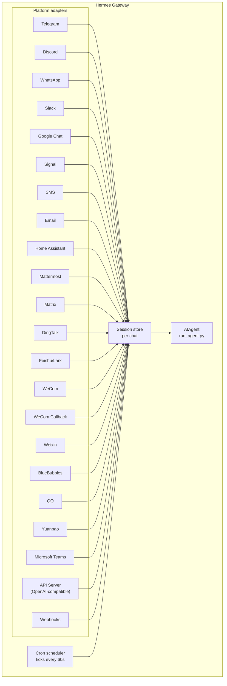

# メッセージングゲートウェイ {#messaging-gateway}

Telegram、Discord、Slack、WhatsApp、Signal、SMS、メール、Home Assistant、Mattermost、Matrix、DingTalk、Feishu/Lark、WeCom、Weixin、BlueBubbles（iMessage）、QQ、Yuanbao、Microsoft Teams、LINE、ntfy、そしてブラウザから Hermes と会話できます。ゲートウェイは単一のバックグラウンドプロセスで、設定済みのすべてのプラットフォームに接続し、セッションを管理し、cron ジョブを実行し、音声メッセージを配信します。

CLI のマイクモード、メッセージング上での音声返信、Discord のボイスチャンネルでの会話まで含めた音声機能の全体像については、[音声モード](/hermes/docs/user-guide/features/voice-mode/) と [Hermes で音声モードを使う](/hermes/docs/guides/use-voice-mode-with-hermes/) をご覧ください。

:::tip
ボットにはモデルプロバイダーとツールプロバイダー（TTS、Web）の両方が必要です。[Nous Portal](/hermes/docs/integrations/nous-portal/) のサブスクリプションはそのすべてをまとめて提供します。
:::

## プラットフォーム比較 {#platform-comparison}

| プラットフォーム | 音声 | 画像 | ファイル | スレッド | リアクション | 入力中表示 | ストリーミング |
|----------|:-----:|:------:|:-----:|:-------:|:---------:|:------:|:---------:|
| Telegram | ✅ | ✅ | ✅ | ✅ | — | ✅ | ✅ |
| Discord | ✅ | ✅ | ✅ | ✅ | ✅ | ✅ | ✅ |
| Slack | ✅ | ✅ | ✅ | ✅ | ✅ | ✅ | ✅ |
| Google Chat | — | ✅ | ✅ | ✅ | — | ✅ | — |
| WhatsApp | — | ✅ | ✅ | — | — | ✅ | ✅ |
| WhatsApp Cloud API | ✅ | ✅ | ✅ | — | — | ✅ | — |
| Signal | — | ✅ | ✅ | — | — | ✅ | — |
| SMS | — | — | — | — | — | — | — |
| メール | — | ✅ | ✅ | ✅ | — | — | — |
| Home Assistant | — | — | — | — | — | — | — |
| Mattermost | ✅ | ✅ | ✅ | ✅ | — | ✅ | ✅ |
| Matrix | ✅ | ✅ | ✅ | ✅ | ✅ | ✅ | ✅ |
| DingTalk | — | ✅ | ✅ | — | ✅ | — | ✅ |
| Feishu/Lark | ✅ | ✅ | ✅ | ✅ | ✅ | ✅ | ✅ |
| WeCom | ✅ | ✅ | ✅ | — | — | — | — |
| WeCom Callback | — | — | — | — | — | — | — |
| Weixin | ✅ | ✅ | ✅ | — | — | ✅ | — |
| BlueBubbles | — | ✅ | ✅ | — | ✅ | ✅ | — |
| Photon (iMessage) | ✅ | ✅ | ✅ | — | ✅ | ✅ | — |
| QQ | ✅ | ✅ | ✅ | — | — | ✅ | — |
| Yuanbao | ✅ | ✅ | ✅ | — | — | ✅ | ✅ |
| Microsoft Teams | — | ✅ | — | ✅ | — | ✅ | — |
| LINE | — | ✅ | ✅ | — | — | ✅ | — |
| ntfy | — | — | — | — | — | — | — |
| Raft | — | — | — | — | — | — | — |
| IRC | — | — | — | — | — | — | — |
| Buzz | — | ✅ | — | ✅ | — | — | — |
| SimpleX | ✅ | ✅ | ✅ | — | — | ✅ | — |

**音声** = TTS による音声返信、または音声メッセージの文字起こし。**画像** = 画像の送受信。**ファイル** = 添付ファイルの送受信。**スレッド** = スレッド形式の会話。**リアクション** = メッセージへの絵文字リアクション。**入力中表示** = 処理中に表示されるインジケーター。**ストリーミング** = メッセージを編集しながら段階的に更新する機能。

:::note Hermes Relay
[Hermes Relay](/hermes/docs/user-guide/messaging/relay/)（実験的機能）はチャットプラットフォームそのものではなく、Discord、Telegram、Slack、WhatsApp といったプラットフォームの前段に立つコネクタの仕組みです。プラットフォームの認証情報はコネクタ側が持ちます。対応できる機能（メディア、ネイティブの承認・確認プロンプト、リアクション、スレッド、入力中表示、ストリーミング）は上の表のように固定されるのではなく、接続時のハンドシェイクでコネクタごとに決まります。
:::

## 構成 {#architecture}



各プラットフォームのアダプターはメッセージを受け取り、チャットごとのセッションストアを経由させて、処理のために AIAgent へ引き渡します。ゲートウェイは cron スケジューラーも動かしており、60 秒ごとに時刻を確認して、実行時刻を迎えたジョブを処理します。

## 意図的に黙るためのトークン {#intentional-silence-tokens}

グループチャット、フック、自動化フローのために、Hermes は明示的な沈黙トークンに対応しています。エージェントの最終的な応答が対応トークンそのものだった場合、ゲートウェイは送信を抑止し、チャットには何も送りません。

対応しているトークン:

- `[SILENT]`
- `SILENT`
- `NO_REPLY`
- `NO REPLY`

空白と大文字小文字は正規化されますが、最終応答の全体がトークンである必要があります。「変化がないときは `[SILENT]` を使ってください」のような文はそのまま送信されます。

沈黙はあくまで配信するかどうかの判断です。Hermes はアシスタント側の沈黙したターンをセッションの記録に残すので、会話は通常どおり交互に進みます。

```text
user: side-channel chatter
assistant: [SILENT]   # stored, not delivered
user: next message
```

失敗したターンはこれまでどおりエラーとして表面化します。テキストが沈黙トークンに似ているというだけで、Hermes が失敗を隠すことはありません。

## すぐに設定する {#quick-setup}

メッセージングのプラットフォームを設定するいちばん簡単な方法は、対話式のウィザードです。

```bash
hermes gateway setup        # Interactive setup for all messaging platforms
```

このコマンドは矢印キーで選びながら各プラットフォームを設定していく形で、すでに設定済みのプラットフォームも表示し、最後にゲートウェイの起動・再起動まで案内してくれます。

## ゲートウェイのコマンド {#gateway-commands}

```bash
hermes gateway              # Run in foreground
hermes gateway setup        # Configure messaging platforms interactively
hermes gateway install      # Install as a user service (Linux) / launchd service (macOS)
sudo hermes gateway install --system   # Linux only: install a boot-time system service
hermes gateway start        # Start the default service
hermes gateway stop         # Stop the default service
hermes gateway status       # Check default service status
hermes gateway status --system         # Linux only: inspect the system service explicitly
```

### Linux 向けのイベントループ監視（任意） {#optional-linux-event-loop-watchdog}

systemd で管理しているゲートウェイでは、Python の asyncio イベントループに
処理時間が回らなくなったときにプロセスを復旧させる設定を有効にできます。これは、
プラットフォーム固有の死活監視タスクまで止まってしまうようなプロセス全体の停止に対応するものです。

```yaml title="~/.hermes/config.yaml"
gateway:
  systemd_watchdog_seconds: 120
```

この設定を変更したら、サービスのユニットファイルを作り直してください。

```bash
hermes gateway install --force
```

正の値を指定すると、生成されるユニットは `Type=notify` と
`NotifyAccess=main`、そして対応する `WatchdogSec` を使うようになります。Hermes はイベントループが
滞りなく進んでいる間だけハートビートを送り、止まると systemd がプロセスを再起動します。既定値の `0` では
従来どおり `Type=simple` のままです。この設定は Linux／systemd 専用で、通常の
ネットワーク切断をイベントループの障害として扱うことはありません。

## チャット内で使えるコマンド {#chat-commands-inside-messaging}

| コマンド | 説明 |
|---------|-------------|
| `/new` or `/reset` | 会話を新しく始めます |
| `/model [provider:model]` | モデルを表示または変更します（`provider:model` の書き方に対応） |
| `/personality [name]` | 人格を設定します（`none` で解除） |
| `/retry` | 直前のメッセージをやり直します |
| `/undo` | 直前のやり取りを取り消します |
| `/status` | セッションの情報を表示します |
| `/whoami` | 現在のスコープでのスラッシュコマンド権限を表示します（管理者／一般／制限なし） |
| `/stop` | 実行中のエージェントを止めます |
| `/approve` | 保留中の危険なコマンドを承認します |
| `/deny` | 保留中の危険なコマンドを拒否します |
| `/sethome` | このチャットをホームチャンネルに設定します |
| `/compress` | 会話のコンテキストを手動で圧縮します |
| `/title [name]` | セッションのタイトルを設定または表示します |
| `/resume [name]` | 名前を付けておいたセッションを再開します |
| `/sessions [all] [search <query>]` | 過去のセッションを一覧表示します。`search <query>` はタイトルや ID で絞り込みます |
| `/usage` | このセッションのトークン使用量を表示します（`/usage reset [--force]` で貯めておいた Codex の上限リセットを使えます） |
| `/insights [days]` | 使用状況の分析を表示します |
| `/reasoning [level\|show\|hide]` | 推論の深さを変えたり、推論の表示を切り替えたりします |
| `/voice [on\|off\|tts\|join\|leave\|status]` | メッセージングでの音声返信と Discord のボイスチャンネルでの挙動を操作します |
| `/rollback [number]` | ファイルシステムのチェックポイントを一覧表示または復元します |
| `/background <prompt>` | 別のバックグラウンドセッションでプロンプトを実行します |
| `/reload-mcp` | 設定から MCP サーバーを読み込み直します |
| `/update` | Hermes Agent を最新版に更新します |
| `/help` | 使えるコマンドを表示します |
| `/<skill-name>` | インストール済みのスキルを呼び出します |

## セッションの管理 {#session-management}

### セッションの永続化 {#session-persistence}

セッションはリセットされるまでメッセージをまたいで保持されます。エージェントは会話の流れを覚えています。

### 過去のセッションを探す（`/sessions`） {#finding-past-sessions-sessions}

`/sessions` は現在のチャットにおける過去のセッションを一覧表示し、`/sessions <name>` でそのひとつを再開します（`/resume` の短縮形です）。一覧が長くなってきたら、`/sessions search <query>`（別名 `find`）でタイトルまたはセッション ID による絞り込みができ、直近に使ったものから順に並びます。`/sessions all` による別スコープをまたいだ一覧表示は管理者専用で、一般ユーザーには自分のチャットのセッションしか見えません。

### `/model` の指定を保持する {#persistent-model-overrides}

ゲートウェイのチャットで `/model` を切り替えると、そのセッションに適用され、さらに**ゲートウェイを再起動しても保持されます**。モデルとプロバイダーの選択はセッションストアに保存され、再起動後に最初に使うときに復元されます（認証情報は読み込み時に改めて解決され、ディスクに書き込まれることはありません）。`/new`（または `/reset`）で指定は解除され、`/model <name> --global` を使うと代わりに `config.yaml` へ書き込まれます。`/model <name> --once` はそのターンにだけ適用されます。

### 配信の確実さ {#delivery-reliability}

エージェントの最終的な応答は、各プラットフォームへの送信の前後で、消えない**配信台帳**
（`state.db`）に記録されます。応答を作り終えてからプラットフォームが受信を確認するまでの間に
ゲートウェイがクラッシュしたり再起動したりしても、次回の起動時に、保存しておいた応答を
再送します。応答を失うことも、ターン全体をやり直すこともありません。

動作は正直な at-least-once（最低 1 回は届く）です。

- 送信が**まったく始まっていない**応答は、そのまま再送されます。
- ゲートウェイが落ちた時点で**送信の途中**だった応答（プラットフォーム側が受け取っているかどうかは
  わかりません）は、目に見える形で
  「♻️ Recovered reply — … may be a duplicate」という接頭辞を付けて再送されます。曖昧なものには
  そうと分かる印を付け、黙って送り直すことはしません。
- 再送には上限があります。3 回まで、24 時間以内という条件で、それを過ぎるとその行は
  破棄されます。配信済みの行は 7 日後に整理されます。

無効にするには `config.yaml` で `gateway.delivery_ledger: false` を指定します（送信中の応答が
クラッシュで失われる、以前の挙動に戻ります）。

### リセットの方針 {#reset-policies}

**既定ではセッションが自動でリセットされることはありません**。自分で `/reset` するか、
コンテキストの圧縮が働くまで文脈は残り続けます。自動リセットが欲しい場合は、
`~/.hermes/config.yaml` の `session_reset` セクションで有効にします。

```yaml
session_reset:
  mode: idle        # "idle", "daily", "both", or "none" (default)
  idle_minutes: 1440  # for idle/both: minutes of inactivity before reset
  at_hour: 4          # for daily/both: hour of day (0-23, local time)
```

| モード | 説明 |
|------|-------------|
| `none` | 自動リセットしません（既定） |
| `daily` | 毎日決まった時刻にリセットします |
| `idle` | N 分間なにも操作がなければリセットします |
| `both` | 先に条件を満たしたほうでリセットします |

生きているバックグラウンドプロセス（`terminal(background=true)` で開始したもの）があると、
出力を失わないよう通常はそのセッションがリセットされないよう保護されます。プレビュー用サーバーなど、
止め忘れたプロセスがセッションを永久に開いたままにしてしまわないよう、`bg_process_max_age_hours`
（既定 **24**）より古いバックグラウンドプロセスはリセットを妨げなくなりました。プロセスが
終了させられるわけでは**なく**、リセットの判定で無視されるだけです。この打ち切りをなくすには `0` を
設定します（生きているプロセスがあれば必ずリセットを妨げる、以前の挙動になります）。数日にわたる
正当なジョブがあり、それが動いている間は会話を開いておきたい場合は、値を大きくしてください。

プラットフォームごとの上書きは `~/.hermes/gateway.json` で設定します。

```json
{
  "reset_by_platform": {
    "telegram": { "mode": "idle", "idle_minutes": 240 },
    "discord": { "mode": "idle", "idle_minutes": 60 }
  }
}
```

## チャンネルごとのモデル・システムプロンプトの上書き {#per-channel-model-system-prompt-overrides}

**ひとつのゲートウェイ**で、チャンネルごとに違うモデルや役割を動かせます。たとえば `#daily` では安価で速いモデルを、`#dev` では専門的なプロンプトを与えた最上位モデルを、といった具合です。`~/.hermes/gateway-config.yaml` のプラットフォームの下に `channel_overrides` を書きます。

```yaml
platforms:
  discord:
    enabled: true
    channel_overrides:
      "123456789012345678":        # channel/thread id
        model: anthropic/claude-sonnet-4.6
        provider: anthropic
        system_prompt: "You are the #dev channel code-review specialist."
      "987654321098765432":
        model: openai/gpt-5-mini
```

詳細:

- 3 つのキーはいずれも任意です。`model` だけ、`system_prompt` だけ、あるいは好きな組み合わせで指定できます。指定しなかった項目は全体の既定値が使われます。
- 探す順番は、まずチャンネル／スレッドの ID が完全一致するもの、次に**親**となるチャンネルやフォーラムの ID です。そのため Discord のスレッドは親チャンネルの設定を自動的に引き継ぎます。
- モデルが決まる優先順位は、セッションでの `/model` による指定 → `channel_overrides` → 全体の設定、の順です。チャットで `/model` を実行したユーザーの指定は、チャンネルの既定より優先されます。
- `system_prompt` の上書きは、そのチャンネルにおいてゲートウェイ全体のプロンプトを置き換えます（一時的なもので、ターンごとに差し込まれ、履歴には保存されません）。

## セキュリティ {#security}

**既定では、許可リストに載っていない、あるいは DM でのペアリングを済ませていないユーザーをゲートウェイはすべて拒否します。** ターミナルを扱えるボットにとって、これが安全な既定値です。

```bash
# Restrict to specific users (recommended):
TELEGRAM_ALLOWED_USERS=123456789,987654321
DISCORD_ALLOWED_USERS=123456789012345678
SIGNAL_ALLOWED_USERS=+155****4567,+155****6543
SMS_ALLOWED_USERS=+155****4567,+155****6543
EMAIL_ALLOWED_USERS=trusted@example.com,colleague@work.com
MATTERMOST_ALLOWED_USERS=3uo8dkh1p7g1mfk49ear5fzs5c
MATRIX_ALLOWED_USERS=@alice:matrix.org
DINGTALK_ALLOWED_USERS=user-id-1
FEISHU_ALLOWED_USERS=ou_xxxxxxxx,ou_yyyyyyyy
WECOM_ALLOWED_USERS=user-id-1,user-id-2
WECOM_CALLBACK_ALLOWED_USERS=user-id-1,user-id-2
TEAMS_ALLOWED_USERS=aad-object-id-1,aad-object-id-2

# Or allow
GATEWAY_ALLOWED_USERS=123456789,987654321

# Or explicitly allow all users (NOT recommended for bots with terminal access):
GATEWAY_ALLOW_ALL_USERS=true
```

### DM でのペアリング（許可リストの代わりに） {#dm-pairing-alternative-to-allowlists}

ユーザー ID を手作業で設定する代わりに、知らないユーザーがボットに DM を送ると 1 回限りのペアリングコードが届く仕組みも使えます。メールだけは例外で、メールのペアリングを明示的に有効にしない限り、知らない差出人からのメールは無視されます。

```bash
# The user sees: "Pairing code: XKGH5N7P"
# You approve them with:
hermes pairing approve telegram XKGH5N7P

# Other pairing commands:
hermes pairing list          # View pending + approved users
hermes pairing revoke telegram 123456789  # Remove access
```

ペアリングコードは 1 時間で期限切れになり、回数制限があり、暗号論的な乱数を使っています。

### 管理者と一般ユーザー {#admins-vs-regular-users}

許可リストが答えるのは「この人はそもそもボットに届くのか」という問いです。**管理者と一般ユーザーの区別**が答えるのは「入れたうえで、何をしてよいのか」という問いです。

許可されたユーザーは、スコープ（DM かグループ／チャンネルか）ごとに次の 2 つのどちらかに分かれます。

- **管理者** — すべて使えます。登録済みのスラッシュコマンド（組み込みとプラグインの両方）をすべて実行でき、制限のかかった機能もすべて使えます。
- **一般ユーザー** — 使える範囲が限られます。エージェントとの会話は普通にできますが、実行できるスラッシュコマンドは明示的に許可したものだけです。どんな場合でも使えるのは `/help` と `/whoami` です。

この区分はプラットフォームごと、スコープごとに設定します。DM の管理者だからといってグループ／チャンネルの管理者になるわけではなく、スコープごとに管理者の一覧を持ちます。

**現時点で区分が制御するもの:** スラッシュコマンドです。実行中のコマンド登録簿を通して働くので、機能ごとに個別の作り込みをしなくても、組み込みコマンドとプラグインが登録したコマンドの両方を対象にできます。普通の会話には影響しないため、管理者でなくてもエージェントと話すことはできます。

**今後制御される可能性があるもの:** ツールの利用、モデルの切り替え、費用のかかる操作といった機能面も、追加していく中で同じ管理者と一般ユーザーの区別に紐づいていく予定です。いま区分を設定しておけば、将来の制限が加わったときに、誰が管理者かを考え直さずにそのまま適用できます。

#### 設定 {#configuration}

```yaml
gateway:
  platforms:
    discord:
      extra:
        allow_from: ["111", "222", "333"]
        allow_admin_from: ["111"]                    # admins → all slash commands
        user_allowed_commands: [status, model]       # what non-admins may run
        # Optional: separate group/channel scope
        group_allow_admin_from: ["111"]
        group_user_allowed_commands: [status]
```

**後方互換について:** あるスコープで `allow_admin_from` を設定していない場合、そのスコープでは区分が無効になり、許可されたユーザー全員がすべてを使えます。既存の環境は何も変えずに動き続けるので、区別したくなったときに有効にしてください。

#### 自分の権限を確認する {#inspecting-your-access}

どのプラットフォームからでも `/whoami` を使えば、現在のスコープ、自分がどの区分か（管理者／一般／制限なし）、実行できるスラッシュコマンドが分かります。プラットフォームごとの例は [Telegram](/hermes/docs/user-guide/messaging/telegram/#slash-command-access-control) と [Discord](/hermes/docs/user-guide/messaging/discord/#slash-command-access-control) のページをご覧ください。

## エージェントの軌道修正 {#redirecting-the-agent}

エージェントが作業している最中にメッセージを送ると、進行中のターンを修正できます。

- **モデルの生成が文脈を保ったまま再開されます** — すでに表示された推論や、見えている途中までのテキストは、通常のアシスタントの区切りとして残ります
- **終わった作業はそのまま残ります** — それまでのツール呼び出しと結果はターンの中に残ります
- **実行中のツールは安全に終わります** — 修正はツールを止めるのではなく、次にツールの結果が返る区切りで反映されます
- **`/stop` は変わらず完全な停止です** — 進行中のターンと前面の作業を中止したいときに使います

### 待機・中断・誘導（busy-input モード） {#queue-vs-interrupt-vs-steer-busy-input-mode}

既定では、作業中のエージェントにメッセージを送ると進行中のターンが修正されます。ほかに 2 つのモードがあります。

- `queue` — 後から送ったメッセージは待機し、いまの作業が終わってから次のターンとして実行されます。
- `steer` — 後から送ったメッセージが `/steer` を通じて進行中の実行に差し込まれ、次のツール呼び出しのあとでエージェントに届きます。中断も新しいターンも発生しません。エージェントがまだ動き出していない場合は `queue` と同じ挙動になります。

```yaml
display:
  busy_input_mode: steer   # or queue, or interrupt (default)
  busy_ack_enabled: true   # set to false to suppress the ⚡/⏳/⏩ chat reply entirely
```

どのプラットフォームでも、作業中のエージェントに初めてメッセージを送ったときは、Hermes がこの設定について 1 行の案内を確認メッセージに添えます（`"💡 First-time tip — …"`）。この案内はインストールごとに 1 回だけ出て、`onboarding.seen.busy_input_prompt` の下のフラグで記録されます。もう一度見たい場合はそのキーを削除してください。

作業中の確認メッセージがうるさいと感じたら、`display.busy_ack_enabled: false` を設定します。入力の扱い方は変わらず、確認メッセージが表示されなくなるだけです。

## 確認の質問（複数選択） {#clarify-questions-multi-select}

エージェントが `clarify` ツールで質問してきたとき、ゲートウェイは選択肢を番号付きの形（対応しているプラットフォームではネイティブのボタン）で表示します。clarify は**複数選択**の質問にも対応していて、エージェントが一度に複数の選択肢を選ばせることもできます。

- **メッセージングのプラットフォーム** — 「Multiple selections allowed」と表示されるので、番号をカンマか空白で区切って返します（例: `1, 3`）。選択肢の文言をそのまま書いても、自由に文章で答えても構いません。
- **従来型の CLI／TUI** — 複数選択はチェックボックスとして表示されます。**Space** で選択を切り替え、**Enter** で確定します。

ひとつだけ選ぶ質問はこれまでどおりで、番号・ボタン・文言のいずれかで選ぶか、「Other」から自分で答えを入力します。

## ツールの進行状況の通知 {#tool-progress-notifications}

ツールの動きをどこまで表示するかは `~/.hermes/config.yaml` で設定します。

```yaml
display:
  tool_progress: all    # off | new | all | verbose | log
  tool_progress_command: false  # set to true to enable /verbose in messaging
  # How progress is grouped on platforms that support message editing:
  #   accumulate (default) — edit one bubble in place as tools run
  #   separate             — send one message per tool (pre-v0.9 style; noisier)
  # Only applies where tool_progress is already enabled.
  tool_progress_grouping: accumulate   # accumulate | separate
```

### `log` モード — チャットではなく監査用のファイルに残す {#log-mode-audit-file-instead-of-chat-messages}

`display.tool_progress: log` を設定すると、進行状況のメッセージはチャットに**まったく**送られません。代わりに、ツール呼び出しが 1 行ずつ `~/.hermes/logs/tool_calls.log` に追記されます。これはローテーションする監査用のファイル（5 MB × 3 世代）で、通常のログと同じく秘密情報を伏せる整形処理を通るため、認証情報がディスクに残ることはありません。チャットを汚さずにツール呼び出しの記録をすべて残したいときに使ってください。

### ステータス表示の文言を変える {#configurable-status-phrases}

長く動いているときにゲートウェイが出すステータス行（「まだ作業中です…」のようなハートビート）は、文言のカタログから選ばれます。組み込みの既定値は `gateway/assets/status_phrases.yaml` に入っており、`HERMES_HOME` の下にファイルを置けば、プロファイルごと持ち運べる形で自分の文言を追加できます。

- `~/.hermes/status_phrases.yaml`、または `~/.hermes/status_phrases/` の中の任意の `*.yaml`（決められた置き場所で、自動的に読み込まれます）
- あるいは設定で相対パスを指定します。

```yaml
display:
  status_phrases:
    path: status_phrases/whatsapp.yaml  # relative to HERMES_HOME
    mode: append                        # append (default) or replace
```

文言のファイルは、表示場所（`status`、`generic`）と文字列のリストを対応づけます（1 か所につき最大 80 個、1 個あたり 160 文字まで）。設定をプロファイルごと持ち運べるように、絶対パスと `..` による外への参照は無視されます。使われるのは設定した文言だけで、ツールの引数やコマンド、推論のテキストがステータス表示に埋め込まれることはありません。

### モデルに渡す文脈にメッセージの時刻を含める {#message-timestamps-in-model-context}

既定では無効です。有効にすると、Hermes は**モデルに渡す文脈の中で**、**ユーザー**のメッセージそれぞれの先頭に
読みやすい形の時刻（例: `[Tue 2026-04-28 13:40:53 CEST]`）を付けます。メッセージがいつ送られたかを
エージェントが把握できるので、時間に関する推論（「今朝そう言っていましたね」、間が空いたことに気づくなど）に
役立ちます。アシスタントのメッセージやシステムプロンプトには**付きません**。

```yaml
gateway:
  message_timestamps:
    enabled: false   # set true to show send-times to the model
```

保存される会話の記録は常にきれいなままです。この設定にかかわらず時刻はメッセージの付随情報として
保存されるので、あとから有効にすれば過去のメッセージについても送信時刻が表示され、読み直しても
接頭辞が二重に付くことはありません。

有効にすると、ボットは作業しながら次のようなステータスメッセージを送ります。

```text
💻 `ls -la`...
🔍 web_search...
📄 web_extract...
🐍 execute_code...
```

## バックグラウンドのセッション {#background-sessions}

プロンプトを別のバックグラウンドセッションで実行すれば、エージェントがそれを独立して進める間も、メインのチャットはすぐに応答できる状態のままです。

```
/background Check all servers in the cluster and report any that are down
```

Hermes はすぐにこう返します。

```
🔄 Background task started: "Check all servers in the cluster..."
   Task ID: bg_143022_a1b2c3
```

### 仕組み {#how-it-works}

`/background` のプロンプトごとに、非同期で動く**独立したエージェントのインスタンス**が立ち上がります。

- **独立したセッション** — バックグラウンドのエージェントは自分だけの会話履歴を持つセッションを使います。いま話しているチャットの文脈は知らず、渡したプロンプトだけを受け取ります。
- **同じ設定** — 現在のゲートウェイの設定から、モデル、プロバイダー、ツールセット、推論の設定、プロバイダーの振り分けを引き継ぎます。
- **待たされない** — メインのチャットは完全に使えるままです。作業中でもメッセージを送ったり、別のコマンドを実行したり、さらにバックグラウンドのタスクを始めたりできます。
- **結果の届き方** — タスクが終わると、コマンドを実行したのと**同じチャットやチャンネル**に結果が届き、「✅ Background task complete」という接頭辞が付きます。失敗した場合は「❌ Background task failed」とエラーが表示されます。

### バックグラウンドプロセスの通知 {#background-process-notifications}

バックグラウンドセッションで動くエージェントが `terminal(background=true)` を使ってサーバーやビルドなどの長く動くプロセスを起動したとき、ゲートウェイは状況の更新をチャットに送れます。これは `~/.hermes/config.yaml` の `display.background_process_notifications` で設定します。

```yaml
display:
  background_process_notifications: concise    # concise | all | result | error | off
```

| モード | 届くもの |
|------|-----------------|
| `concise` | 完了時に 1 行のステータスメッセージ。失敗した場合は出力の末尾を少し添えます（既定） |
| `all` | 実行中の出力の更新**と**、最後の生の出力のメッセージ |
| `result` | 最後の生の出力による完了メッセージだけ（終了コードにかかわらず） |
| `error` | 終了コードが 0 以外のときだけ、最後の生の出力のメッセージ |
| `off` | プロセス監視のメッセージを一切送りません |

環境変数で設定することもできます。

```bash
HERMES_BACKGROUND_NOTIFICATIONS=result
```

### 使いどころ {#use-cases}

- **サーバーの監視** — 「/background Check the health of all services and alert me if anything is down」
- **時間のかかるビルド** — 会話を続けながら「/background Build and deploy the staging environment」
- **調べもの** — 「/background Research competitor pricing and summarize in a table」
- **ファイルの整理** — 「/background Organize the photos in ~/Downloads by date into folders」

:::tip
メッセージングのプラットフォームでのバックグラウンドタスクは、投げっぱなしで構いません。待つ必要も、様子を見に行く必要もありません。終われば結果が同じチャットに自動で届きます。
:::

## サービスの管理 {#service-management}

### Linux（systemd） {#linux-systemd}

```bash
hermes gateway install               # Install as user service
hermes gateway start                 # Start the service
hermes gateway stop                  # Stop the service
hermes gateway status                # Check status
journalctl --user -u hermes-gateway -f  # View logs

# Enable lingering (keeps running after logout)
sudo loginctl enable-linger $USER

# Or install a boot-time system service that still runs as your user
sudo hermes gateway install --system
sudo hermes gateway start --system
sudo hermes gateway status --system
journalctl -u hermes-gateway -f
```

ノート PC や開発用のマシンではユーザーサービスを使ってください。systemd の linger に頼らず起動時に立ち上がってほしい VPS や画面のないホストでは、システムサービスを使います。

:::danger 独自の `ExecStopPost` による強制終了の追加設定は入れないでください
Hermes がインストールするユニットは、`KillMode=mixed` と `KillSignal=SIGTERM` によってすでにゲートウェイをきれいに終了させ、`Restart=always` と `RestartForceExitStatus` によって更新や `/restart` のあと正しく再起動します。`ExecStopPost=/bin/kill -9 $MAINPID` のような systemd の追加設定は入れ**ない**でください。`ExecStopPost` は正常な再起動も含めて*すべての*停止で走るため、生まれたばかりのインスタンスが安定する前に `SIGKILL` してしまい、`Restart=always` がすぐにまた起動させます。結果として再起動が延々と続きます（Telegram では再起動メッセージが大量に流れます）。もしそうした追加設定を入れてしまっている場合は削除してください。`systemctl --user edit hermes-gateway`（システムサービスなら `sudo systemctl edit hermes-gateway`）で `ExecStopPost` の行を消し、`systemctl --user daemon-reload` を実行します。
:::

:::tip 画面のない VM では、ユーザーサービス + linger にすると root を求められません
システムサービスは再起動のたびに root が必要で、これは `hermes update` の最後に走る自動的なゲートウェイ再起動にも当てはまります。`hermes update` を root 以外のユーザーで実行すると、パスワード不要の `sudo systemctl` を試み、それが使えなければ再起動を飛ばして `sudo systemctl restart hermes-gateway` というコマンドを表示します（対話的なパスワード入力で止まってしまうことはありません）。

ログインすることのない画面のない VM なら、linger を有効にした**ユーザー**サービスにすることで、root をまったく使わずに同じ「起動時に立ち上がる」動きが得られます。

```bash
hermes gateway install          # user service
sudo loginctl enable-linger $USER   # one-time: start at boot, survive logout
```

こうしておけば、`hermes update` は特別な権限なしでゲートウェイを再起動できます。システムサービスのままにしたい場合は、更新を `sudo hermes update` で実行するか、サービス用のアカウントに systemctl へのパスワード不要の sudo を与えます。たとえば `sudo visudo -f /etc/sudoers.d/hermes-gateway` で次のように書きます。

```
hermes ALL=(root) NOPASSWD: /usr/bin/systemctl --no-ask-password reset-failed hermes-gateway*, /usr/bin/systemctl --no-ask-password start hermes-gateway*, /usr/bin/systemctl --no-ask-password restart hermes-gateway*
```
:::

はっきりした意図がない限り、ユーザーサービスとシステムサービスのユニットを両方インストールしたままにしないでください。両方あると起動・停止・状態確認の動きが曖昧になるため、Hermes は検出したときに警告します。

:::info 複数のインストール
同じマシンで複数の Hermes を（`HERMES_HOME` のディレクトリを分けて）動かしている場合、それぞれに固有の systemd サービス名が割り当てられます。既定の `~/.hermes` は `hermes-gateway` を使い、それ以外は `hermes-gateway-<hash>` になります。`hermes gateway` のコマンドは、いまの `HERMES_HOME` に対応するサービスを自動的に対象にします。
:::

### macOS（launchd） {#macos-launchd}

```bash
hermes gateway install               # Install as launchd agent
hermes gateway start                 # Start the service
hermes gateway stop                  # Stop the service
hermes gateway status                # Check status
tail -f ~/.hermes/logs/gateway.log   # View logs
```

生成される plist は `~/Library/LaunchAgents/ai.hermes.gateway.plist` に置かれます。次の 3 つの環境変数が含まれます。

- **PATH** — インストール時点のシェルの PATH に、仮想環境の `bin/` と `node_modules/.bin` を先頭に加えたもの。これにより、WhatsApp のブリッジのようなゲートウェイの子プロセスからも、自分で入れたツール（Node.js、ffmpeg など）が使えます。
- **VIRTUAL_ENV** — Python の仮想環境を指し示し、ツールがパッケージを正しく見つけられるようにします。
- **HERMES_HOME** — ゲートウェイをどの Hermes のインストールに紐づけるかを決めます。

:::tip インストール後に PATH が変わったら
launchd の plist は静的なものです。ゲートウェイを設定したあとに新しいツール（nvm で入れた新しい Node.js、Homebrew で入れた ffmpeg など）を追加した場合は、`hermes gateway install` をもう一度実行して PATH を取り込み直してください。ゲートウェイは古い plist を検出して自動的に読み込み直します。
:::

:::info 複数のインストール
Linux の systemd サービスと同じく、`HERMES_HOME` のディレクトリごとに固有の launchd ラベルが割り当てられます。既定の `~/.hermes` は `ai.hermes.gateway` を使い、それ以外は `ai.hermes.gateway-<suffix>` になります。
:::

## プラットフォームごとのツールセット {#platform-specific-toolsets}

プラットフォームごとに専用のツールセットがあります。

| プラットフォーム | ツールセット | 使える機能 |
|----------|---------|--------------|
| CLI | `hermes-cli` | すべて使えます |
| Telegram | `hermes-telegram` | ターミナルを含むすべてのツール |
| Discord | `hermes-discord` | ターミナルを含むすべてのツール |
| WhatsApp | `hermes-whatsapp` | ターミナルを含むすべてのツール |
| WhatsApp Cloud API | `hermes-whatsapp` | ターミナルを含むすべてのツール（Baileys のブリッジとツールセットを共有します） |
| Slack | `hermes-slack` | ターミナルを含むすべてのツール |
| Google Chat | `hermes-google_chat` | ターミナルを含むすべてのツール |
| Signal | `hermes-signal` | ターミナルを含むすべてのツール |
| SMS | `hermes-sms` | ターミナルを含むすべてのツール |
| メール | `hermes-email` | ターミナルを含むすべてのツール |
| Home Assistant | `hermes-homeassistant` | すべてのツールに加えて HA の機器操作（ha_list_entities、ha_get_state、ha_call_service、ha_list_services） |
| Mattermost | `hermes-mattermost` | ターミナルを含むすべてのツール |
| Matrix | `hermes-matrix` | ターミナルを含むすべてのツール |
| DingTalk | `hermes-dingtalk` | ターミナルを含むすべてのツール |
| Feishu/Lark | `hermes-feishu` | ターミナルを含むすべてのツール |
| WeCom | `hermes-wecom` | ターミナルを含むすべてのツール |
| WeCom Callback | `hermes-wecom-callback` | ターミナルを含むすべてのツール |
| Weixin | `hermes-weixin` | ターミナルを含むすべてのツール |
| BlueBubbles | `hermes-bluebubbles` | ターミナルを含むすべてのツール |
| QQBot | `hermes-qqbot` | ターミナルを含むすべてのツール |
| Yuanbao | `hermes-yuanbao` | ターミナルを含むすべてのツール |
| Microsoft Teams | `hermes-teams` | ターミナルを含むすべてのツール |
| API Server | `hermes-api-server` | すべてのツール（`clarify` と `text_to_speech` は除きます。プログラムからの利用には対話する相手がいないためです） |
| Webhooks | `hermes-webhook` | ターミナルを含むすべてのツール |
| Raft | `hermes-raft` | 呼び出し専用のチャンネル。メッセージの入出力にはエージェントが Raft の CLI を使います |

## 複数プラットフォームのゲートウェイを運用する {#operating-a-multi-platform-gateway}

ゲートウェイは通常、複数のアダプター（Telegram + Discord + Slack など）を同時に動かします。以下の節では、すべてのプラットフォームにまたがる日々の運用を扱います。

### `/platform` コマンド {#platform-command}

ゲートウェイが動き出したら、接続済みの CLI セッションやチャットから `/platform` スラッシュコマンドを使うことで、ゲートウェイ全体を再起動せずに個々のアダプターの状態を見たり操作したりできます。

```
/platform list                  # show all adapters and their state
/platform pause <name>          # stop dispatching new messages to one adapter
/platform resume <name>         # re-enable a paused adapter
```

`/platform list` は、各アダプターが `running` なのか、（手動で）`paused` なのか、`paused-by-breaker` なのか（後述）を表示します。一時停止してもアダプターは読み込まれたままで、バックグラウンドの処理も生き続けます。届いたメッセージは捨てられますが、接続そのものは開いたままなので、再開はすぐに済みます。

より広くまとめて状態を見る [`/platforms`](/hermes/docs/reference/slash-commands/#info) コマンドもあります。

### 自動のサーキットブレーカー {#automatic-circuit-breaker}

各アダプターはサーキットブレーカーで包まれています。やり直しの効く失敗（ネットワークの一時的な不調、レート制限の応答、上流からの 5xx、WebSocket の切断）が繰り返されるとブレーカーが落ちます。アダプターは自動的に一時停止され、ほかに生きているプラットフォームのホームチャンネルが設定されていればそこに運用者向けの通知が送られ、構造化されたログ行が出力されます。

ブレーカーは自動では復帰**しません**。手動で `/platform resume <name>` を実行するまで開いたままです。これは意図的な設計で、プラットフォームの障害が長引いているときに、ゲートウェイが再接続を繰り返して消耗しないようにするためです。

### プラットフォームが一時停止したときに見る場所 {#where-to-look-when-a-platform-is-paused}

アダプターが一時停止したら、次を確認します。

1. **ゲートウェイのログ**（`~/.hermes/logs/gateway.log`、または systemd／launchd のユニットのログ）。プラットフォーム名と `circuit breaker`、`paused`、`disabled` で検索してください。ブレーカーが落ちたときの記録には、失敗した回数と最後のエラーが含まれます。
2. **`/platform list`** の出力 — 現在の状態と直近の理由が分かります。
3. **提供元のステータスページ**（Telegram の Bot API、Discord など）。ブレーカーが落ちたのはプラットフォーム側が不調だったからなので、復旧するまでは再開しないでください。

上流が正常に戻ったら、`/platform resume <name>` でブレーカーが解除され、アダプターが再び動き出します。

### 再起動の通知 {#restart-notifications}

ゲートウェイが再起動したとき（あるいは処理途中のセッションを抱えたまま停止したとき）、各プラットフォームのホームチャンネルに「エージェントが戻りました」「エージェントが中断されました」というメッセージを 1 回だけ送れます。これは `gateway-config.yaml` の `gateway_restart_notification` フラグでプラットフォームごとに制御し、既定は `true` です。

```yaml
gateway:
  platforms:
    telegram:
      home_chat_id: "123456789"
      gateway_restart_notification: false   # opt out for this platform
    discord:
      home_chat_id: "987654321"
      # gateway_restart_notification omitted → defaults to true
```

うるさく感じるプラットフォームや重要度の低いプラットフォームでは切っておき、主に使うチャットでは残しておく、という使い方ができます。通知は、処理途中のセッションがいくつあっても、再起動につき 1 回だけ送られます。

### 入力中の表示 {#typing-indicators}

エージェントがメッセージを処理している間、対応しているプラットフォームではゲートウェイが入力中の状態を表示します。Telegram／Discord／Signal では「typing…」の吹き出し、Slack では「is thinking…」というアシスタントのステータスです。これは `gateway-config.yaml` の `typing_indicator` フラグでプラットフォームごとに制御し、既定は `true` です。

```yaml
gateway:
  platforms:
    slack:
      typing_indicator: false   # don't show "is thinking…" on Slack
    telegram:
      # typing_indicator omitted → defaults to true
```

表示してほしくないプラットフォームでは `typing_indicator: false` を設定します。Slack の「is thinking…」をうるさく感じる人もいます（Slack の Assistant API を使う都合で、表示中は入力欄が一時的に使えなくなります）。無効にしても抑えられるのは表示だけで、メッセージの配信をはじめほかの動きは変わりません。このフラグは汎用なので、同じキーがどのプラットフォームでも使えます。

### ゲートウェイの再起動をまたいだセッションの再開 {#session-resume-across-gateway-restarts}

ツールの呼び出しや生成の途中でゲートウェイが停止すると、影響を受けたセッションには `restart_interrupted` の印が付きます。次の起動時、ゲートウェイはそれぞれについて自動再開を予約します。ユーザーにはチャットで短い案内（「Send any message after restart and I'll try to resume where you left off.」）が届き、返信するとセッションは最後に確定したターンから再開します。

この動きは既定で有効で、ゲートウェイの起動時にログへ記録されます。

```
Scheduled auto-resume for N restart-interrupted session(s)
```

設定は不要です。案内が不要なら、そのプラットフォームで `gateway_restart_notification: false` を設定してください。

### モバイル向けに調整された進行状況の既定値 {#mobile-friendly-progress-defaults}

Telegram はたいていスマートフォンの受信箱なので、既定値もその画面に合わせてあります。

- **`tool_progress`** の既定は **`off`** — ツールごとの足跡がチャットを埋め尽くすことはありません。
- **`busy_ack_detail`** の既定は **`off`** — 作業中の確認メッセージや長時間のハートビートは簡潔なままです（`iteration 21/60` のような細かい情報は出ません）。
- **`interim_assistant_messages`** は **有効のまま** — ターンの途中でアシスタントが実際に語る内容（これから何をするかをモデル自身が伝えるもの）は、雑音ではなく意味のある情報です。
- **`long_running_notifications`** は **有効のまま** — 「⏳ Working — N min」という吹き出しをその場で書き換えながら数分ごとに更新するので、30 分も `typing…` を眺め続ける代わりに、動いていることが分かります。

有効のままにしてある既定値を切ったり、プラットフォームごとに詳しい進行状況を出し直したりするには次のようにします。

```yaml
display:
  platforms:
    telegram:
      # Re-enable the tool-progress stream
      tool_progress: new
      # Show "iteration N/M, running: tool" in heartbeats and busy acks
      busy_ack_detail: true
      # Or quiet them entirely
      interim_assistant_messages: false
      long_running_notifications: false
```

### 進行状況の吹き出しの後片付け（任意） {#progress-bubble-cleanup-opt-in}

ツールの進行状況のメッセージ、「まだ作業中です…」のハートビート、ステータスの吹き出しは、最終的な応答が届いたあとに自動で削除することもできます。`display.platforms.<platform>.cleanup_progress` でプラットフォームごとに有効にします。

```yaml
display:
  platforms:
    telegram:
      cleanup_progress: true
    discord:
      cleanup_progress: true
```

既定は `false` です。この設定が働くのは、アダプターが `delete_message` を実装しているプラットフォーム（現在は Telegram と Discord）だけです。失敗した実行では後片付けを**行わず**、手がかりとして吹き出しを残します。

## 次に読むもの {#next-steps}

- [Telegram の設定](/hermes/docs/user-guide/messaging/telegram/)
- [Discord の設定](/hermes/docs/user-guide/messaging/discord/)
- [Slack の設定](/hermes/docs/user-guide/messaging/slack/)
- [Google Chat の設定](/hermes/docs/user-guide/messaging/google_chat/)
- [WhatsApp の設定](/hermes/docs/user-guide/messaging/whatsapp/)
- [WhatsApp Business Cloud API の設定](/hermes/docs/user-guide/messaging/whatsapp-cloud/)
- [Signal の設定](/hermes/docs/user-guide/messaging/signal/)
- [SMS の設定（Twilio）](/hermes/docs/user-guide/messaging/sms/)
- [メールの設定](/hermes/docs/user-guide/messaging/email/)
- [Home Assistant との連携](/hermes/docs/user-guide/messaging/homeassistant/)
- [Mattermost の設定](/hermes/docs/user-guide/messaging/mattermost/)
- [Matrix の設定](/hermes/docs/user-guide/messaging/matrix/)
- [DingTalk の設定](/hermes/docs/user-guide/messaging/dingtalk/)
- [Feishu/Lark の設定](/hermes/docs/user-guide/messaging/feishu/)
- [WeCom の設定](/hermes/docs/user-guide/messaging/wecom/)
- [WeCom Callback の設定](/hermes/docs/user-guide/messaging/wecom-callback/)
- [Weixin の設定（WeChat）](/hermes/docs/user-guide/messaging/weixin/)
- [BlueBubbles の設定（iMessage）](/hermes/docs/user-guide/messaging/bluebubbles/)
- [Photon の設定（iMessage）](/hermes/docs/user-guide/messaging/photon/)
- [QQBot の設定](/hermes/docs/user-guide/messaging/qqbot/)
- [Yuanbao の設定](/hermes/docs/user-guide/messaging/yuanbao/)
- [Microsoft Teams の設定](/hermes/docs/user-guide/messaging/teams/)
- [Teams の会議パイプライン](/hermes/docs/user-guide/messaging/teams-meetings/)
- [Microsoft Graph の Webhook リスナー](/hermes/docs/user-guide/messaging/msgraph-webhook/)
- [LINE の設定](/hermes/docs/user-guide/messaging/line/)
- [ntfy の設定](/hermes/docs/user-guide/messaging/ntfy/)
- [SimpleX Chat の設定](/hermes/docs/user-guide/messaging/simplex/)
- [Open WebUI と API サーバー](/hermes/docs/user-guide/messaging/open-webui/)
- [Raft の設定](/hermes/docs/user-guide/messaging/raft/)
- [IRC の設定](/hermes/docs/user-guide/messaging/irc/)
- [Buzz の設定](/hermes/docs/user-guide/messaging/buzz/)
- [A2A（エージェント間連携）の設定](/hermes/docs/user-guide/messaging/a2a/)
- [Webhook](/hermes/docs/user-guide/messaging/webhooks/)
