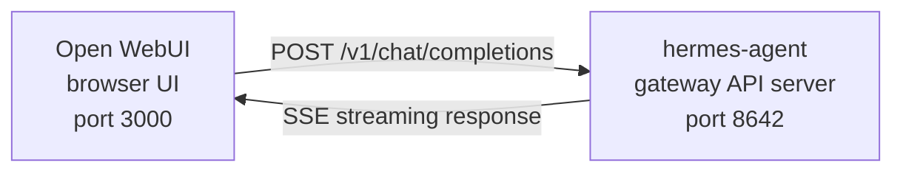

# Open WebUI との連携 {#open-webui-integration}

[Open WebUI](https://github.com/open-webui/open-webui)（126k★）は、自分のサーバーで動かせる AI 向けチャット画面としてもっとも広く使われているものです。Hermes Agent に組み込まれた API サーバーを使えば、Open WebUI をエージェントの洗練された Web の入口として利用できます。会話の管理、ユーザーアカウント、今どきのチャット画面が一式そろっています。

## 全体の構成 {#architecture}



Open WebUI は、OpenAI につなぐときとまったく同じやり方で Hermes Agent の API サーバーにつながります。Hermes は自分の道具一式（ターミナル、ファイル操作、Web 検索、記憶、スキル）を使ってリクエストを処理し、最終的な応答を返します。

:::important 処理が走る場所
API サーバーは**単なる LLM の中継役ではなく、Hermes エージェントの実行環境そのもの**です。リクエストごとに、API サーバーが動いているホスト上でサーバー側の `AIAgent` が作られます。ツールの実行も、その API サーバーが動いている場所で行われます。

たとえば手元のノート PC から、別のマシンで動く Hermes の API サーバーに Open WebUI や他の OpenAI 互換クライアントを向けた場合、`pwd`、ファイル操作、ブラウザー操作、ローカルの MCP ツールなど作業環境に関わるツールは、ノート PC ではなく相手側の API サーバーのホストで動きます。
:::

Open WebUI と Hermes はサーバー同士で通信するため、この連携に `API_SERVER_CORS_ORIGINS` は必要ありません。

## すぐに動かす {#quick-setup}

### 1. API サーバーを有効にする {#1-enable-the-api-server}

```bash
hermes config set API_SERVER_ENABLED true
hermes config set API_SERVER_KEY your-secret-key
```

`hermes config set` は、フラグを `config.yaml` に、秘密の値を `~/.hermes/.env` に自動で振り分けます。ゲートウェイがすでに動いている場合は、変更を反映させるために再起動してください。

```bash
hermes gateway stop && hermes gateway
```

### 2. Hermes Agent のゲートウェイを起動する {#2-start-hermes-agent-gateway}

```bash
hermes gateway
```

次のような表示が出るはずです。

```
[API Server] API server listening on http://127.0.0.1:8642
```

### 3. API サーバーにつながるか確かめる {#3-verify-the-api-server-is-reachable}

```bash
curl -s http://127.0.0.1:8642/health
# {"status": "ok", ...}

curl -s -H "Authorization: Bearer your-secret-key" http://127.0.0.1:8642/v1/models
# {"object":"list","data":[{"id":"hermes-agent", ...}]}
```

`/health` が失敗する場合、ゲートウェイが `API_SERVER_ENABLED=true` を読み込めていません。再起動してください。`/v1/models` が `401` を返す場合は、`Authorization` ヘッダーの値が `API_SERVER_KEY` と一致していません。

### 4. Open WebUI を起動する {#4-start-open-webui}

```bash
docker run -d -p 3000:8080 \
  -e OPENAI_API_BASE_URL=http://host.docker.internal:8642/v1 \
  -e OPENAI_API_KEY=your-secret-key \
  -e ENABLE_OLLAMA_API=false \
  --add-host=host.docker.internal:host-gateway \
  -v open-webui:/app/backend/data \
  --name open-webui \
  --restart always \
  ghcr.io/open-webui/open-webui:main
```

`ENABLE_OLLAMA_API=false` は、既定で有効な Ollama のバックエンドを止めるための指定です。そのままにしておくと空の項目がモデル選択欄に並んで邪魔になります。実際に Ollama を併用しているなら、この行は外してください。

初回の起動には 15〜30 秒かかります。Open WebUI が最初の起動時に sentence-transformer の埋め込みモデル（約 150MB）をダウンロードするためです。`docker logs open-webui` の出力が落ち着いてから画面を開いてください。

### 5. 画面を開く {#5-open-the-ui}

**http://localhost:3000** にアクセスします。管理者アカウントを作成してください（最初のユーザーが管理者になります）。モデルの選択欄にエージェントが表示されているはずです（名前はプロファイル名、既定のプロファイルなら **hermes-agent** になります）。あとは話しかけるだけです。

## Docker Compose での構成 {#docker-compose-setup}

継続的に使うなら、`docker-compose.yml` を用意します。

```yaml
services:
  open-webui:
    image: ghcr.io/open-webui/open-webui:main
    ports:
      - "3000:8080"
    volumes:
      - open-webui:/app/backend/data
    environment:
      - OPENAI_API_BASE_URL=http://host.docker.internal:8642/v1
      - OPENAI_API_KEY=your-secret-key
      - ENABLE_OLLAMA_API=false
    extra_hosts:
      - "host.docker.internal:host-gateway"
    restart: always

volumes:
  open-webui:
```

そのうえで次を実行します。

```bash
docker compose up -d
```

## 管理画面から設定する {#configuring-via-the-admin-ui}

環境変数ではなく画面から接続設定をしたい場合は、次の手順で行います。

1. **http://localhost:3000** で Open WebUI にログインします
2. **プロフィールのアイコン** → **Admin Settings** をクリックします
3. **Connections** を開きます
4. **OpenAI API** の欄で、**レンチのアイコン**（Manage）をクリックします
5. **+ Add New Connection** をクリックします
6. 次の内容を入力します:
   - **URL**: `http://host.docker.internal:8642/v1`
   - **API Key**: Hermes 側の `API_SERVER_KEY` とまったく同じ値
7. **チェックマーク**をクリックして接続を確認します
8. **Save** します

これでモデルの選択欄にエージェントが表示されます（名前はプロファイル名、既定のプロファイルなら **hermes-agent** になります）。

:::warning
環境変数が効くのは Open WebUI の**初回起動時だけ**です。それ以降、接続設定は内部のデータベースに保存されます。あとから変更するときは、管理画面を使うか、Docker のボリュームを削除して作り直してください。
:::

## API の種類: Chat Completions と Responses {#api-type-chat-completions-vs-responses}

Open WebUI がバックエンドにつなぐときの API の形式は 2 種類あります。

| 種類 | 形式 | 使いどころ |
|------|--------|-------------|
| **Chat Completions**（既定） | `/v1/chat/completions` | おすすめ。そのままで動きます。 |
| **Responses**（実験的） | `/v1/responses` | `previous_response_id` を使い、会話の状態をサーバー側で持たせたい場合。 |

### Chat Completions を使う（おすすめ） {#using-chat-completions-recommended}

これが既定で、追加の設定は要りません。Open WebUI が OpenAI 形式のリクエストを送り、Hermes Agent がそれに応じて返します。リクエストごとに会話の履歴が丸ごと含まれます。

### Responses API を使う {#using-responses-api}

Responses API の形式を使うには、次のようにします。

1. **Admin Settings** → **Connections** → **OpenAI** → **Manage** を開きます
2. hermes-agent の接続設定を編集します
3. **API Type** を "Chat Completions" から **"Responses (Experimental)"** に変更します
4. 保存します

Responses API では、Open WebUI が Responses 形式（`input` の配列と `instructions`）でリクエストを送り、Hermes Agent は `previous_response_id` を通じてツール呼び出しの履歴をターンをまたいで保てます。`stream: true` のときは、仕様どおりの `function_call` と `function_call_output` の項目も逐次送られるので、Responses のイベントを描画できるクライアントであれば、ツール呼び出しの独自の表示を作れます。

:::note
現状の Open WebUI は Responses 形式でも会話の履歴をクライアント側で管理しており、`previous_response_id` を使わずに毎回すべてのメッセージ履歴を送ります。いま Responses 形式を選ぶ主な利点は、構造化されたイベントの流れです。テキストの差分、`function_call`、`function_call_output` の各項目が、Chat Completions のチャンクではなく OpenAI Responses の SSE イベントとして届きます。
:::

## 動作の流れ {#how-it-works}

Open WebUI でメッセージを送ると、次のことが起こります。

1. Open WebUI が、入力したメッセージと会話の履歴を載せて `POST /v1/chat/completions` を送ります
2. Hermes Agent が、API サーバーのプロファイル、モデルやプロバイダーの設定、記憶、スキル、API サーバー用に設定されたツール群を使って、サーバー側に `AIAgent` のインスタンスを作ります
3. エージェントがリクエストを処理します。その過程で API サーバーのホスト上のツール（ターミナル、ファイル操作、Web 検索など）を呼ぶことがあります
4. ツールが動いている間、**進行状況が画面に随時流れる**ので、エージェントが何をしているかが分かります（例: `` `💻 ls -la` ``, `` `🔍 Python 3.12 release` ``）
5. エージェントの最終的なテキスト応答が Open WebUI に流れてきます
6. Open WebUI がその応答をチャット画面に表示します

エージェントが使えるのは、その API サーバーの Hermes インスタンスと同じツールと機能です。API サーバーが別のマシンにあるなら、ツールもそちら側で動きます。

いま**手元の**作業環境に対してツールを動かしたいのであれば、Hermes をローカルで動かし、その向き先を純粋な LLM プロバイダーか、純粋な OpenAI 互換のモデルプロキシ（vLLM、LiteLLM、Ollama、llama.cpp、OpenAI、OpenRouter など）にしてください。「頭脳は遠隔、手元は手元」という分離実行の仕組みは [#18715](https://github.com/NousResearch/hermes-agent/issues/18715) で検討中で、現在の API サーバーの動きではありません。

:::tip ツールの進行状況
逐次表示が有効なとき（既定です）、ツールが動くたびに短い目印が流れます。ツールの絵文字と主要な引数です。エージェントの最終的な答えの前に応答の流れの中に現れるので、裏で何が起きているかが見えます。
:::

## 設定の一覧 {#configuration-reference}

### Hermes Agent（API サーバー） {#hermes-agent-api-server}

| 変数 | 既定値 | 説明 |
|----------|---------|-------------|
| `API_SERVER_ENABLED` | `false` | API サーバーを有効にします |
| `API_SERVER_PORT` | `8642` | HTTP サーバーのポート |
| `API_SERVER_HOST` | `127.0.0.1` | 待ち受けるアドレス |
| `API_SERVER_KEY` | _(必須)_ | 認証用のベアラートークン。`OPENAI_API_KEY` と一致させます。 |

### Open WebUI {#open-webui}

| 変数 | 説明 |
|----------|-------------|
| `OPENAI_API_BASE_URL` | Hermes Agent の API の URL（`/v1` まで含めます） |
| `OPENAI_API_KEY` | 空にはできません。`API_SERVER_KEY` と一致させます。 |

## 困ったときは {#troubleshooting}

### モデルの選択欄に何も出ない {#no-models-appear-in-the-dropdown}

- **URL の末尾に `/v1` が付いているか確認する**: `http://host.docker.internal:8642/v1` です（`:8642` だけでは足りません）
- **ゲートウェイが動いているか確認する**: `curl http://localhost:8642/health` が `{"status": "ok"}` を返すはずです
- **モデルの一覧を確認する**: `curl -H "Authorization: Bearer your-secret-key" http://localhost:8642/v1/models` が `hermes-agent` を含む一覧を返すはずです
- **Docker のネットワーク**: Docker の中から見た `localhost` は、ホストではなくコンテナー自身です。`host.docker.internal` か `--network=host` を使ってください。
- **空の Ollama のバックエンドが選択欄を覆っている**: `ENABLE_OLLAMA_API=false` を付けていないと、Hermes のモデルの上に空の Ollama の欄が表示されます。`-e ENABLE_OLLAMA_API=false` を付けてコンテナーを起動し直すか、**Admin Settings → Connections** で Ollama を無効にしてください。

### 接続テストは通るのにモデルが読み込まれない {#connection-test-passes-but-no-models-load}

ほぼ確実に `/v1` の付け忘れです。Open WebUI の接続テストはつながるかどうかを見るだけで、モデルの一覧が取れるかまでは確かめません。

### 応答に時間がかかる {#response-takes-a-long-time}

Hermes Agent が最終的な応答を作る前に、複数のツール（ファイルの読み取り、コマンドの実行、Web 検索など）を動かしているのかもしれません。込み入った依頼では普通のことです。エージェントが終えた時点で、応答がまとめて表示されます。

### 「Invalid API key」と出る {#invalid-api-key-errors}

Open WebUI 側の `OPENAI_API_KEY` が、Hermes Agent の `API_SERVER_KEY` と一致しているか確認してください。

:::warning
Open WebUI は、初回起動後は OpenAI 互換の接続設定を自分のデータベースに保存します。管理画面で誤った鍵を保存してしまった場合、環境変数を直すだけでは足りません。**Admin Settings → Connections** で保存済みの接続を更新するか削除するか、Open WebUI のデータのディレクトリーやデータベースを初期化してください。
:::

## プロファイルを使った複数人での利用 {#multi-user-setup-with-profiles}

利用者ごとに設定・記憶・スキルを分けた Hermes を動かすには、[プロファイル](/hermes/docs/user-guide/profiles/)を使います。プロファイルごとに別のポートで API サーバーが動き、Open WebUI にはプロファイル名がモデル名として自動で表示されます。

### 1. プロファイルを作って API サーバーを設定する {#1-create-profiles-and-configure-api-servers}

`API_SERVER_*` は YAML の設定キーではなく環境変数なので、それぞれのプロファイルの `.env` に書きます。ポートは、既定のプラットフォームが使う範囲（`8644` は webhook アダプター、`8645` は wecom-callback、`8646` は msgraph-webhook）を避けて、`8650+` のあたりを選んでください。

```bash
hermes profile create alice
cat >> ~/.hermes/profiles/alice/.env <<EOF
API_SERVER_ENABLED=true
API_SERVER_PORT=8650
API_SERVER_KEY=alice-secret
EOF

hermes profile create bob
cat >> ~/.hermes/profiles/bob/.env <<EOF
API_SERVER_ENABLED=true
API_SERVER_PORT=8651
API_SERVER_KEY=bob-secret
EOF
```

### 2. それぞれのゲートウェイを起動する {#2-start-each-gateway}

```bash
hermes -p alice gateway &
hermes -p bob gateway &
```

### 3. Open WebUI に接続を追加する {#3-add-connections-in-open-webui}

**Admin Settings** → **Connections** → **OpenAI API** → **Manage** で、プロファイルごとに接続をひとつずつ追加します。

| 接続 | URL | API キー |
|-----------|-----|---------|
| Alice | `http://host.docker.internal:8650/v1` | `alice-secret` |
| Bob | `http://host.docker.internal:8651/v1` | `bob-secret` |

モデルの選択欄には `alice` と `bob` が別々のモデルとして並びます。管理画面から Open WebUI の利用者にモデルを割り当てれば、それぞれに独立した Hermes のエージェントを持たせられます。

:::tip モデル名を自分で決める
モデル名は既定でプロファイル名になります。別の名前にしたい場合は、そのプロファイルの `.env` に `API_SERVER_MODEL_NAME` を設定します。
```bash
hermes -p alice config set API_SERVER_MODEL_NAME "Alice's Agent"
```
:::

## Linux の Docker（Docker Desktop なし） {#linux-docker-no-docker-desktop}

Docker Desktop を使わない Linux では、`host.docker.internal` は既定では名前解決できません。次のいずれかで対応します。

```bash
# Option 1: Add host mapping
docker run --add-host=host.docker.internal:host-gateway ...

# Option 2: Use host networking
docker run --network=host -e OPENAI_API_BASE_URL=http://localhost:8642/v1 ...

# Option 3: Use Docker bridge IP
docker run -e OPENAI_API_BASE_URL=http://172.17.0.1:8642/v1 ...
```
