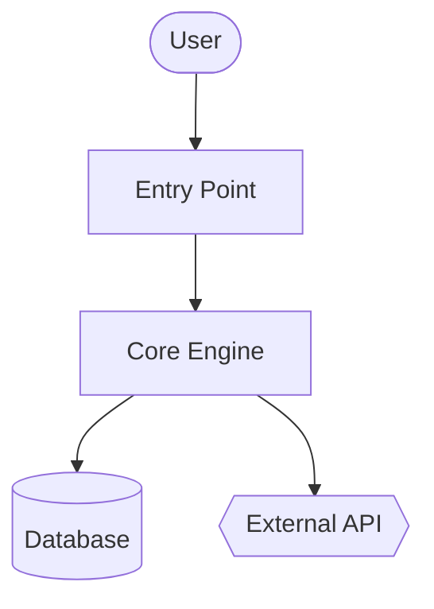
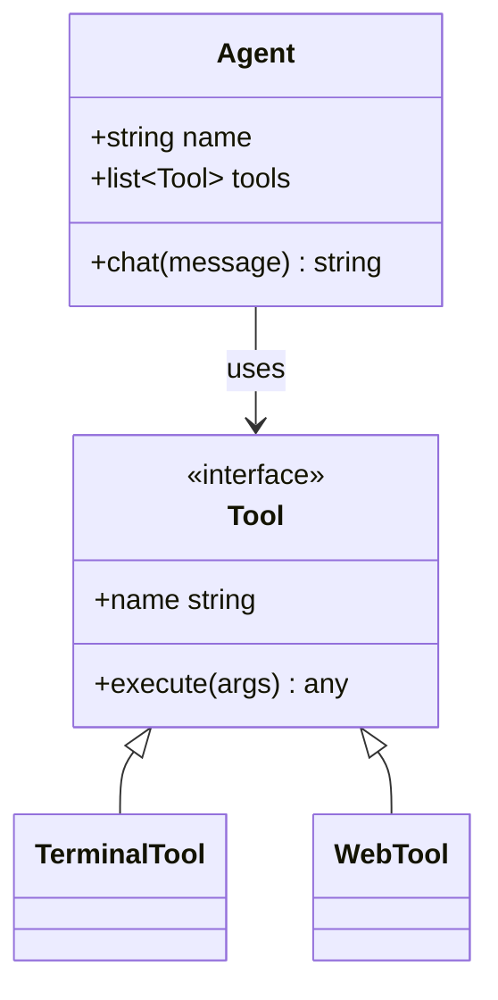
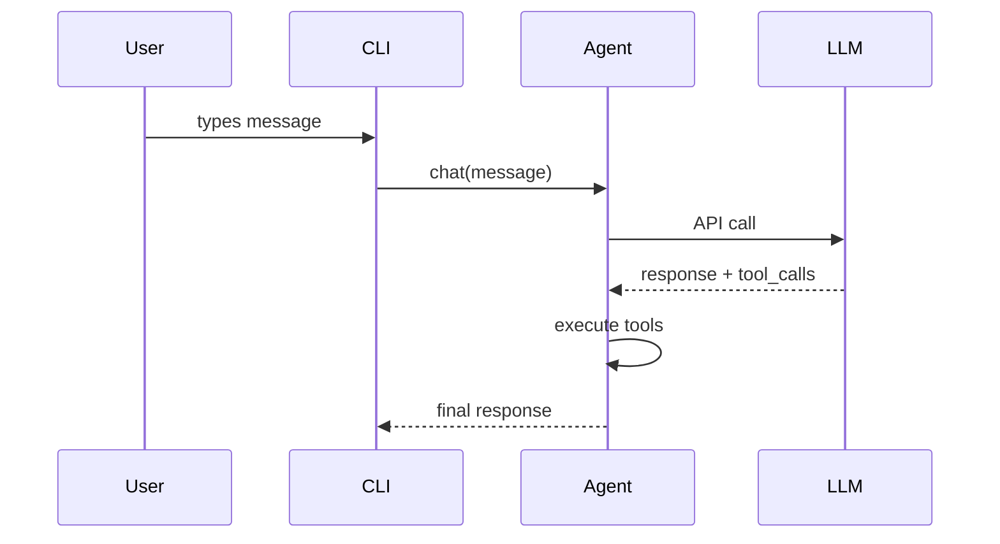

# Code Wiki {#code-wiki}

どんなコードベースにも、ドキュメント一式と Mermaid 図を生成します。

## skill の情報 {#skill-metadata}

| | |
|---|---|
| 提供元 | オプション — `hermes skills install official/software-development/code-wiki` で導入します |
| パス | `optional-skills/software-development/code-wiki` |
| バージョン | `0.1.0` |
| 作者 | Teknium (teknium1), Hermes Agent |
| ライセンス | MIT |
| 対応プラットフォーム | linux, macos, windows |
| タグ | `Documentation`, `Mermaid`, `Architecture`, `Diagrams`, `Wiki`, `Code-Analysis` |
| 関連 skill | [`codebase-inspection`](/hermes/docs/user-guide/skills/bundled/github/github-codebase-inspection/), [`github-repo-management`](/hermes/docs/user-guide/skills/bundled/github/github-github-repo-management/) |

## 参考: SKILL.md 全文 {#reference-full-skillmd}

:::info
以下は、この skill が呼び出されたときに Hermes が読み込む skill 定義の全文です。skill が有効なあいだ、エージェントはこれを指示として受け取ります。
:::

# Code Wiki Skill {#code-wiki-skill}

どんなコードベースにも、全体のドキュメント一式を生成します — 概要、アーキテクチャ、モジュールごとの掘り下げ、Mermaid のクラス図とシーケンス図です。Google CodeWiki に着想を得ていますが、ローカルリポジトリ、プライベートリポジトリ、そしてどんな言語にも対応します。既存の Hermes ツール（`terminal`、`read_file`、`search_files`、`write_file`）だけを使い、Docker も外部サービスも追加の依存関係も要りません。

この skill が生み出すのは**参照用のドキュメント**（何を／どうやって）です。戦略的な物語（なぜ — それは別の skill です）は生み出しません。

## いつ使うか {#when-to-use}

- ユーザーが「このコードベースをドキュメント化して」「ドキュメント一式を生成して」「アーキテクチャ図を作って」と言うとき
- 不慣れなリポジトリに慣れようとしていて、構造化された参照資料が欲しいとき
- ユーザーが GitHub の URL を指してドキュメントを求めるとき
- GitHub でレンダリングされる、安定した成果物（markdown ＋ Mermaid）が必要なとき

次には使わないでください。
- 単一ファイル／単一関数のドキュメント — 直接答えます
- 特定の 1 エンドポイントの API 参照 — `read_file` を使ってその場で答えます
- 戦略的な「なぜこれが存在するのか」の物語 — 別の skill、別の目的です
- ユーザーがこのセッションで能動的に開発中のコードベース — 出てくる質問にその都度答えます

## 事前に必要なもの {#prerequisites}

- 環境変数は不要です。
- リポジトリの SHA 追跡とリモートクローンのために、PATH に `git` があること。
- 任意: 言語別の内訳統計のための `pygount`（`codebase-inspection` skill を参照）。

## 実行方法 {#how-to-run}

対象リポジトリのルートから `terminal` ツールを通して起動し、`read_file` / `search_files` / `write_file` を使ってドキュメント一式を生成します。既定の出力先は `~/.hermes/wikis/<repo-name>/` です。リポジトリ内（`docs/wiki/`）に書き込むのは、ユーザーが明示的に求めたときだけにします。

## 早見表 {#quick-reference}

| ステップ | アクション |
|---|---|
| 1 | 対象を解決する — ローカルの cwd、与えられたパス、または一時ディレクトリへの `git clone --depth 50 <url>` |
| 2 | 構造をスキャンする — `ls`、`find -maxdepth 3`、マニフェストファイル、README |
| 3 | ドキュメント化する 8〜10 個のモジュールを選ぶ |
| 4 | `README.md`（概要＋モジュールマップ）を書く |
| 5 | Mermaid フローチャート付きの `architecture.md` を書く |
| 6 | モジュールごとのドキュメントを `modules/` に書く |
| 7 | `diagrams/class-diagram.md`（Mermaid classDiagram）を書く |
| 8 | `diagrams/sequences.md`（Mermaid sequenceDiagram、2〜4 個のワークフロー）を書く |
| 9 | `getting-started.md` を書く |
| 10 | 該当すれば `api.md` を書く、なければ飛ばす |
| 11 | `.codewiki-state.json` を書く |
| 12 | パスをユーザーに報告する |

## 手順 {#procedure}

### 1. 対象を解決する {#1-resolve-the-target}

GitHub の URL の場合:

```bash
WIKI_TMP=$(mktemp -d)
git clone --depth 50 <url> "$WIKI_TMP/repo"
cd "$WIKI_TMP/repo"
REPO_SHA=$(git rev-parse HEAD)
REPO_NAME=$(basename <url> .git)
```

ローカルパスの場合（指定がなければ cwd）:

```bash
cd <path>
REPO_SHA=$(git rev-parse HEAD 2>/dev/null || echo "uncommitted")
REPO_NAME=$(basename "$PWD")
```

そして出力ディレクトリを設定します。

```bash
OUTPUT_DIR="$HOME/.hermes/wikis/$REPO_NAME"
mkdir -p "$OUTPUT_DIR/modules" "$OUTPUT_DIR/diagrams"
```

### 2. リポジトリの構造をスキャンする {#2-scan-repo-structure}

シェルの作業には `terminal` ツールを、マニフェストには `read_file` を使います。

```bash
# Shallow tree first
ls -la

# Deeper tree, noise filtered
find . -type d \
  -not -path '*/\.*' \
  -not -path '*/node_modules*' \
  -not -path '*/venv*' \
  -not -path '*/__pycache__*' \
  -not -path '*/dist*' \
  -not -path '*/build*' \
  -not -path '*/target*' \
  -maxdepth 3 | sort

# Language breakdown (skip if pygount unavailable)
pygount --format=summary \
  --folders-to-skip=".git,node_modules,venv,.venv,__pycache__,.cache,dist,build,target" \
  . 2>/dev/null || true
```

それから、該当するマニフェスト（`package.json`、`pyproject.toml`、`setup.py`、`Cargo.toml`、`go.mod`、`pom.xml`、`build.gradle`）とプロジェクトの README を `read_file` します。名前を推測するのではなく、`search_files target='files'` を使ってそれらを見つけます。

### 3. ドキュメント化するモジュールを選ぶ {#3-pick-modules-to-document}

最初のパスは **8〜10 個のモジュール**に絞ります。言語ごとの目安は次のとおりです。

- Python: トップレベルのパッケージ（`__init__.py` を持つディレクトリ）と、サブシステムのディレクトリ
- JS/TS: `src/<subdir>`、トップレベルのワークスペースディレクトリ
- Rust: ワークスペース内の各クレート、またはトップレベルの `src/<module>` ディレクトリ
- Go: トップレベルの各パッケージディレクトリ
- 混在／不慣れ: ソースコードを含むトップレベルのディレクトリ（設定でもテストでもないもの）

とても大きなリポジトリでは、次で優先順位を付けます。
1. インポート元の数（多くからインポートされるモジュールは中核）
2. LOC（大きいモジュールは通常、独自のドキュメントに値する）
3. README／トップレベルのドキュメントでの言及

大きなリポジトリでは、モジュールごとのドキュメントを生成する前に、モジュール一覧をユーザーに伝えます — 方向を修正する機会を与えます。

### 4. `README.md` を書く {#4-write-readmemd}

実際のプロジェクトの README と、上位 2〜3 個のエントリーポイントファイルを `read_file` します。それから `write_file` します。

````markdown
# <Project Name>

<One paragraph: what it is and what it's for. Self-contained — don't assume the
reader has the source README.>

## Key Concepts

- **<Concept 1>** — <one line>
- **<Concept 2>** — <one line>

## Entry Points

- [`path/to/main.py`](https://github.com/NousResearch/hermes-agent/blob/main/optional-skills/software-development/code-wiki/<link>) — <what runs when you start it>
- [`path/to/cli.py`](https://github.com/NousResearch/hermes-agent/blob/main/optional-skills/software-development/code-wiki/<link>) — <CLI surface>

## High-Level Architecture

<2-3 sentences. Detail goes in architecture.md.>

See [architecture.md](https://github.com/NousResearch/hermes-agent/blob/main/optional-skills/software-development/code-wiki/architecture.md).

## Module Map

| Module | Purpose |
|---|---|
| [`<module>`](https://github.com/NousResearch/hermes-agent/blob/main/optional-skills/software-development/code-wiki/modules/<module>.md) | <one-line purpose> |

## Getting Started

See [getting-started.md](https://github.com/NousResearch/hermes-agent/blob/main/optional-skills/software-development/code-wiki/getting-started.md).
````

For link targets in local mode use relative paths. For cloned repos use `https://github.com/<owner>/<repo>/blob/<sha>/<path>` so links survive future commits.

### 5. Write `architecture.md`

````markdown
# Architecture

<2-3 paragraphs: shape of the system. What talks to what. Where data enters,
where it exits, where state lives.>

## Components

- **<Component>** — <1-2 sentences>. See [`modules/<module>.md`](https://github.com/NousResearch/hermes-agent/blob/main/optional-skills/software-development/code-wiki/modules/<module>.md).

## System Diagram



## Data Flow {#data-flow}

1. **<Step>** — [`<file>`](https://github.com/NousResearch/hermes-agent/blob/main/optional-skills/software-development/code-wiki/<link>)
2. **<Step>** — [`<file>`](https://github.com/NousResearch/hermes-agent/blob/main/optional-skills/software-development/code-wiki/<link>)

## Key Design Decisions {#key-design-decisions}

- <Anything load-bearing the reader should know>
````

**Mermaid shape semantics:**
- `[]` = component
- `[()]` = database / storage
- `{{}}` = external service
- `(())` = entry point or terminal
- `-->` = sync call, `-.->` = async/event

Cap at ~20 nodes per diagram. Split into sub-diagrams if larger.

### 6. Write per-module docs in `modules/`

For each selected module, inspect its layout with `ls`, identify 3–5 most important files (by size, by being named `core.py` / `main.py` / `__init__.py`, by being imported a lot), then `read_file` those files (use `offset` / `limit` to read only what you need; prefer `search_files` for specific symbols).

````markdown
# Module: `<module>`

<1-2 sentence purpose.>

## Responsibilities

- <bullet>
- <bullet>

## Key Files

- [`<module>/<file>`](https://github.com/NousResearch/hermes-agent/blob/main/optional-skills/software-development/code-wiki/<link>) — <what it does>

## Public API

<Functions/classes/constants other code uses. Group related items. Show
signatures, not full implementations.>

## Internal Structure

<How the module is organized internally. State management.>

## Dependencies

- **Used by:** <other modules>
- **Uses:** <other modules + external libs>

## Notable Patterns / Gotchas

- <Anything non-obvious>
````

### 7. Write `diagrams/class-diagram.md`

Pick the 5–10 most important classes/types. `read_file` them, then write:

````markdown
# Class Diagram

## Core Types



## Notes {#notes}

<Anything the diagram can't express — lifecycle, threading, etc.>
````

For languages without classes (Go, C, Rust): use the diagram for struct relationships, or skip class-diagram.md and explain it in prose in architecture.md. Don't force-fit.

### 8. Write `diagrams/sequences.md`

Pick 2–4 of the most important workflows. Trace each call path through the code (read entry point, follow function calls), then:

````markdown
# Sequence Diagrams

## Workflow: <Name>

<1 sentence describing what this does and when it runs.>



### Walkthrough {#walkthrough}

1. **User input** — [`cli.py:HermesCLI.run_session`](https://github.com/NousResearch/hermes-agent/blob/main/optional-skills/software-development/code-wiki/<link>)
2. **Message dispatch** — [`run_agent.py:AIAgent.chat`](https://github.com/NousResearch/hermes-agent/blob/main/optional-skills/software-development/code-wiki/<link>)
````

Don't invent participants. Every box must correspond to a real component the reader can find in the code.

### 9. Write `getting-started.md`

````markdown
# Getting Started

## Prerequisites

<From manifest files + README. Be specific — versions if pinned.>

## Installation

```bash
<exact commands>
```

## First Run {#first-run}

```bash
<minimum command to see the system do something useful>
```

## Common Workflows {#common-workflows}

### <Workflow 1> {#workflow-1}
<commands>

## Configuration {#configuration}

- `<config-file>` — <what it controls>
- Env var `<VAR>` — <what it controls>

## Where to Go Next {#where-to-go-next}

- Architecture: [architecture.md](https://github.com/NousResearch/hermes-agent/blob/main/optional-skills/software-development/code-wiki/architecture.md)
- Module reference: [README.md#module-map](https://github.com/NousResearch/hermes-agent/blob/main/optional-skills/software-development/code-wiki/README.md#module-map)
````

### 10. Write `api.md` (skip if not applicable)

Only write this if the project is a library or API server. If it is:

- Find the public API surface (`__init__.py` exports, OpenAPI specs, route handlers, exported types)
- Document each public entry with signature, parameters, return type, one-line description
- Group by category

### 11. Write the state file

```bash
cat > "$OUTPUT_DIR/.codewiki-state.json" <<EOF
{
  "repo_name": "$REPO_NAME",
  "source_path": "$PWD",
  "source_sha": "$REPO_SHA",
  "generated_at": "$(date -u +%Y-%m-%dT%H:%M:%SZ)",
  "generator": "hermes-agent code-wiki skill v0.1.0",
  "modules_documented": []
}
EOF
```

### 12. ユーザーに報告する {#12-report-to-user}

何を、どこに生成したかを正確に伝えます。

```
Generated wiki at ~/.hermes/wikis/<repo-name>/:
  README.md                   project overview, module map
  architecture.md             system architecture + flowchart
  getting-started.md          setup, first run, workflows
  modules/<N files>           per-module deep-dives
  diagrams/architecture.md    Mermaid flowchart
  diagrams/class-diagram.md   Mermaid class diagram
  diagrams/sequences.md       Mermaid sequence diagrams
```

一時ディレクトリにクローンした場合は、生成したドキュメントを確認したあとで削除できること（`rm -rf "$WIKI_TMP"`）をユーザーに念押しします。

## スコープの制御 {#scope-control}

50 万 LOC のモノレポに全体のドキュメント一式を生成するのは、トークンを極端に消費します。既定では範囲を限定します。

- 初回スキャン: ディレクトリの深さは最大 3
- モジュールごとのドキュメント: ユーザーが範囲を広げない限り最大 10 モジュール
- ファイルごとの読み取り: 全体を読むより、シンボルには `search_files` を、`read_file` には `offset`/`limit` を優先
- ベンダーのコード（`vendor/`、`third_party/`、生成コード、`_pb2.py`、`.min.js`）は飛ばす

ユーザーが「全部を網羅的にやって」と言うなら、それを信じます — ただしまずコストを見積もります。「このリポジトリには約 340 個のソースファイルがあり、網羅的なカバーは高くつきます — 確認しますか？」

## 再実行／更新 {#re-run-update}

対象パスに `.codewiki-state.json` がすでに存在する場合:

- 前回の SHA とモジュール一覧をそこから読みます
- ソースの SHA が一致する場合: 再生成するか飛ばすかをユーザーに尋ねます
- SHA が異なる場合: ファイルが変わったモジュールだけを再生成することを提案します（`git diff --name-only <old-sha> HEAD`）

完全な増分再生成は将来の拡張です — 今のところは、全体を再生成するので構いません。

## 落とし穴 {#pitfalls}

- **コンポーネントの捏造。** すべての図のノードと、主張する関数呼び出しは、ソースに存在していなければなりません。書く前に `read_file` します。自動生成ドキュメントの最大の失敗モードは、もっともらしく聞こえる捏造です。
- **一般的な AI の散文。** 「このモジュールは……を担当します」は中身がありません。モジュールが実際に何をするかを、ドメイン固有の言葉で言います。
- **コードを散文で言い直すこと。** 「`process` 関数は、各項目に `process_item` を呼ぶことで項目を処理します」と言うモジュールドキュメントは、関数へのリンクを張るより悪いです。
- **Mermaid が 50 ノードを超える。** 読みやすくレンダリングされません。分割します。
- **テスト、生成コード、ベンダーの依存関係を、製品コードのようにドキュメント化すること。** 飛ばします。
- **尋ねずにリポジトリ内へ出力すること。** 既定は `~/.hermes/wikis/` です。リポジトリ内に書き込むのは、ユーザーが明示的に求めたときだけです。
- **Mermaid の特殊文字は引用符が必要:** `A[Tool / Agent]` ではなく `A["Tool / Agent"]`。ノード内の改行には `<br>`。
- **SKILL.md 内の入れ子のコードフェンス。** Mermaid ブロックを含む markdown の例を書くときは、3 バックティックの内側の ` ```mermaid ` が外側を閉じないように、4 バックティックの外側フェンスを使います。（この SKILL.md はそうしています。）
- **classDiagram のジェネリクス**は `<T>` ではなく `~T~` としてレンダリングされます（例: `List~Tool~`）。
- **GitHub の Mermaid テーマは固定です** — `%%{init: ...}%%` ブロックを含めないでください。レンダリング時に取り除かれます。

## 検証 {#verification}

書いたあと、次を確認します。

1. **Mermaid ブロックが釣り合っている** — ファイルごとに opens と closes が等しい:
   ```bash
   for f in "$OUTPUT_DIR"/diagrams/*.md "$OUTPUT_DIR"/architecture.md; do
     opens=$(grep -c '^```mermaid' "$f")
     total=$(grep -c '^```' "$f")
     echo "$f: $opens mermaid blocks, $total total fences (expect total = opens*2)"
   done
   ```
2. **期待されるファイルがすべて存在する** —
   ```bash
   ls "$OUTPUT_DIR"/{README.md,architecture.md,getting-started.md,.codewiki-state.json} \
      "$OUTPUT_DIR"/modules/ "$OUTPUT_DIR"/diagrams/
   ```
3. **モジュール数が意図どおり** — `ls "$OUTPUT_DIR/modules" | wc -l` は、ステップ 3 で決めたモジュール数と等しくなるはずです。
4. **捏造したパスがない** — 2〜3 個のソースリンクが実在のファイルに解決することを確認します。
